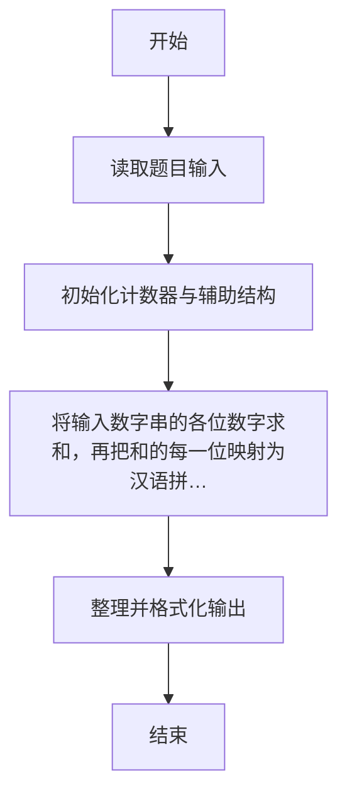
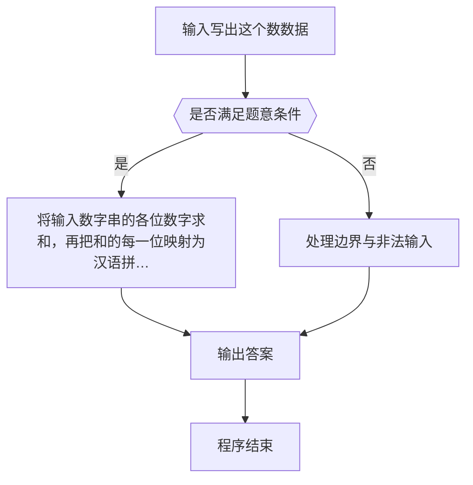

# 1002 写出这个数

- **分值：** 20分

### 题目描述

读入一个正整数 n，计算其各位数字之和，用汉语拼音写出和的每一位数字。

### 输入格式：

每个测试输入包含 1 个测试用例，即给出自然数 n 的值。这里保证 n 小于 10^100。

### 输出格式：

在一行内输出 n 的各位数字之和的每一位，拼音数字间有 1 个空格，但一行中最后一个拼音数字后没有空格。

### 输入样例：
```
1234567890987654321123456789
```

### 输出样例：
```
yi san wu
```


### 解题思路

本题的核心是：将输入数字串的各位数字求和，再把和的每一位映射为汉语拼音，避免整数溢出。程序先读取题目输入，再按照上述规则完成数据处理，最后严格按照题目要求输出结果。实现时应优先根据题目约束选择合适的数据类型和数据结构，避免溢出或不必要的重复计算。

时间复杂度为 O(L)；空间复杂度取决于输入规模，主要用于保存题目数据和中间结果。

### 代码流程说明

1. 读取 1002 写出这个数 所需的输入数据。
2. 初始化计数器、数组或其他辅助变量。
3. 将输入数字串各位求和，再把和的每一位映射为汉语拼音，避免整数溢出。
4. 按题目规定的格式输出计算结果。

### 代码实现

```r
# 实现原理：本题的核心是：将输入数字串的各位数字求和，再把和的每一位映射为汉语拼音，避免整数溢出。程序先读取题目输入，再按照上述规则完成数据处理，最后严格按照题目要求输出结果。实现时应优先根据题目约束选择合适的数据类型和数据结构，避免溢出或不必要的重复计算。 时间复杂度为 O(L)；空间复杂度取决于输入规模，主要用于保存题目数据和中间结果。
# 代码按“读取输入—核心计算—格式化输出”的流程组织。

# 读取题目输入。
x <- scan(what = character(), quiet = TRUE)[1]
word <- c('ling', 'yi', 'er', 'san', 'si', 'wu', 'liu', 'qi', 'ba', 'jiu')
total <- sum(as.integer(strsplit(x, '')[[1]]))
# 按题目要求输出结果。
cat(paste(word[as.integer(strsplit(as.character(total), '')[[1]]) + 1], collapse = ' '), '\n', sep = '')

```

### 代码流程图



### 解题流程图



### 常见易错点

- 大整数或超长串不要用浮点/普通整型硬算，应按字符串或高精度处理。
- 输出格式必须与题目要求完全一致，包括空格、换行、大小写和特殊符号。
