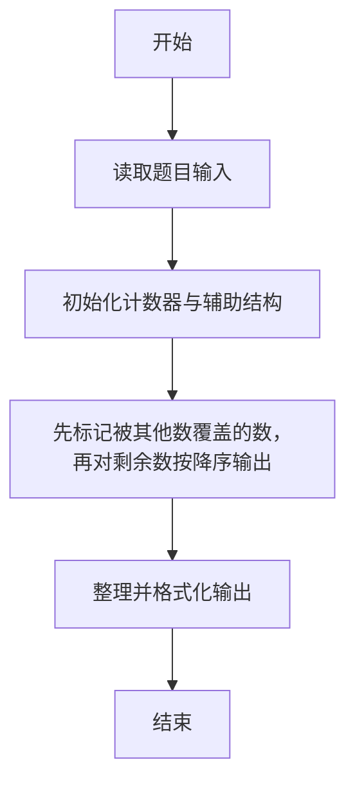
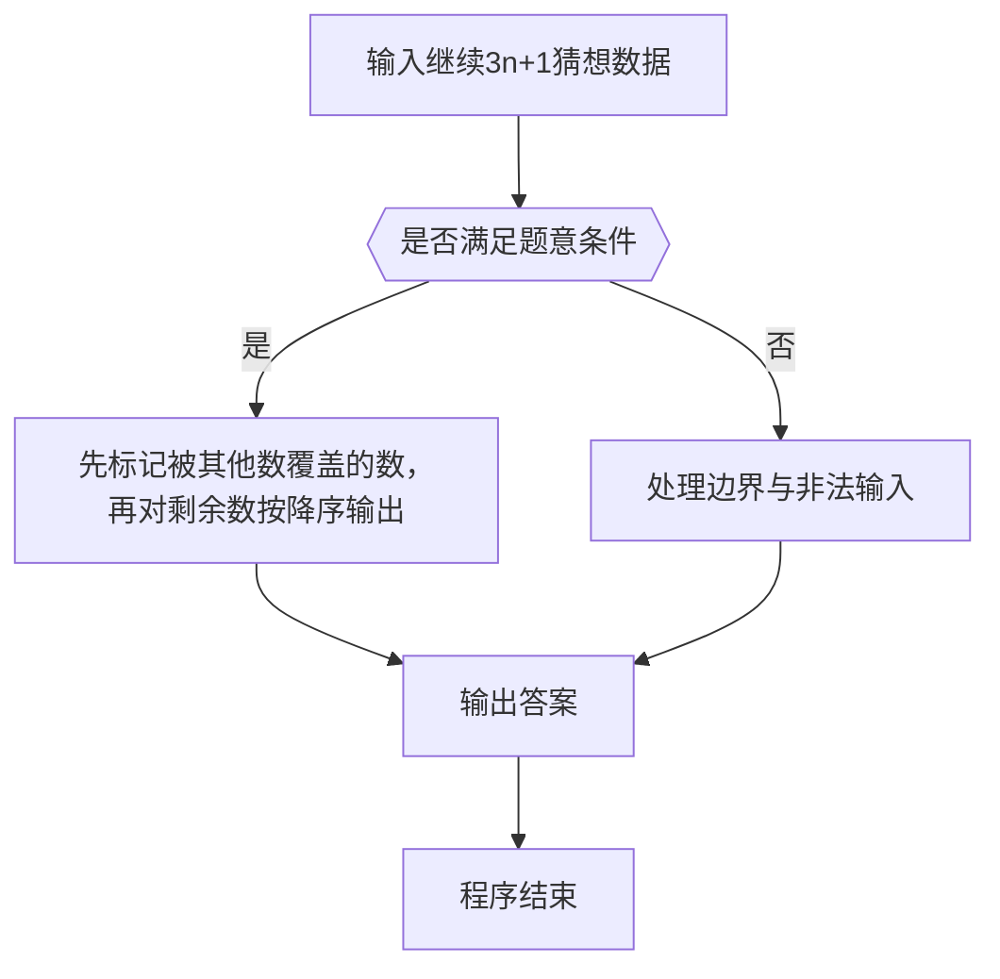

# 1005 继续(3n+1)猜想

- **分值：** 25分

### 题目描述

卡拉兹(Callatz)猜想已经在1001中给出了描述。在这个题目里，情况稍微有些复杂。

当我们验证卡拉兹猜想的时候，为了避免重复计算，可以记录下递推过程中遇到的每一个数。例如对 n=3 进行验证的时候，我们需要计算 3、5、8、4、2、1，则当我们对 n=5、8、4、2 进行验证的时候，就可以直接判定卡拉兹猜想的真伪，而不需要重复计算，因为这 4 个数已经在验证3的时候遇到过了，我们称 5、8、4、2 是被 3“覆盖”的数。我们称一个数列中的某个数 n 为“关键数”，如果 n 不能被数列中的其他数字所覆盖。

现在给定一系列待验证的数字，我们只需要验证其中的几个关键数，就可以不必再重复验证余下的数字。你的任务就是找出这些关键数字，并按从大到小的顺序输出它们。

### 输入格式：

每个测试输入包含 1 个测试用例，第 1 行给出一个正整数 K（K < 100），第 2 行给出 K 个互不相同的待验证的正整数 n（1 < n ≤ 100）的值，数字间用空格隔开。

### 输出格式：

每个测试用例的输出占一行，按从大到小的顺序输出关键数字。数字间用 1 个空格隔开，但一行中最后一个数字后没有空格。

### 输入样例：
```
6
3 5 6 7 8 11
```

### 输出样例：
```
7 6
```


### 解题思路

本题的核心是：先标记被其他数覆盖的数，再对剩余数按降序输出。程序先读取题目输入，再按照上述规则完成数据处理，最后严格按照题目要求输出结果。实现时应优先根据题目约束选择合适的数据类型和数据结构，避免溢出或不必要的重复计算。

时间复杂度为 O(n²)；空间复杂度取决于输入规模，主要用于保存题目数据和中间结果。

### 代码流程说明

1. 读取 1005 继续(3n+1)猜想 所需的输入数据。
2. 初始化计数器、数组或其他辅助变量。
3. 先标记被其他数覆盖的数，再对剩余数按降序输出。
4. 按题目规定的格式输出计算结果。

### 代码实现

```r
# 实现原理：本题的核心是：先标记被其他数覆盖的数，再对剩余数按降序输出。程序先读取题目输入，再按照上述规则完成数据处理，最后严格按照题目要求输出结果。实现时应优先根据题目约束选择合适的数据类型和数据结构，避免溢出或不必要的重复计算。 时间复杂度为 O(n²)；空间复杂度取决于输入规模，主要用于保存题目数据和中间结果。
# 代码按“读取输入—核心计算—格式化输出”的流程组织。

# 读取题目输入。
z <- scan(what = integer(), quiet = TRUE)
n <- z[1]
a <- z[seq_len(n) + 1]
covered <- integer()
# 遍历数据并执行题目要求的处理。
for (v in a) {
  first <- TRUE
  x <- v
  # 按题意重复处理，直到满足结束条件。
  while (x != 1) {
    if (!first) covered <- c(covered, x)
    x <- if (x %% 2 == 1) (3 * x + 1) %/% 2 else x %/% 2
    first <- FALSE
  }
}
ans <- sort(a[!(a %in% covered)], decreasing = TRUE)
# 按题目要求输出结果。
cat(paste(ans, collapse = ' '), '\n', sep='')

```

### 代码流程图



### 解题流程图



### 常见易错点

- 排序与并列名次规则要严格按题意，注意稳定顺序与并列处理。
- 输出格式必须与题目完全一致，包括空格、换行与单复数。
- 输出格式必须与题目要求完全一致，包括空格、换行、大小写和特殊符号。
