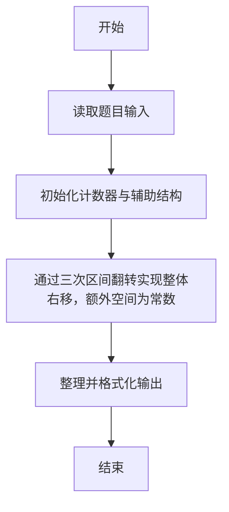
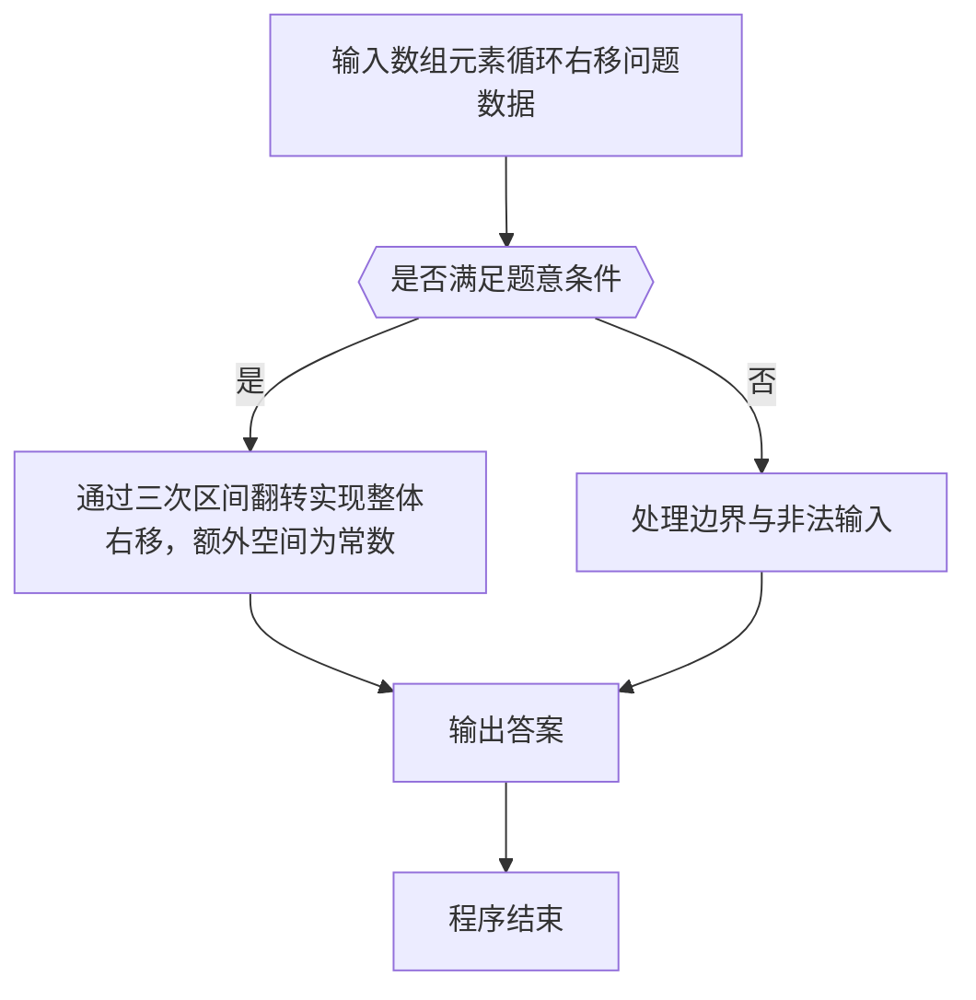

# 1008 数组元素循环右移问题

- **分值：** 20分

### 题目描述

一个数组 A 中存有 N（N > 0）个整数，在不允许使用另外数组的前提下，将每个整数循环向右移 M（M ≥ 0）个位置，即将 A 中的数据由（A_0 A_1 ⋯ A_N-1）变换为（A_N-M ⋯ A_N-1 A_0 A_1 ⋯ A_N-M-1）（最后 M 个数循环移至最前面的 M 个位置）。如果需要考虑程序移动数据的次数尽量少，要如何设计移动的方法？

### 输入格式：

每个输入包含一个测试用例，第 1 行输入 N（1 ≤ N ≤ 100）和 M（M ≥ 0）；第 2 行输入 N 个整数，之间用空格分隔。

### 输出格式：

在一行中输出循环右移M位以后的整数序列，之间用空格分隔，序列结尾不能有多余空格。

### 输入样例：
```
6 2
1 2 3 4 5 6
```

### 输出样例：
```
5 6 1 2 3 4
```


### 解题思路

本题的核心是：通过三次区间翻转实现整体右移，额外空间为常数。程序先读取题目输入，再按照上述规则完成数据处理，最后严格按照题目要求输出结果。实现时应优先根据题目约束选择合适的数据类型和数据结构，避免溢出或不必要的重复计算。

时间复杂度为 O(n)；空间复杂度取决于输入规模，主要用于保存题目数据和中间结果。

### 代码流程说明

1. 读取 1008 数组元素循环右移问题 所需的输入数据。
2. 初始化计数器、数组或其他辅助变量。
3. 通过三次区间翻转实现整体右移，额外空间为常数。
4. 按题目规定的格式输出计算结果。

### 代码实现

```r
# 实现原理：本题的核心是：通过三次区间翻转实现整体右移，额外空间为常数。程序先读取题目输入，再按照上述规则完成数据处理，最后严格按照题目要求输出结果。实现时应优先根据题目约束选择合适的数据类型和数据结构，避免溢出或不必要的重复计算。 时间复杂度为 O(n)；空间复杂度取决于输入规模，主要用于保存题目数据和中间结果。
# 代码按“读取输入—核心计算—格式化输出”的流程组织。

# 读取题目输入。
z <- scan(what = integer(), quiet = TRUE)
n <- z[1]
m <- z[2]
a <- z[seq_len(n) + 2]
m <- m %% n
# 按题目要求输出结果。
cat(paste(a[((n - m + seq_len(n) - 1) %% n) + 1], collapse = ' '), '\n', sep='')

```

### 代码流程图



### 解题流程图



### 常见易错点

- 注意输入范围与边界值，选择合适的数据类型。
- 循环与下标要严格对应题目定义，避免越界或漏算。
- 输出格式必须与题目要求完全一致，包括空格与换行。
- 输出格式必须与题目要求完全一致，包括空格、换行、大小写和特殊符号。
