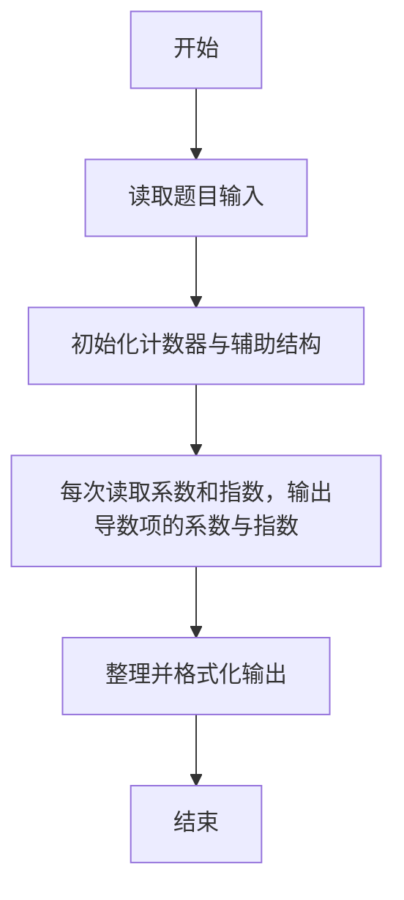
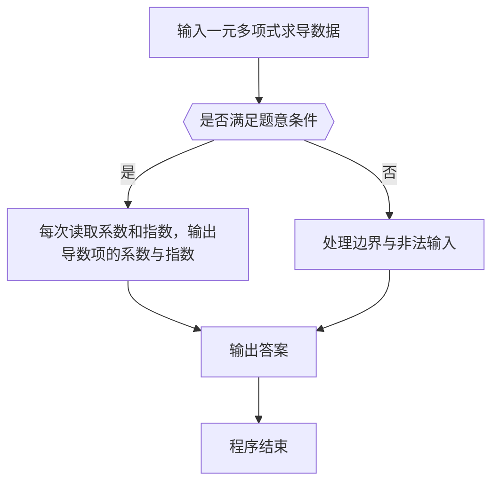

# 1010 一元多项式求导

- **分值：** 25分

### 题目描述

设计函数求一元多项式的导数。（注：当 n 为整数时，x^n 的一阶导数为 n x^n-1。）

### 输入格式：

以指数递降方式输入多项式非零项系数和指数（绝对值均为不超过 1000 的整数）。数字间以空格分隔。

### 输出格式：

以与输入相同的格式输出导数多项式非零项的系数和指数。数字间以空格分隔，但结尾不能有多余空格。注意“零多项式”的指数和系数都是 0，但是表示为 `0 0`。

### 输入样例：
```
3 4 -5 2 6 1 -2 0
```

### 输出样例：
```
12 3 -10 1 6 0
```


### 解题思路

本题的核心是：每次读取系数和指数，输出导数项的系数与指数。程序先读取题目输入，再按照上述规则完成数据处理，最后严格按照题目要求输出结果。实现时应优先根据题目约束选择合适的数据类型和数据结构，避免溢出或不必要的重复计算。

时间复杂度为 O(n)；空间复杂度取决于输入规模，主要用于保存题目数据和中间结果。

### 代码流程说明

1. 读取 1010 一元多项式求导 所需的输入数据。
2. 初始化计数器、数组或其他辅助变量。
3. 每次读取系数和指数，输出导数项的系数与指数。
4. 按题目规定的格式输出计算结果。

### 代码实现

```r
# 实现原理：本题的核心是：每次读取系数和指数，输出导数项的系数与指数。程序先读取题目输入，再按照上述规则完成数据处理，最后严格按照题目要求输出结果。实现时应优先根据题目约束选择合适的数据类型和数据结构，避免溢出或不必要的重复计算。 时间复杂度为 O(n)；空间复杂度取决于输入规模，主要用于保存题目数据和中间结果。
# 代码按“读取输入—核心计算—格式化输出”的流程组织。

# 读取题目输入。
z <- scan(what = integer(), quiet = TRUE)
out <- integer()
if (length(z) >= 2) for (i in seq(1, length(z) - 1, by = 2)) if (z[i + 1] != 0) out <- c(out, z[i] * z[i + 1], z[i + 1] - 1)
if (!length(out)) out <- c(0, 0)
# 按题目要求输出结果。
cat(paste(out, collapse = ' '), '\n', sep='')

```

### 代码流程图



### 解题流程图



### 常见易错点

- 输出格式必须与题目完全一致，包括空格、换行与单复数。
- 输出格式必须与题目要求完全一致，包括空格、换行、大小写和特殊符号。
