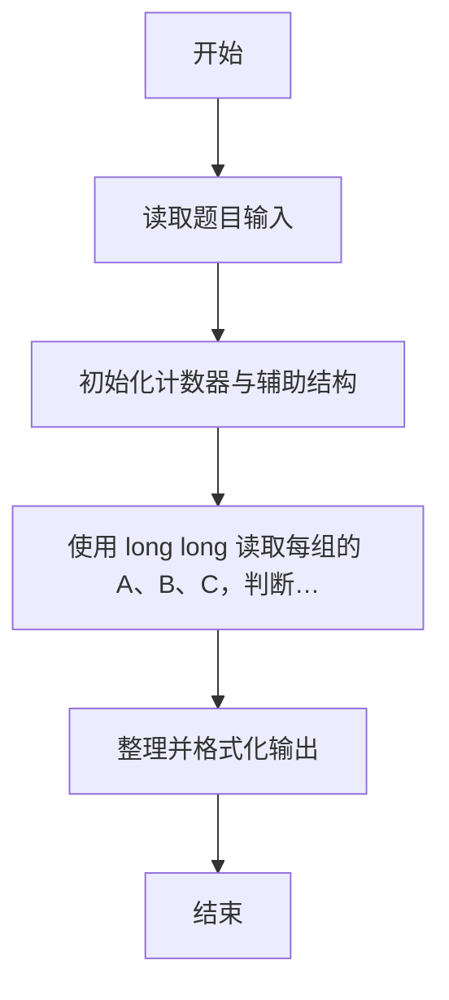
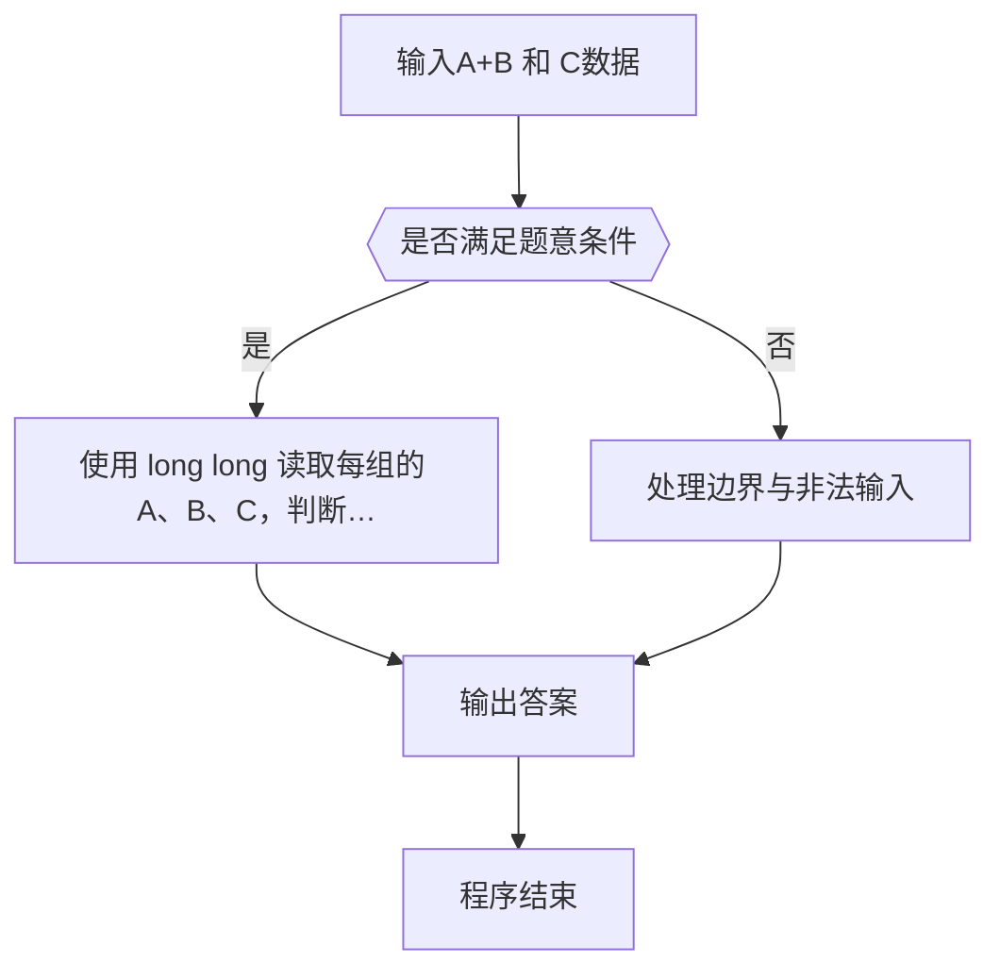

# 1011 A+B 和 C

- **分值：** 15分

### 题目描述

给定区间 [-2^31, 2^31] 内的 3 个整数 A、B 和 C，请判断 A+B 是否大于 C。

### 输入格式：

输入第 1 行给出正整数 T（T ≤ 10），是测试用例的个数。随后给出 T 组测试用例，每组占一行，顺序给出 A、B 和 C。整数间以空格分隔。

### 输出格式：

对每组测试用例，在一行中输出 `Case #X: true` 如果 A+B > C，否则输出 `Case #X: false`，其中 `X` 是测试用例的编号（从 1 开始）。

### 输入样例：
```
4
1 2 3
2 3 4
2147483647 0 2147483646
0 -2147483648 -2147483647
```

### 输出样例：
```
Case #1: false
Case #2: true
Case #3: true
Case #4: false
```


### 解题思路

本题的核心是：使用 long long 读取每组的 A、B、C，判断 A+B 是否大于 C，避免 int 溢出。程序先读取题目输入，再按照上述规则完成数据处理，最后严格按照题目要求输出结果。实现时应优先根据题目约束选择合适的数据类型和数据结构，避免溢出或不必要的重复计算。

时间复杂度为 O(T)；空间复杂度为 O(1)。

### 代码流程说明

1. 读取 1011 A+B 和 C 所需的输入数据。
2. 初始化计数器、数组或其他辅助变量。
3. 使用 long long 读取每组的 A、B、C，判断 A+B 是否大于 C，避免 int 溢出。
4. 按题目规定的格式输出计算结果。

### 代码实现

```r
# 实现原理：使用 R 的 numeric 类型读取每组的 A、B、C，并逐组判断 A+B 是否大于 C；该类型可以准确表示题目范围内的整数。程序先读取输入，再完成比较，最后按题目要求输出结果。时间复杂度为 O(T)，额外空间复杂度为 O(1)。
# 代码按“读取输入—核心计算—格式化输出”的流程组织。

# 读取题目输入。
z <- scan(what = numeric(), quiet = TRUE)
t <- z[1]
at <- 2
# 遍历数据并执行题目要求的处理。
for (i in seq_len(t)) {
  ok <- z[at] + z[at + 1] > z[at + 2]
  at <- at + 3
  # 按题目要求输出结果。
  cat(sprintf('Case #%d: %s\n', i, if (ok) 'true' else 'false'))
}

```

### 代码流程图



### 解题流程图



### 常见易错点

- 素数判断注意 1 不是素数，边界与取整平方根范围要正确。
- 大整数或超长串不要用浮点/普通整型硬算，应按字符串或高精度处理。
- 输出格式必须与题目要求完全一致，包括空格、换行、大小写和特殊符号。
