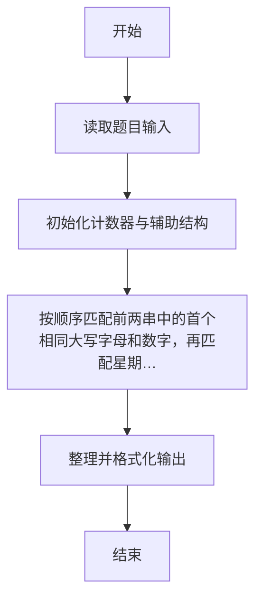
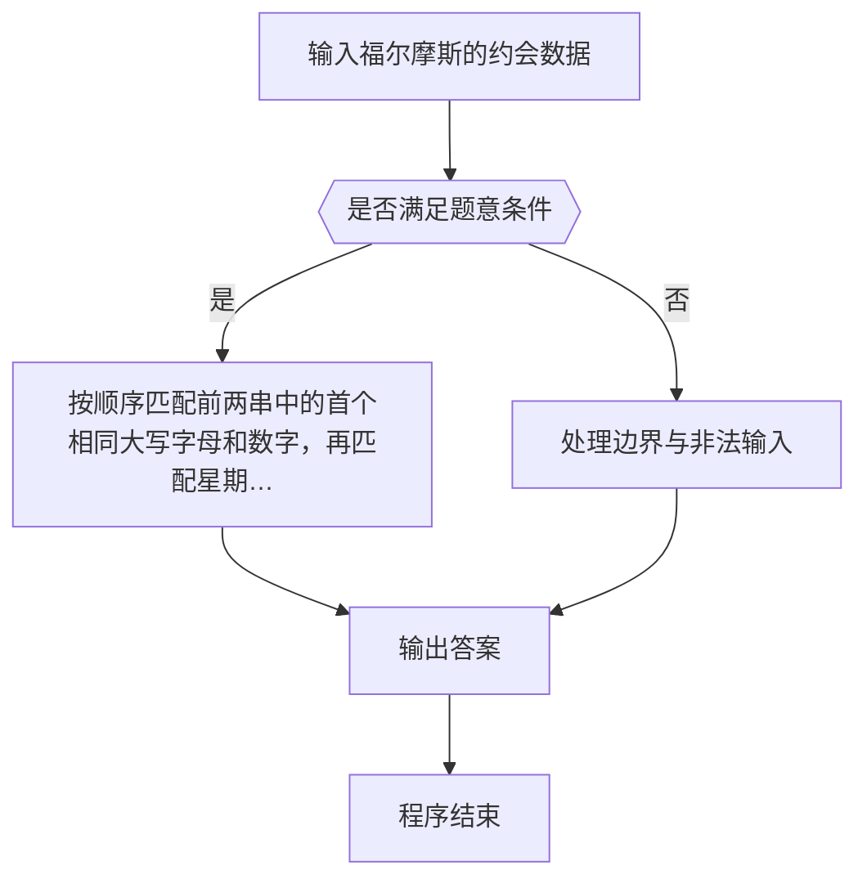

# 1014 福尔摩斯的约会

- **分值：** 20分

### 题目描述

大侦探福尔摩斯接到一张奇怪的字条：
```
我们约会吧！
3485djDkxh4hhGE
2984akDfkkkkggEdsb
s&hgsfdk
d&Hyscvnm
```
大侦探很快就明白了，字条上奇怪的乱码实际上就是约会的时间`星期四 14:04`，因为前面两字符串中第 1 对相同的大写英文字母（大小写有区分）是第 4 个字母 `D`，代表星期四；第 2 对相同的字符是 `E` ，那是第 5 个英文字母，代表一天里的第 14 个钟头（于是一天的 0 点到 23 点由数字 0 到 9、以及大写字母 `A` 到 `N` 表示）；后面两字符串第 1 对相同的英文字母 `s` 出现在第 4 个位置（从 0 开始计数）上，代表第 4 分钟。现给定两对字符串，请帮助福尔摩斯解码得到约会的时间。

### 输入格式：

输入在 4 行中分别给出 4 个非空、不包含空格、且长度不超过 60 的字符串。

### 输出格式：

在一行中输出约会的时间，格式为 `DAY HH:MM`，其中 `DAY` 是某星期的 3 字符缩写，即 `MON` 表示星期一，`TUE` 表示星期二，`WED` 表示星期三，`THU` 表示星期四，`FRI` 表示星期五，`SAT` 表示星期六，`SUN` 表示星期日。题目输入保证每个测试存在唯一解。

### 输入样例：
```
3485djDkxh4hhGE
2984akDfkkkkggEdsb
s&hgsfdk
d&Hyscvnm
```

### 输出样例：
```
THU 14:04
```


### 解题思路

本题的核心是：按顺序匹配前两串中的首个相同大写字母和数字，再匹配星期与分钟。程序先读取题目输入，再按照上述规则完成数据处理，最后严格按照题目要求输出结果。实现时应优先根据题目约束选择合适的数据类型和数据结构，避免溢出或不必要的重复计算。

时间复杂度为 O(L)；空间复杂度取决于输入规模，主要用于保存题目数据和中间结果。

### 代码流程说明

1. 读取 1014 福尔摩斯的约会 所需的输入数据。
2. 初始化计数器、数组或其他辅助变量。
3. 按顺序匹配前两串中的首个相同大写字母和数字，再匹配星期与分钟。
4. 按题目规定的格式输出计算结果。

### 代码实现

```r
# 实现原理：本题的核心是：按顺序匹配前两串中的首个相同大写字母和数字，再匹配星期与分钟。程序先读取题目输入，再按照上述规则完成数据处理，最后严格按照题目要求输出结果。实现时应优先根据题目约束选择合适的数据类型和数据结构，避免溢出或不必要的重复计算。 时间复杂度为 O(L)；空间复杂度取决于输入规模，主要用于保存题目数据和中间结果。
# 代码按“读取输入—核心计算—格式化输出”的流程组织。

# 读取题目输入。
z <- scan(what = character(), quiet = TRUE)
a <- strsplit(z[1], '')[[1]]
b <- strsplit(z[2], '')[[1]]
c <- strsplit(z[3], '')[[1]]
d <- strsplit(z[4], '')[[1]]
i <- which(a == b & a %in% LETTERS[1:7])[1]
day <- a[i]
i <- i + 1
j <- which(seq_along(a) >= i & a == b & (a %in% LETTERS[1:14] | a %in% as.character(0:9)))[1]
h <- if (a[j] %in% as.character(0:9)) as.integer(a[j]) else match(a[j], LETTERS) + 9
mm <- which(c == d & (c %in% LETTERS | c %in% letters))[1] - 1
# 按题目要求输出结果。
cat(sprintf('%s %02d:%02d\n', c('MON','TUE','WED','THU','FRI','SAT','SUN')[match(day, LETTERS[1:7])], h, mm))

```

### 代码流程图



### 解题流程图



### 常见易错点

- 注意输入范围与边界值，选择合适的数据类型。
- 循环与下标要严格对应题目定义，避免越界或漏算。
- 输出格式必须与题目要求完全一致，包括空格与换行。
- 输出格式必须与题目要求完全一致，包括空格、换行、大小写和特殊符号。
