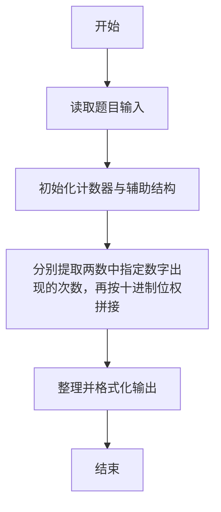
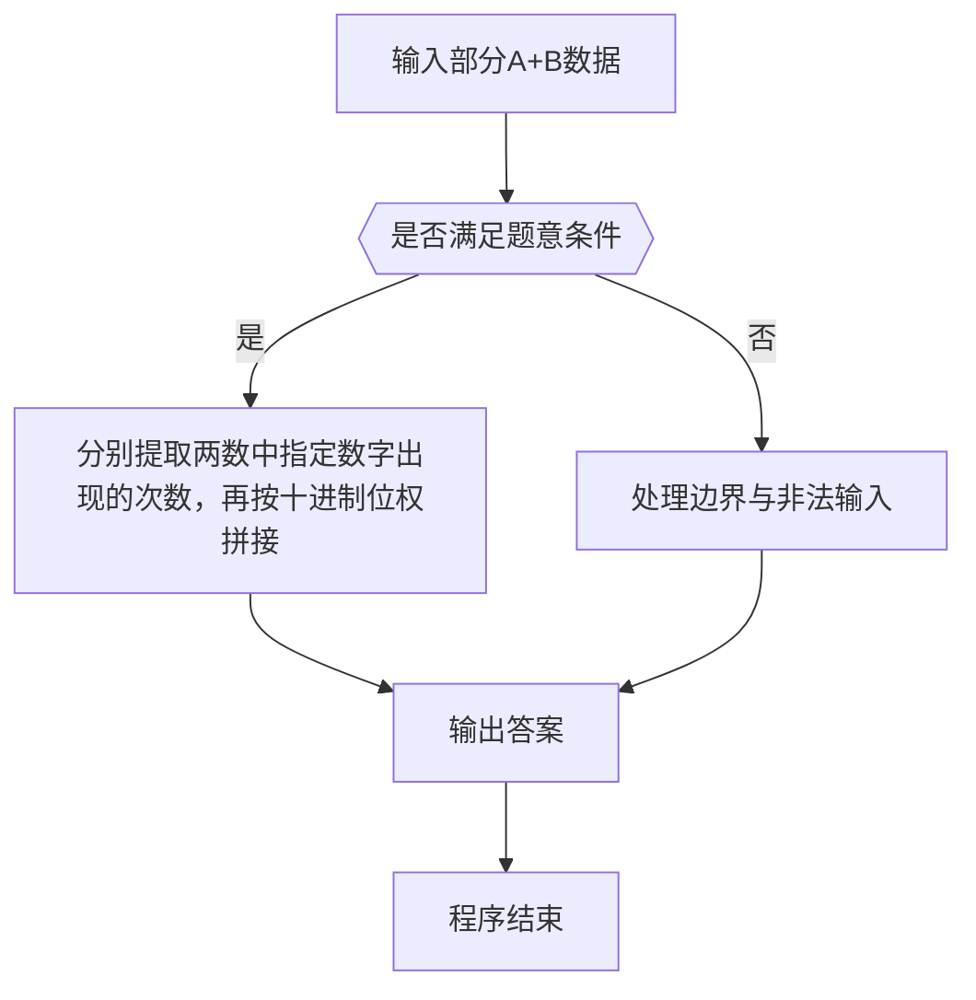

# 1016 部分A+B

- **分值：** 15分

### 题目描述

正整数 A 的“D_A（为 1 位整数）部分”定义为由 A 中所有 D_A 组成的新整数 P_A。例如：给定 A = 3862767，D_A = 6，则 A 的“6 部分”P_A 是 66，因为 A 中有 2 个 6。

现给定 A、D_A、B、D_B，请编写程序计算 P_A + P_B。

### 输入格式：

输入在一行中依次给出 A、D_A、B、D_B，中间以空格分隔，其中 0 < A, B < 10^9。

### 输出格式：

在一行中输出 P_A + P_B 的值。

### 输入样例 1：
```
3862767 6 13530293 3

```

### 输出样例 1：
```
399

```

### 输入样例 2：
```
3862767 1 13530293 8

```

### 输出样例 2：
```
0

```

**鸣谢用户 George Hu 修正数据范围！**


### 解题思路

本题的核心是：分别提取两数中指定数字出现的次数，再按十进制位权拼接。程序先读取题目输入，再按照上述规则完成数据处理，最后严格按照题目要求输出结果。实现时应优先根据题目约束选择合适的数据类型和数据结构，避免溢出或不必要的重复计算。

时间复杂度为 O(L)；空间复杂度取决于输入规模，主要用于保存题目数据和中间结果。

### 代码流程说明

1. 读取 1016 部分A+B 所需的输入数据。
2. 初始化计数器、数组或其他辅助变量。
3. 分别提取两数中指定数字出现的次数，再按十进制位权拼接。
4. 按题目规定的格式输出计算结果。

### 代码实现

```r
# 实现原理：本题的核心是：分别提取两数中指定数字出现的次数，再按十进制位权拼接。程序先读取题目输入，再按照上述规则完成数据处理，最后严格按照题目要求输出结果。实现时应优先根据题目约束选择合适的数据类型和数据结构，避免溢出或不必要的重复计算。 时间复杂度为 O(L)；空间复杂度取决于输入规模，主要用于保存题目数据和中间结果。
# 代码按“读取输入—核心计算—格式化输出”的流程组织。

# 读取题目输入。
z <- scan(what = character(), quiet = TRUE)
a <- z[1]
da <- z[2]
b <- z[3]
db <- z[4]
# 定义辅助函数，封装可复用的计算逻辑。
part <- function(s, d) {
  q <- strsplit(s, '')[[1]]
  v <- q[q == d]
  if (length(v)) as.numeric(paste0(v, collapse='')) else 0
}
# 按题目要求输出结果。
cat(part(a, da) + part(b, db), '\n', sep='')

```

### 代码流程图



### 解题流程图



### 常见易错点

- 注意输入范围与边界值，选择合适的数据类型。
- 循环与下标要严格对应题目定义，避免越界或漏算。
- 输出格式必须与题目要求完全一致，包括空格与换行。
- 输出格式必须与题目要求完全一致，包括空格、换行、大小写和特殊符号。
