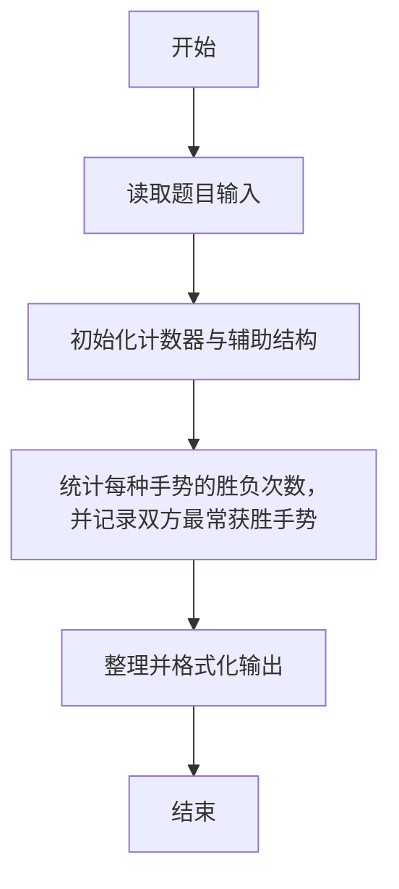
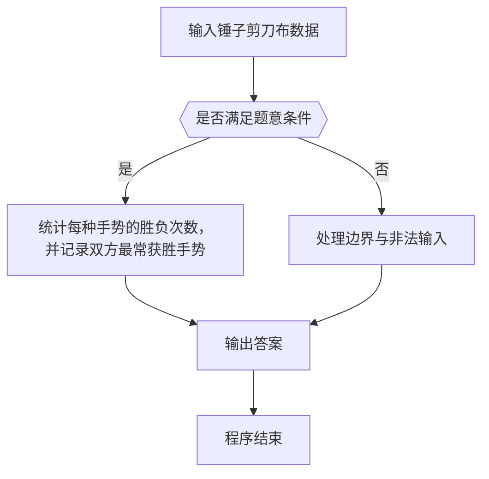

# 1018 锤子剪刀布

- **分值：** 20分

### 题目描述

大家应该都会玩“锤子剪刀布”的游戏：两人同时给出手势，胜负规则如图所示：


现给出两人的交锋记录，请统计双方的胜、平、负次数，并且给出双方分别出什么手势的胜算最大。

### 输入格式：

输入第 1 行给出正整数 N（≤ 10^5），即双方交锋的次数。随后 N 行，每行给出一次交锋的信息，即甲、乙双方同时给出的手势。`C` 代表“锤子”、`J` 代表“剪刀”、`B` 代表“布”，第 1 个字母代表甲方，第 2 个代表乙方，中间有 1 个空格。

### 输出格式：

输出第 1、2 行分别给出甲、乙的胜、平、负次数，数字间以 1 个空格分隔。第 3 行给出两个字母，分别代表甲、乙获胜次数最多的手势，中间有 1 个空格。如果解不唯一，则输出按字母序最小的解。

### 输入样例：
```
10
C J
J B
C B
B B
B C
C C
C B
J B
B C
J J
```

### 输出样例：
```
5 3 2
2 3 5
B B
```


### 解题思路

本题的核心是：统计每种手势的胜负次数，并记录双方最常获胜手势。程序先读取题目输入，再按照上述规则完成数据处理，最后严格按照题目要求输出结果。实现时应优先根据题目约束选择合适的数据类型和数据结构，避免溢出或不必要的重复计算。

时间复杂度为 O(n)；空间复杂度取决于输入规模，主要用于保存题目数据和中间结果。

### 代码流程说明

1. 读取 1018 锤子剪刀布 所需的输入数据。
2. 初始化计数器、数组或其他辅助变量。
3. 统计每种手势的胜负次数，并记录双方最常获胜手势。
4. 按题目规定的格式输出计算结果。

### 代码实现

```r
# 实现原理：本题的核心是：统计每种手势的胜负次数，并记录双方最常获胜手势。程序先读取题目输入，再按照上述规则完成数据处理，最后严格按照题目要求输出结果。实现时应优先根据题目约束选择合适的数据类型和数据结构，避免溢出或不必要的重复计算。 时间复杂度为 O(n)；空间复杂度取决于输入规模，主要用于保存题目数据和中间结果。
# 代码按“读取输入—核心计算—格式化输出”的流程组织。

# 读取题目输入。
z <- scan(what = character(), quiet = TRUE)
n <- as.integer(z[1])
at <- 2
ca <- setNames(c(0,0,0), c('B','C','J'))
cb <- ca
wa <- wb <- tie <- 0
# 定义辅助函数，封装可复用的计算逻辑。
win <- function(a,b) (a=='C'&&b=='J') || (a=='J'&&b=='B') || (a=='B'&&b=='C')
# 遍历数据并执行题目要求的处理。
for (i in seq_len(n)) {
  a <- z[at]
  b <- z[at+1]
  at <- at+2
  if (a==b) tie <- tie+1 else if (win(a,b)) {
    wa<-wa+1
    ca[a]<-ca[a]+1
  } else {
  wb<-wb+1
  cb[b]<-cb[b]+1
}
}
# 定义辅助函数，封装可复用的计算逻辑。
best <- function(x) c('B','C','J')[which.max(x)]
# 按题目要求输出结果。
cat(paste(wa, tie, wb), '\n', sep='')
cat(paste(wb, tie, wa), '\n', sep='')
cat(paste(best(ca), best(cb)), '\n', sep='')
```

### 代码流程图



### 解题流程图



### 常见易错点

- 注意输入范围与边界值，选择合适的数据类型。
- 循环与下标要严格对应题目定义，避免越界或漏算。
- 输出格式必须与题目要求完全一致，包括空格与换行。
- 输出格式必须与题目要求完全一致，包括空格、换行、大小写和特殊符号。
