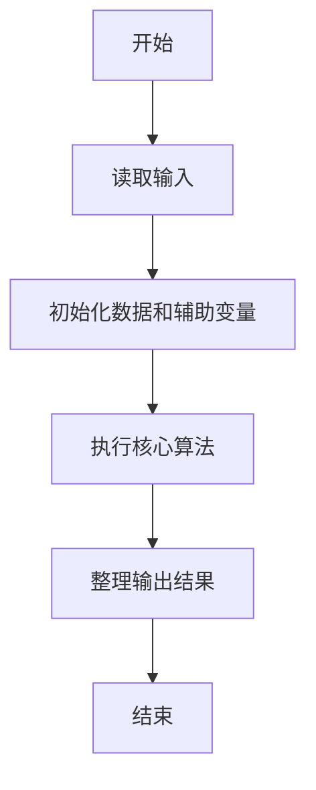
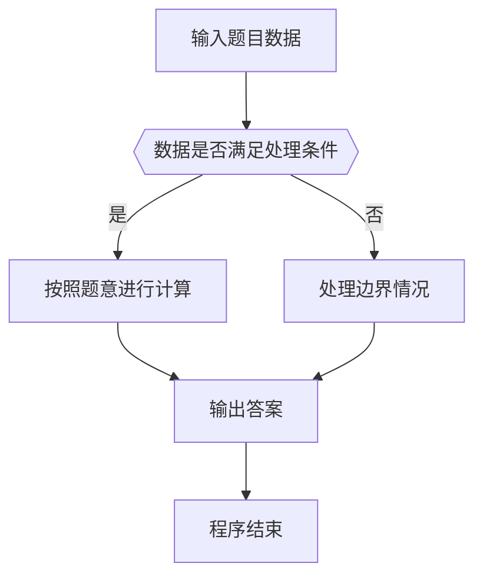

# 1022 D进制的A+B

- **分值：** 20分

### 题目描述

输入两个非负 10 进制整数 $A$ 和 $B$（$A,B\le 2^{30}-1$），输出 $A+B$ 的 $D$（$1<D\le 10$）进制数。

### 输入格式：

输入在一行中依次给出 3 个整数 $A$、$B$ 和 $D$。

### 输出格式：

输出 $A+B$ 的 $D$ 进制数。

### 输入样例：
```
123 456 8

```

### 输出样例：
```
1103

```

**鸣谢用户谢浩然补充数据！**


### 解题思路

本题的核心是：将非负整数反复除以 D 取余，逆序得到目标进制表示。程序先读取题目输入，再按照上述规则完成数据处理，最后严格按照题目要求输出结果。实现时应优先根据题目约束选择合适的数据类型和数据结构，避免溢出或不必要的重复计算。

时间复杂度为 O(log_D n)；空间复杂度取决于输入规模，主要用于保存题目数据和中间结果。

### 代码流程说明

1. 读取 1022 D进制的A+B 所需的输入数据。
2. 初始化计数器、数组或其他辅助变量。
3. 将非负整数反复除以 D 取余，逆序得到目标进制表示。
4. 按题目规定的格式输出计算结果。

### 代码实现

```r
# 实现原理：本题的核心是：将非负整数反复除以 D 取余，逆序得到目标进制表示。程序先读取题目输入，再按照上述规则完成数据处理，最后严格按照题目要求输出结果。实现时应优先根据题目约束选择合适的数据类型和数据结构，避免溢出或不必要的重复计算。 时间复杂度为 O(log_D n)；空间复杂度取决于输入规模，主要用于保存题目数据和中间结果。
# 代码按“读取输入—核心计算—格式化输出”的流程组织。

# 读取题目输入。
z <- scan(what = numeric(), quiet = TRUE)
x <- z[1]+z[2]
base <- z[3]
# 按题目要求输出结果。
if(x==0) cat('0\n') else {
  out <- character()
  # 按题意重复处理，直到满足结束条件。
  while(x>0) {
    out <- c(as.character(x%%base),out)
    x <- x%/%base
  }
# 按题目要求输出结果。
cat(paste(out,collapse=''),'\n')
}
```

### 代码流程图



### 解题流程图



### 常见易错点

- 注意输入数据的范围，选择足够大的整数类型，并正确处理边界值。
- 循环、数组下标和字符串结束位置要严格对应题目定义，避免越界。
- 输出格式必须与题目要求完全一致，包括空格、换行、大小写和特殊符号。
- 如果存在排序、去重、进位、约分或四舍五入等操作，应在输出前统一完成。
