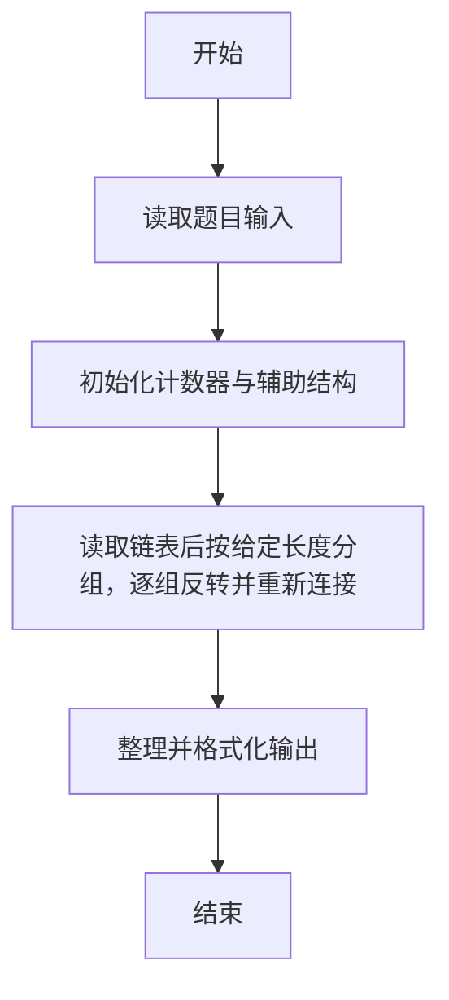
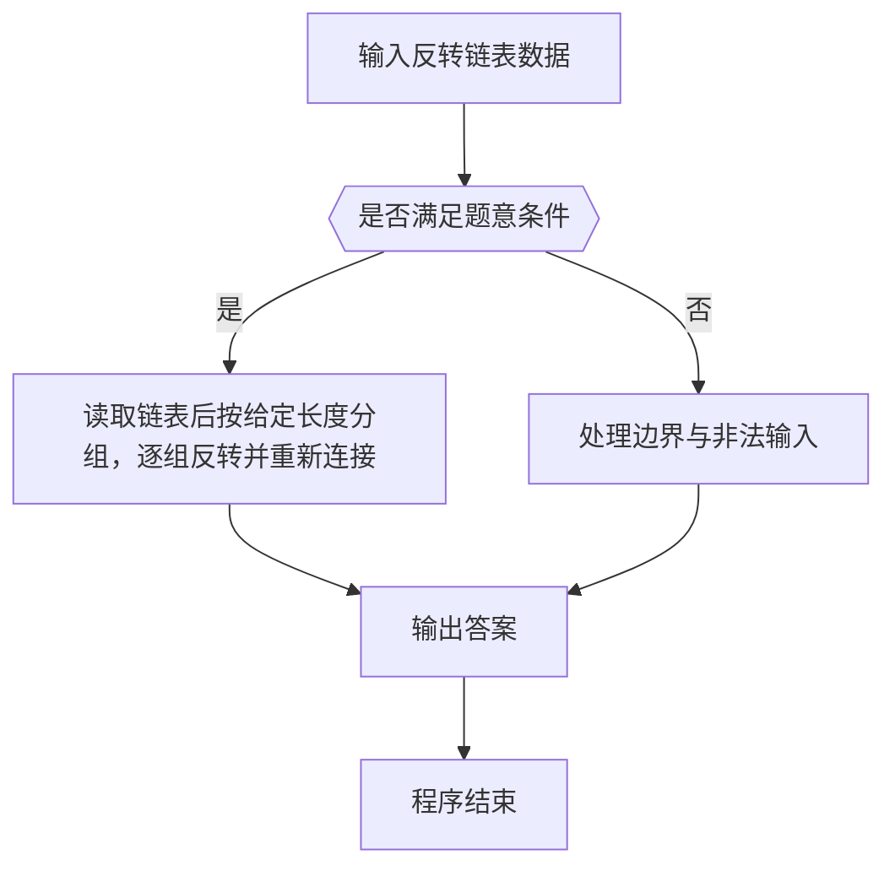

# 1025 反转链表

- **分值：** 25分

### 题目描述

给定一个常数 K 以及一个单链表 L，请编写程序将 L 中每 K 个结点反转。例如：给定 L 为 1 → 2 → 3 → 4 → 5 → 6，K 为 3，则输出应该为 3 → 2 → 1 → 6 → 5 → 4；如果 K 为 4，则输出应该为 4 → 3 → 2 → 1 → 5 → 6，即最后不到 K 个元素不反转。

### 输入格式：

每个输入包含 1 个测试用例。每个测试用例第 1 行给出第 1 个结点的地址、结点总个数正整数 N（N ≤ 10^5）、以及正整数 K（K ≤ N），即要求反转的子链结点的个数。结点的地址是 5 位非负整数，NULL 地址用 -1 表示。

接下来有 N 行，每行格式为：
```
Address Data Next
```

其中 `Address` 是结点地址，`Data` 是该结点保存的整数数据，`Next` 是下一结点的地址。

### 输出格式：

对每个测试用例，顺序输出反转后的链表，其上每个结点占一行，格式与输入相同。

### 输入样例：
```
00100 6 4
00000 4 99999
00100 1 12309
68237 6 -1
33218 3 00000
99999 5 68237
12309 2 33218
```

### 输出样例：
```
00000 4 33218
33218 3 12309
12309 2 00100
00100 1 99999
99999 5 68237
68237 6 -1
```


### 解题思路

本题的核心是：读取链表后按给定长度分组，逐组反转并重新连接。程序先读取题目输入，再按照上述规则完成数据处理，最后严格按照题目要求输出结果。实现时应优先根据题目约束选择合适的数据类型和数据结构，避免溢出或不必要的重复计算。

时间复杂度为 O(n)；空间复杂度取决于输入规模，主要用于保存题目数据和中间结果。

### 代码流程说明

1. 读取 1025 反转链表 所需的输入数据。
2. 初始化计数器、数组或其他辅助变量。
3. 读取链表后按给定长度分组，逐组反转并重新连接。
4. 按题目规定的格式输出计算结果。

### 代码实现

```r
# 实现原理：本题的核心是：读取链表后按给定长度分组，逐组反转并重新连接。程序先读取题目输入，再按照上述规则完成数据处理，最后严格按照题目要求输出结果。实现时应优先根据题目约束选择合适的数据类型和数据结构，避免溢出或不必要的重复计算。 时间复杂度为 O(n)；空间复杂度取决于输入规模，主要用于保存题目数据和中间结果。
# 代码按“读取输入—核心计算—格式化输出”的流程组织。

# 读取题目输入。
z <- scan(what = character(), quiet = TRUE)
head <- z[1]
n <- as.integer(z[2])
k <- as.integer(z[3])
at <- 4
val <- list()
nx <- list()
# 遍历数据并执行题目要求的处理。
for(i in seq_len(n)) {
  ad<-z[at]
  val[[ad]]<-z[at+1]
  nx[[ad]]<-z[at+2]
  at<-at+3
}
lst <- character()
x<-head
# 按题意重复处理，直到满足结束条件。
while(x!='-1') {
  lst<-c(lst,x)
  x<-nx[[x]]
}
if(length(lst)>=k) for(i in seq(1,length(lst)-k+1,by=k)) lst[i:(i+k-1)]<-rev(lst[i:(i+k-1)])
# 遍历数据并执行题目要求的处理。
for(i in seq_along(lst)) cat(paste(lst[i],val[[lst[i]]],if(i<length(lst))lst[i+1] else '-1'), '\n', sep='')

```

### 代码流程图



### 解题流程图



### 常见易错点

- 链表处理需按地址串成有效链，注意末结点 -1 与不足一组时不反转/仍成块。
- 输出格式必须与题目要求完全一致，包括空格、换行、大小写和特殊符号。
