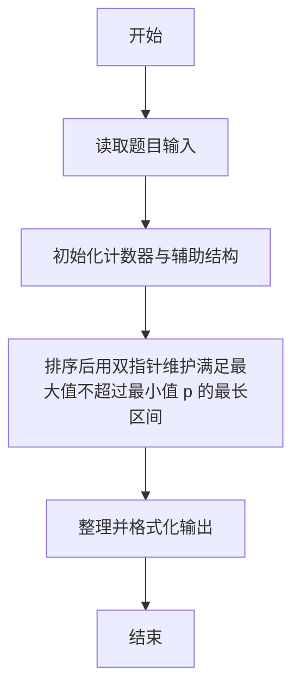
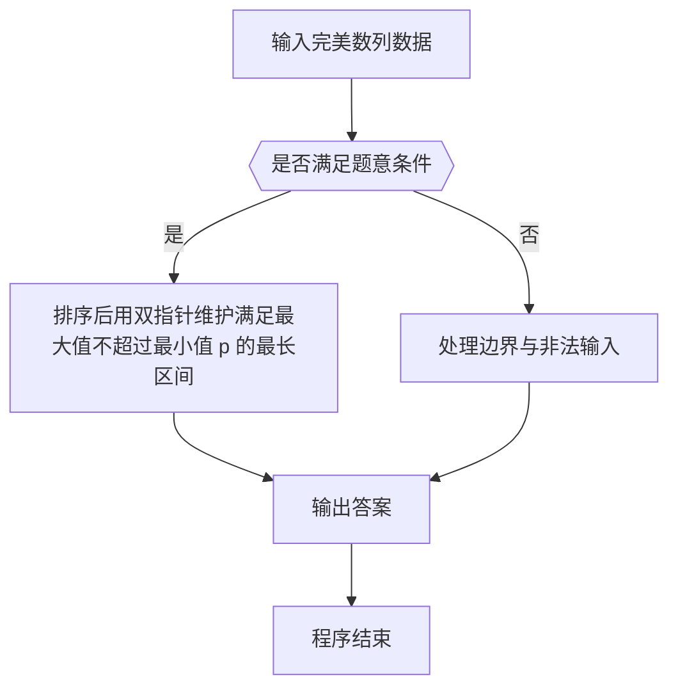

# 1030 完美数列

- **分值：** 25分

### 题目描述

给定一个正整数数列，和正整数 p，设这个数列中的最大值是 M，最小值是 m，如果 M ≤ mp，则称这个数列是完美数列。

现在给定参数 p 和一些正整数，请你从中选择尽可能多的数构成一个完美数列。

### 输入格式：

输入第一行给出两个正整数 N 和 p，其中 N（≤ 10^5）是输入的正整数的个数，p（≤ 10^9）是给定的参数。第二行给出 N 个正整数，每个数不超过 10^9。

### 输出格式：

在一行中输出最多可以选择多少个数可以用它们组成一个完美数列。

### 输入样例：
```
10 8
2 3 20 4 5 1 6 7 8 9
```

### 输出样例：
```
8
```


### 解题思路

本题的核心是：排序后用双指针维护满足最大值不超过最小值 p 的最长区间。程序先读取题目输入，再按照上述规则完成数据处理，最后严格按照题目要求输出结果。实现时应优先根据题目约束选择合适的数据类型和数据结构，避免溢出或不必要的重复计算。

时间复杂度为 O(n log n)；空间复杂度取决于输入规模，主要用于保存题目数据和中间结果。

### 代码流程说明

1. 读取 1030 完美数列 所需的输入数据。
2. 初始化计数器、数组或其他辅助变量。
3. 排序后用双指针维护满足最大值不超过最小值 p 的最长区间。
4. 按题目规定的格式输出计算结果。

### 代码实现

```r
# 实现原理：本题的核心是：排序后用双指针维护满足最大值不超过最小值 $p$ 的最长区间。程序先读取题目输入，再按照上述规则完成数据处理，最后严格按照题目要求输出结果。实现时应优先根据题目约束选择合适的数据类型和数据结构，避免溢出或不必要的重复计算。 时间复杂度为 O(n log n)；空间复杂度取决于输入规模，主要用于保存题目数据和中间结果。
# 代码按“读取输入—核心计算—格式化输出”的流程组织。

# 读取题目输入。
z<-scan(what=integer(),quiet=TRUE)
n<-z[1]
p<-z[2]
a<-sort(z[3:(n+2)])
ans<-0
# 遍历数据并执行题目要求的处理。
for(l in seq_len(n)){
  r<-l
  # 按题意重复处理，直到满足结束条件。
  while(r<=n&&a[r]<=a[l]*p)r<-r+1
  ans<-max(ans,r-l)
}
# 按题目要求输出结果。
cat(ans, '\n', sep='')

```

### 代码流程图



### 解题流程图



### 常见易错点

- 排序与并列名次规则要严格按题意，注意稳定顺序与并列处理。
- 输出格式必须与题目要求完全一致，包括空格、换行、大小写和特殊符号。
