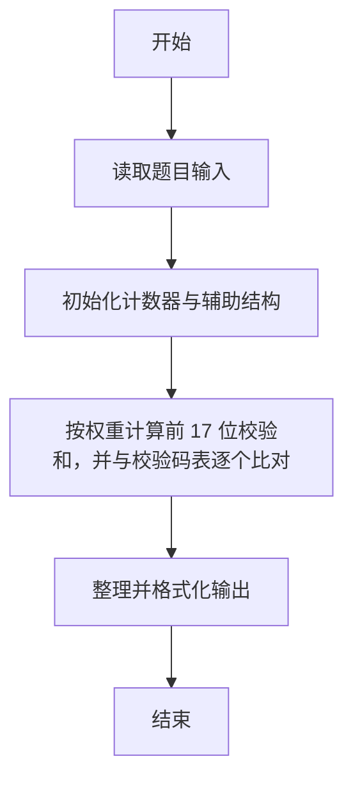
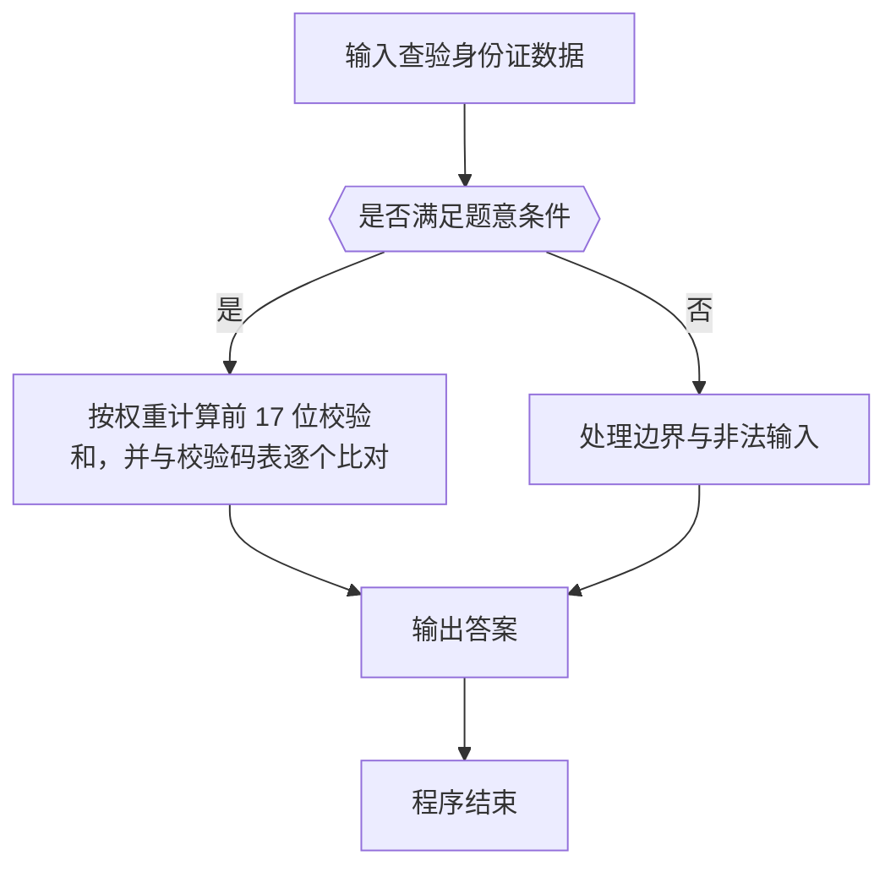

# 1031 查验身份证

- **分值：** 15分

### 题目描述

一个合法的身份证号码由17位地区、日期编号和顺序编号加1位校验码组成。校验码的计算规则如下：

首先对前17位数字加权求和，权重分配为：{7，9，10，5，8，4，2，1，6，3，7，9，10，5，8，4，2}；然后将计算的和对11取模得到值`Z`；最后按照以下关系对应`Z`值与校验码`M`的值：
```
Z：0 1 2 3 4 5 6 7 8 9 10
M：1 0 X 9 8 7 6 5 4 3 2
```
现在给定一些身份证号码，请你验证校验码的有效性，并输出有问题的号码。

### 输入格式：

输入第一行给出正整数 N（N ≤ 100），是输入的身份证号码的个数。随后 N 行，每行给出 1 个 18 位身份证号码。

### 输出格式：

按照输入的顺序每行输出1个有问题的身份证号码。这里并不检验前17位是否合理，只检查前17位是否全为数字且最后1位校验码计算准确。如果所有号码都正常，则输出`All passed`。

### 输入样例 1：
```
4
320124198808240056
12010X198901011234
110108196711301866
37070419881216001X
```

### 输出样例 1：
```
12010X198901011234
110108196711301866
37070419881216001X
```

### 输入样例 2：
```
2
320124198808240056
110108196711301862
```

### 输出样例 2：
```
All passed
```

**鸣谢阜阳师范学院范建中老师补充数据**

**鸣谢浙江工业大学之江学院石洗凡老师纠正数据**


### 解题思路

本题的核心是：按权重计算前 17 位校验和，并与校验码表逐个比对。程序先读取题目输入，再按照上述规则完成数据处理，最后严格按照题目要求输出结果。实现时应优先根据题目约束选择合适的数据类型和数据结构，避免溢出或不必要的重复计算。

时间复杂度为 O(n)；空间复杂度取决于输入规模，主要用于保存题目数据和中间结果。

### 代码流程说明

1. 读取 1031 查验身份证 所需的输入数据。
2. 初始化计数器、数组或其他辅助变量。
3. 按权重计算前 17 位校验和，并与校验码表逐个比对。
4. 按题目规定的格式输出计算结果。

### 代码实现

```r
# 实现原理：本题的核心是：按权重计算前 17 位校验和，并与校验码表逐个比对。程序先读取题目输入，再按照上述规则完成数据处理，最后严格按照题目要求输出结果。实现时应优先根据题目约束选择合适的数据类型和数据结构，避免溢出或不必要的重复计算。 时间复杂度为 O(n)；空间复杂度取决于输入规模，主要用于保存题目数据和中间结果。
# 代码按“读取输入—核心计算—格式化输出”的流程组织。

# 读取题目输入。
z<-scan(what=character(),quiet=TRUE)
n<-as.integer(z[1])
w<-c(7,9,10,5,8,4,2,1,6,3,7,9,10,5,8,4,2)
check<-'10X98765432'
bad<-character()
# 遍历数据并执行题目要求的处理。
for(i in seq_len(n)){
  s<-z[i+1]
  first<-substr(s,1,17)
  if(!grepl('^[0-9]{17}$',first)||!grepl('^[0-9X]$',substr(s,18,18)))bad<-c(bad,s)else{
    v<-as.integer(strsplit(first,'')[[1]])
    if(substr(check,sum(v*w)%%11+1,sum(v*w)%%11+1)!=substr(s,18,18))bad<-c(bad,s)
  }
}
# 按题目要求输出结果。
if(length(bad))cat(paste(bad,collapse='\n'),'\n',sep='')else cat('All passed\n')

```

### 代码流程图



### 解题流程图



### 常见易错点

- 注意输入范围与边界值，选择合适的数据类型。
- 循环与下标要严格对应题目定义，避免越界或漏算。
- 输出格式必须与题目要求完全一致，包括空格与换行。
- 输出格式必须与题目要求完全一致，包括空格、换行、大小写和特殊符号。
