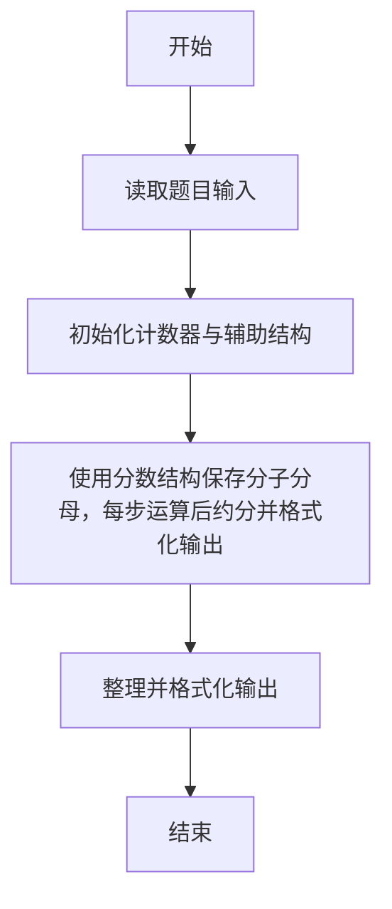
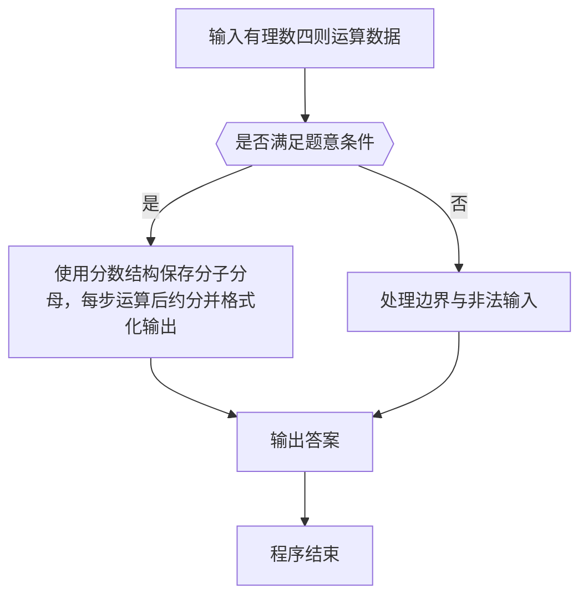

# 1034 有理数四则运算

- **分值：** 20分

### 题目描述

本题要求编写程序，计算 2 个有理数的和、差、积、商。

### 输入格式：

输入在一行中按照 `a1/b1 a2/b2` 的格式给出两个分数形式的有理数，其中分子和分母全是整型范围内的整数，负号只可能出现在分子前，分母不为 0。

### 输出格式：

分别在 4 行中按照 `有理数1 运算符 有理数2 = 结果` 的格式顺序输出 2 个有理数的和、差、积、商。注意输出的每个有理数必须是该有理数的最简形式 `k a/b`，其中 `k` 是整数部分，`a/b` 是最简分数部分；若为负数，则须加括号；若除法分母为 0，则输出 `Inf`。题目保证正确的输出中没有超过整型范围的整数。

### 输入样例 1：
```
2/3 -4/2
```

### 输出样例 1：
```
2/3 + (-2) = (-1 1/3)
2/3 - (-2) = 2 2/3
2/3 * (-2) = (-1 1/3)
2/3 / (-2) = (-1/3)
```

### 输入样例 2：
```
5/3 0/6
```

### 输出样例 2：
```
1 2/3 + 0 = 1 2/3
1 2/3 - 0 = 1 2/3
1 2/3 * 0 = 0
1 2/3 / 0 = Inf
```


### 解题思路

本题的核心是：使用分数结构保存分子分母，每步运算后约分并格式化输出。程序先读取题目输入，再按照上述规则完成数据处理，最后严格按照题目要求输出结果。实现时应优先根据题目约束选择合适的数据类型和数据结构，避免溢出或不必要的重复计算。

时间复杂度为 O(1)；空间复杂度取决于输入规模，主要用于保存题目数据和中间结果。

### 代码流程说明

1. 读取 1034 有理数四则运算 所需的输入数据。
2. 初始化计数器、数组或其他辅助变量。
3. 使用分数结构保存分子分母，每步运算后约分并格式化输出。
4. 按题目规定的格式输出计算结果。

### 代码实现

```r
# 实现原理：本题的核心是：使用分数结构保存分子分母，每步运算后约分并格式化输出。程序先读取题目输入，再按照上述规则完成数据处理，最后严格按照题目要求输出结果。实现时应优先根据题目约束选择合适的数据类型和数据结构，避免溢出或不必要的重复计算。 时间复杂度为 O(1)；空间复杂度取决于输入规模，主要用于保存题目数据和中间结果。
# 代码按“读取输入—核心计算—格式化输出”的流程组织。

# 读取题目输入。
z<-scan(what=character(),quiet=TRUE)
# 定义辅助函数，封装可复用的计算逻辑。
gcd<-function(a,b)if(b==0)a else Recall(b,a%%b)
# 定义辅助函数，封装可复用的计算逻辑。
parse<-function(s)as.numeric(strsplit(s,'/',fixed=TRUE)[[1]])
# 定义辅助函数，封装可复用的计算逻辑。
show<-function(x){
  if(x[1]==0)return('0')
  if(x[2]<0)x <- -x
  d<-gcd(abs(x[1]),x[2])
  x<-x/d
  neg<-x[1]<0
  num<-abs(x[1])
  value<-if(num%%x[2]==0)as.character(num%/%x[2])else if(num>x[2])paste0(num%/%x[2],' ',num%%x[2],'/',x[2])else paste0(num,'/',x[2])
  if(neg)paste0('(-',value,')')else value
}
a<-parse(z[1])
b<-parse(z[2])
ops<-list(c(a[1]*b[2]+b[1]*a[2],a[2]*b[2]),c(a[1]*b[2]-b[1]*a[2],a[2]*b[2]),c(a[1]*b[1],a[2]*b[2]),if(b[1]==0)c(0,1)else c(a[1]*b[2],a[2]*b[1]))
# 遍历数据并执行题目要求的处理。
for(i in 1:4)cat(show(a),c(' + ',' - ',' * ',' / ')[i],show(b),' = ',if(i==4&&b[1]==0)'Inf' else show(ops[[i]]),'\n',sep='')

```

### 代码流程图



### 解题流程图



### 常见易错点

- 输出格式必须与题目完全一致，包括空格、换行与单复数。
- 输出格式必须与题目要求完全一致，包括空格、换行、大小写和特殊符号。
