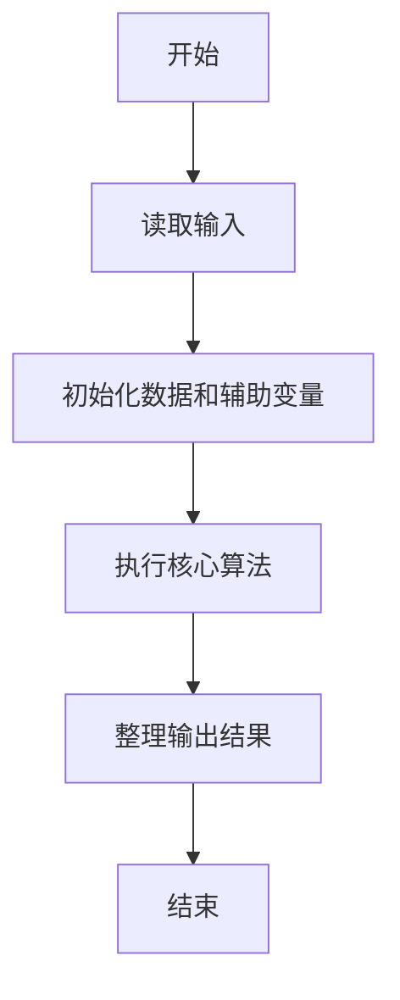
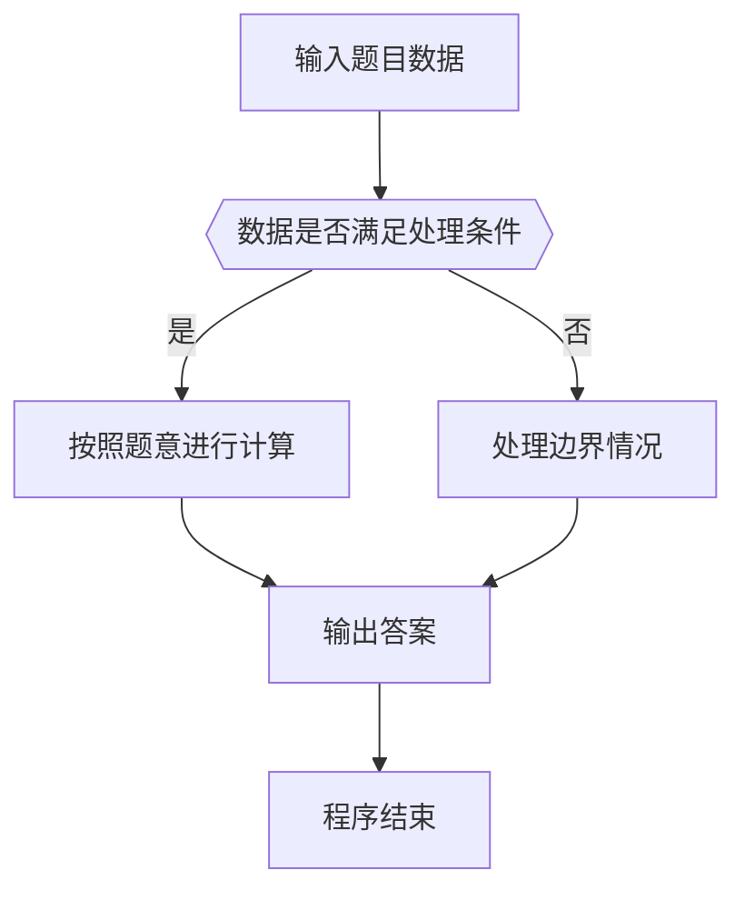

# 1044 火星数字

- **分值：** 20分

### 题目描述

火星人是以 13 进制计数的：

- 地球人的 0 被火星人称为 tret。
- 地球人数字 1 到 12 的火星文分别为：jan, feb, mar, apr, may, jun, jly, aug, sep, oct, nov, dec。
- 火星人将进位以后的 12 个高位数字分别称为：tam, hel, maa, huh, tou, kes, hei, elo, syy, lok, mer, jou。

例如地球人的数字 `29` 翻译成火星文就是 `hel mar`；而火星文 `elo nov` 对应地球数字 `115`。为了方便交流，请你编写程序实现地球和火星数字之间的互译。

### 输入格式：

输入第一行给出一个正整数 $N$（$N<100$），随后 $N$ 行，每行给出一个 $[0,169)$ 区间内的数字 —— 或者是地球文，或者是火星文。

### 输出格式：

对应输入的每一行，在一行中输出翻译后的另一种语言的数字。

### 输入样例：
```
4
29
5
elo nov
tam
```

### 输出样例：
```
hel mar
may
115
13
```


### 解题思路

本题的核心是：使用低位和高位火星数字表，在地球数与火星数之间按进制规则转换。程序先读取题目输入，再按照上述规则完成数据处理，最后严格按照题目要求输出结果。实现时应优先根据题目约束选择合适的数据类型和数据结构，避免溢出或不必要的重复计算。

时间复杂度为 O(L)；空间复杂度取决于输入规模，主要用于保存题目数据和中间结果。

### 代码流程说明

1. 读取 1044 火星数字 所需的输入数据。
2. 初始化计数器、数组或其他辅助变量。
3. 使用低位和高位火星数字表，在地球数与火星数之间按进制规则转换。
4. 按题目规定的格式输出计算结果。

### 代码实现

```r
# 实现原理：本题的核心是：使用低位和高位火星数字表，在地球数与火星数之间按进制规则转换。程序先读取题目输入，再按照上述规则完成数据处理，最后严格按照题目要求输出结果。实现时应优先根据题目约束选择合适的数据类型和数据结构，避免溢出或不必要的重复计算。 时间复杂度为 O(L)；空间复杂度取决于输入规模，主要用于保存题目数据和中间结果。
# 代码按“读取输入—核心计算—格式化输出”的流程组织。

# 读取题目输入。
lines<-readLines(file('stdin'),warn=FALSE)
n<-as.integer(lines[1])
lo<-c('tret','jan','feb','mar','apr','may','jun','jly','aug','sep','oct','nov','dec')
hi<-c('','tam','hel','maa','huh','tou','kes','hei','elo','syy','lok','mer','jou')
# 遍历数据并执行题目要求的处理。
for(line in lines[2:(n+1)]){
  line<-trimws(line)
  if(grepl('^[0-9]+$',line)){
    x<-as.integer(line)
    # 按题目要求输出结果。
    if(x<13)cat(lo[x+1])else if(x%%13==0)cat(hi[x%/%13+1])else cat(hi[x%/%13+1],lo[x%%13+1])
  }else{
  p<-strsplit(line,' ')[[1]]
  v<-if(p[1]%in%hi)(match(p[1],hi)-1)*13 else 0
  if(v==0)v<-match(p[1],lo)-1
  if(length(p)>1)v<-v*13+match(p[2],lo)-1
  # 按题目要求输出结果。
  cat(v)
}
# 按题目要求输出结果。
cat('\n')
}
```

### 代码流程图



### 解题流程图



### 常见易错点

- 注意输入数据的范围，选择足够大的整数类型，并正确处理边界值。
- 循环、数组下标和字符串结束位置要严格对应题目定义，避免越界。
- 输出格式必须与题目要求完全一致，包括空格、换行、大小写和特殊符号。
- 如果存在排序、去重、进位、约分或四舍五入等操作，应在输出前统一完成。
