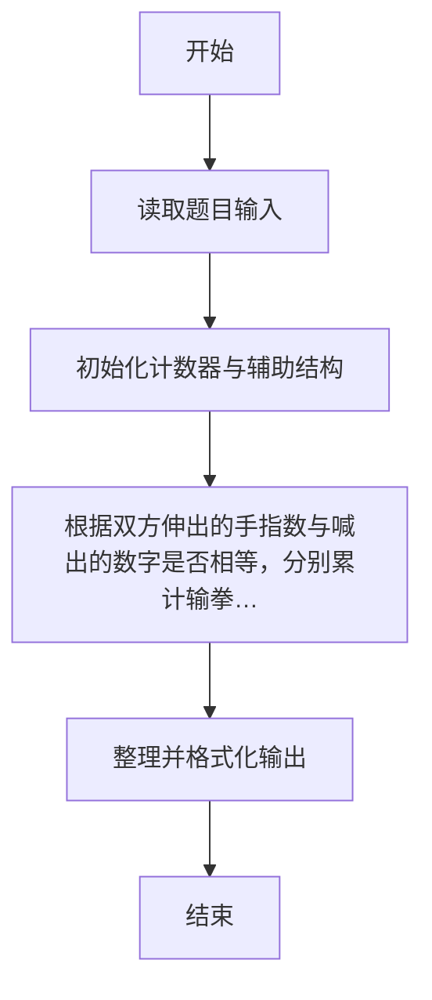
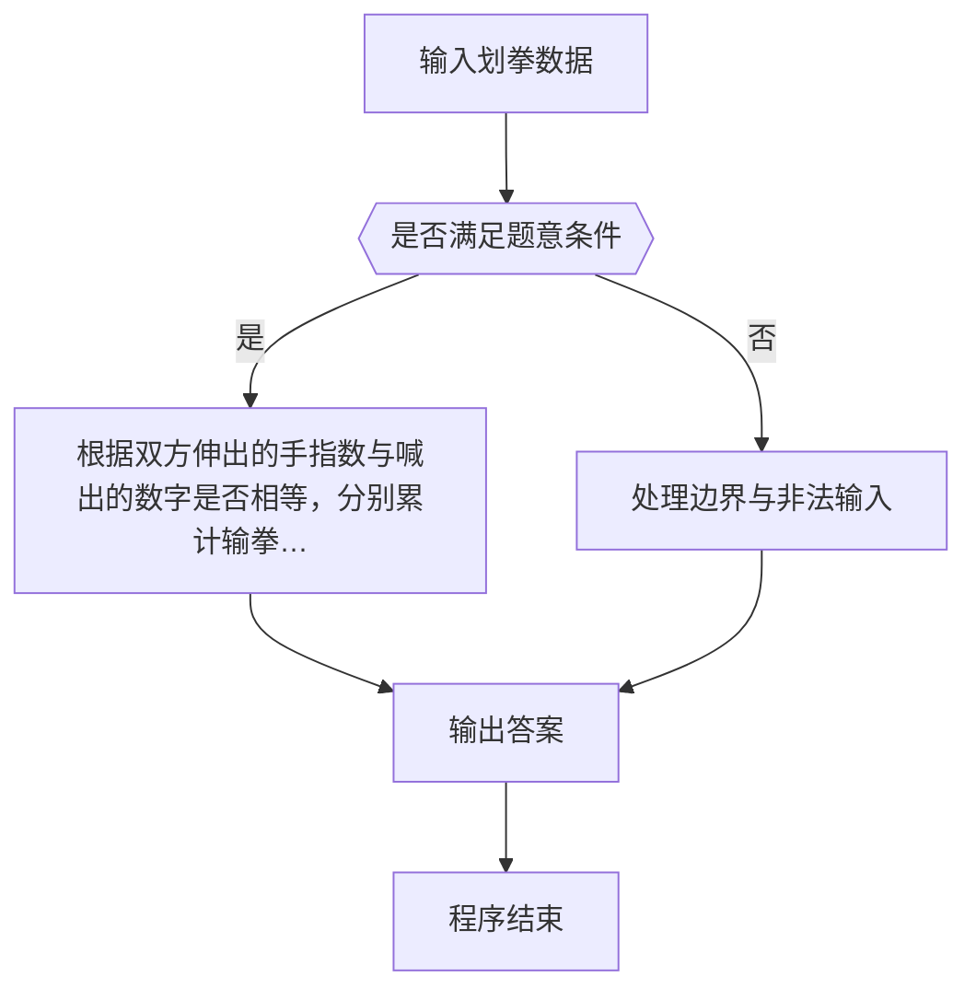

# 1046 划拳

- **分值：** 15分

### 题目描述

划拳是古老中国酒文化的一个有趣的组成部分。酒桌上两人划拳的方法为：每人口中喊出一个数字，同时用手比划出一个数字。如果谁比划出的数字正好等于两人喊出的数字之和，谁就赢了，输家罚一杯酒。两人同赢或两人同输则继续下一轮，直到唯一的赢家出现。

下面给出甲、乙两人的划拳记录，请你统计他们最后分别喝了多少杯酒。

### 输入格式：

输入第一行先给出一个正整数 N（≤ 100），随后 N 行，每行给出一轮划拳的记录，格式为：
```
甲喊 甲划 乙喊 乙划
```
其中`喊`是喊出的数字，`划`是划出的数字，均为不超过 100 的正整数（两只手一起划）。

### 输出格式：

在一行中先后输出甲、乙两人喝酒的杯数，其间以一个空格分隔。

### 输入样例：
```
5
8 10 9 12
5 10 5 10
3 8 5 12
12 18 1 13
4 16 12 15
```

### 输出样例：
```
1 2
```


### 解题思路

本题的核心是：根据双方伸出的手指数与喊出的数字是否相等，分别累计输拳次数。程序先读取题目输入，再按照上述规则完成数据处理，最后严格按照题目要求输出结果。实现时应优先根据题目约束选择合适的数据类型和数据结构，避免溢出或不必要的重复计算。

时间复杂度为 O(n)；空间复杂度取决于输入规模，主要用于保存题目数据和中间结果。

### 代码流程说明

1. 读取 1046 划拳 所需的输入数据。
2. 初始化计数器、数组或其他辅助变量。
3. 根据双方伸出的手指数与喊出的数字是否相等，分别累计输拳次数。
4. 按题目规定的格式输出计算结果。

### 代码实现

```r
# 实现原理：本题的核心是：根据双方伸出的手指数与喊出的数字是否相等，分别累计输拳次数。程序先读取题目输入，再按照上述规则完成数据处理，最后严格按照题目要求输出结果。实现时应优先根据题目约束选择合适的数据类型和数据结构，避免溢出或不必要的重复计算。 时间复杂度为 O(n)；空间复杂度取决于输入规模，主要用于保存题目数据和中间结果。
# 代码按“读取输入—核心计算—格式化输出”的流程组织。

# 读取题目输入。
z<-scan(what=integer(),quiet=TRUE)
n<-z[1]
a<-b<-0
at<-2
# 遍历数据并执行题目要求的处理。
for(i in seq_len(n)){
  x<-z[at]
  y<-z[at+1]
  u<-z[at+2]
  v<-z[at+3]
  at<-at+4
  s<-x+u
  if(y==s&&v!=s)b<-b+1 else if(v==s&&y!=s)a<-a+1
}
# 按题目要求输出结果。
cat(paste(a,b), '\n', sep='')

```

### 代码流程图



### 解题流程图



### 常见易错点

- 注意输入范围与边界值，选择合适的数据类型。
- 循环与下标要严格对应题目定义，避免越界或漏算。
- 输出格式必须与题目要求完全一致，包括空格与换行。
- 输出格式必须与题目要求完全一致，包括空格、换行、大小写和特殊符号。
