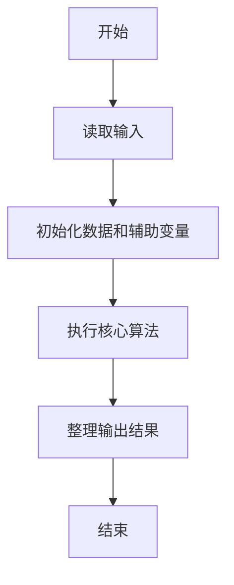
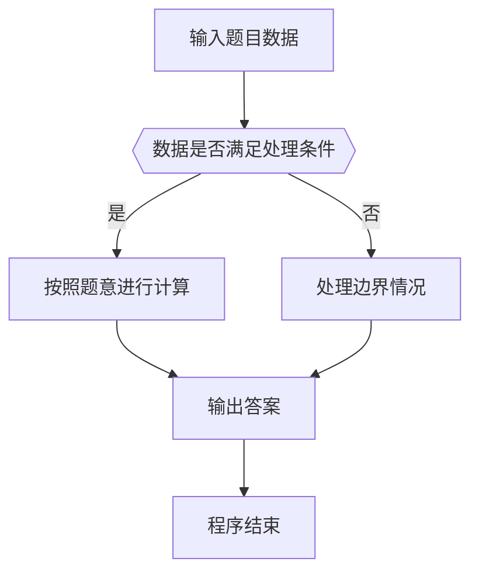

# 1047 编程团体赛

- **分值：** 20分

### 题目描述

编程团体赛的规则为：每个参赛队由若干队员组成；所有队员独立比赛；参赛队的成绩为所有队员的成绩和；成绩最高的队获胜。

现给定所有队员的比赛成绩，请你编写程序找出冠军队。

### 输入格式：

输入第一行给出一个正整数 $N$（$\le 10^4$），即所有参赛队员总数。随后 $N$ 行，每行给出一位队员的成绩，格式为：`队伍编号-队员编号 成绩`，其中`队伍编号`为 1 到 1000 的正整数，`队员编号`为 1 到 10 的正整数，`成绩`为 0 到 100 的整数。

### 输出格式：

在一行中输出冠军队的编号和总成绩，其间以一个空格分隔。注意：题目保证冠军队是唯一的。

### 输入样例：
```
6
3-10 99
11-5 87
102-1 0
102-3 100
11-9 89
3-2 61
```

### 输出样例：
```
11 176
```


### 解题思路

本题的核心是：按队伍汇总成员成绩，最后输出总成绩最高的队伍。程序先读取题目输入，再按照上述规则完成数据处理，最后严格按照题目要求输出结果。实现时应优先根据题目约束选择合适的数据类型和数据结构，避免溢出或不必要的重复计算。

时间复杂度为 O(n)；空间复杂度取决于输入规模，主要用于保存题目数据和中间结果。

### 代码流程说明

1. 读取 1047 编程团体赛 所需的输入数据。
2. 初始化计数器、数组或其他辅助变量。
3. 按队伍汇总成员成绩，最后输出总成绩最高的队伍。
4. 按题目规定的格式输出计算结果。

### 代码实现

```r
# 实现原理：本题的核心是：按队伍汇总成员成绩，最后输出总成绩最高的队伍。程序先读取题目输入，再按照上述规则完成数据处理，最后严格按照题目要求输出结果。实现时应优先根据题目约束选择合适的数据类型和数据结构，避免溢出或不必要的重复计算。 时间复杂度为 O(n)；空间复杂度取决于输入规模，主要用于保存题目数据和中间结果。
# 代码按“读取输入—核心计算—格式化输出”的流程组织。

# 读取题目输入。
z<-scan(what=character(),quiet=TRUE)
n<-as.integer(z[1])
score<-numeric(1000)
at<-2
# 遍历数据并执行题目要求的处理。
for(i in seq_len(n)){
  p<-strsplit(z[at],'-',fixed=TRUE)[[1]]
  id<-as.integer(p[1])
  score[id]<-score[id]+as.integer(z[at+1])
  at<-at+2
}
b<-which.max(score)
# 按题目要求输出结果。
cat(b,score[b],'\n')
```

### 代码流程图



### 解题流程图



### 常见易错点

- 注意输入数据的范围，选择足够大的整数类型，并正确处理边界值。
- 循环、数组下标和字符串结束位置要严格对应题目定义，避免越界。
- 输出格式必须与题目要求完全一致，包括空格、换行、大小写和特殊符号。
- 如果存在排序、去重、进位、约分或四舍五入等操作，应在输出前统一完成。
