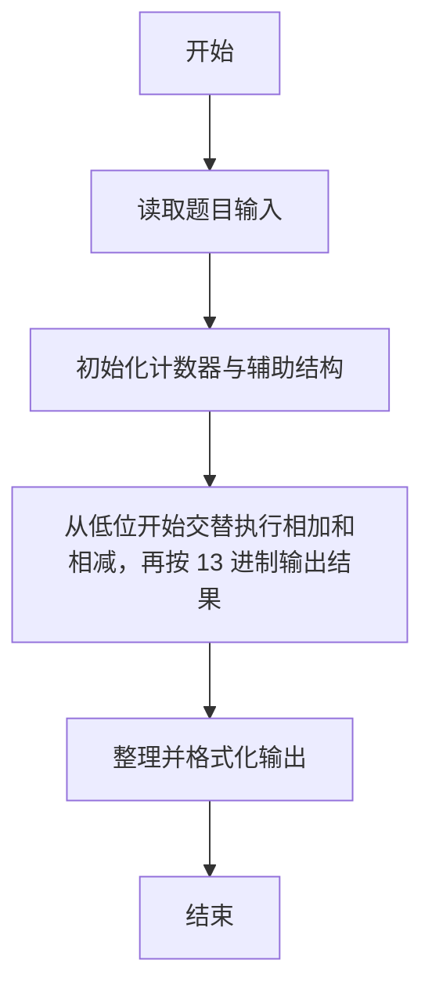
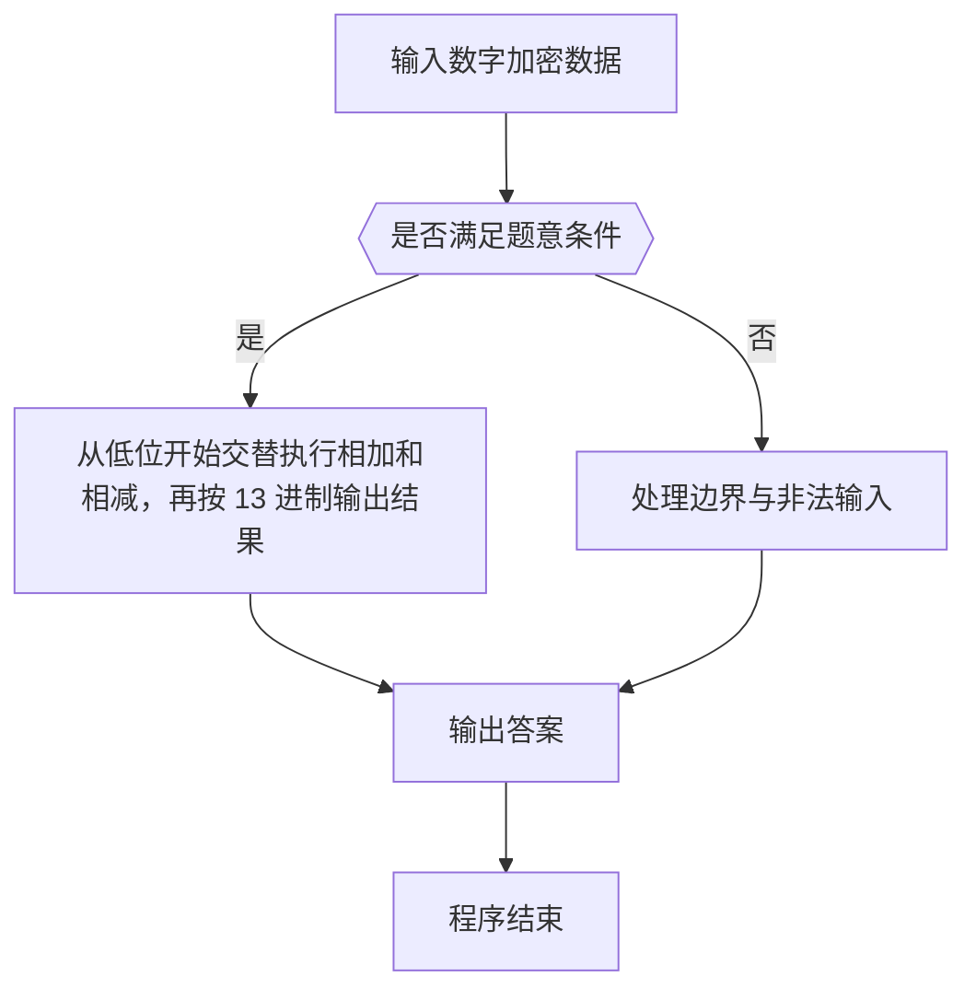

# 1048 数字加密

- **分值：** 20分

### 题目描述

本题要求实现一种数字加密方法。首先固定一个加密用正整数 A，对任一正整数 B，将其每一位数字与 A 的对应位置上的数字进行以下运算：对奇数位，对应位的数字相加后对 13 取余——这里用 J 代表 10、Q 代表 11、K 代表 12；对偶数位，用 B 的数字减去 A 的数字，若结果为负数，则再加 10。这里令个位为第 1 位。

### 输入格式：

输入在一行中依次给出 A 和 B，均为不超过 100 位的正整数，其间以空格分隔。

### 输出格式：

在一行中输出加密后的结果。

### 输入样例：
```
1234567 368782971
```

### 输出样例：
```
3695Q8118
```


### 解题思路

本题的核心是：从低位开始交替执行相加和相减，再按 13 进制输出结果。程序先读取题目输入，再按照上述规则完成数据处理，最后严格按照题目要求输出结果。实现时应优先根据题目约束选择合适的数据类型和数据结构，避免溢出或不必要的重复计算。

时间复杂度为 O(L)；空间复杂度取决于输入规模，主要用于保存题目数据和中间结果。

### 代码流程说明

1. 读取 1048 数字加密 所需的输入数据。
2. 初始化计数器、数组或其他辅助变量。
3. 从低位开始交替执行相加和相减，再按 13 进制输出结果。
4. 按题目规定的格式输出计算结果。

### 代码实现

```r
# 实现原理：本题的核心是：从低位开始交替执行相加和相减，再按 13 进制输出结果。程序先读取题目输入，再按照上述规则完成数据处理，最后严格按照题目要求输出结果。实现时应优先根据题目约束选择合适的数据类型和数据结构，避免溢出或不必要的重复计算。 时间复杂度为 O(L)；空间复杂度取决于输入规模，主要用于保存题目数据和中间结果。
# 代码按“读取输入—核心计算—格式化输出”的流程组织。

# 读取题目输入。
z<-scan(what=character(),quiet=TRUE)
a<-strsplit(z[1],'')[[1]]
b<-strsplit(z[2],'')[[1]]
l<-max(length(a),length(b))
out<-character(l)
# 遍历数据并执行题目要求的处理。
for(i in 0:(l-1)){
  x<-if(i<length(a))as.integer(a[length(a)-i])else 0
  y<-if(i<length(b))as.integer(b[length(b)-i])else 0
  v<-if(i%%2==0)(x+y)%%13 else (y-x+10)%%10
  out[l-i]<-if(v<10)as.character(v)else c('J','Q','K')[v-9]
}
# 按题目要求输出结果。
cat(paste(out,collapse=''), '\n', sep='')

```

### 代码流程图



### 解题流程图



### 常见易错点

- 输出格式必须与题目完全一致，包括空格、换行与单复数。
- 输出格式必须与题目要求完全一致，包括空格、换行、大小写和特殊符号。
