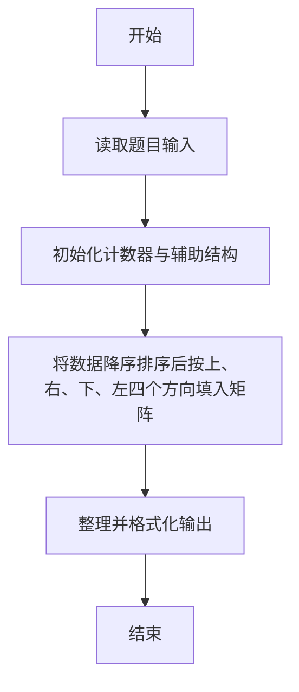
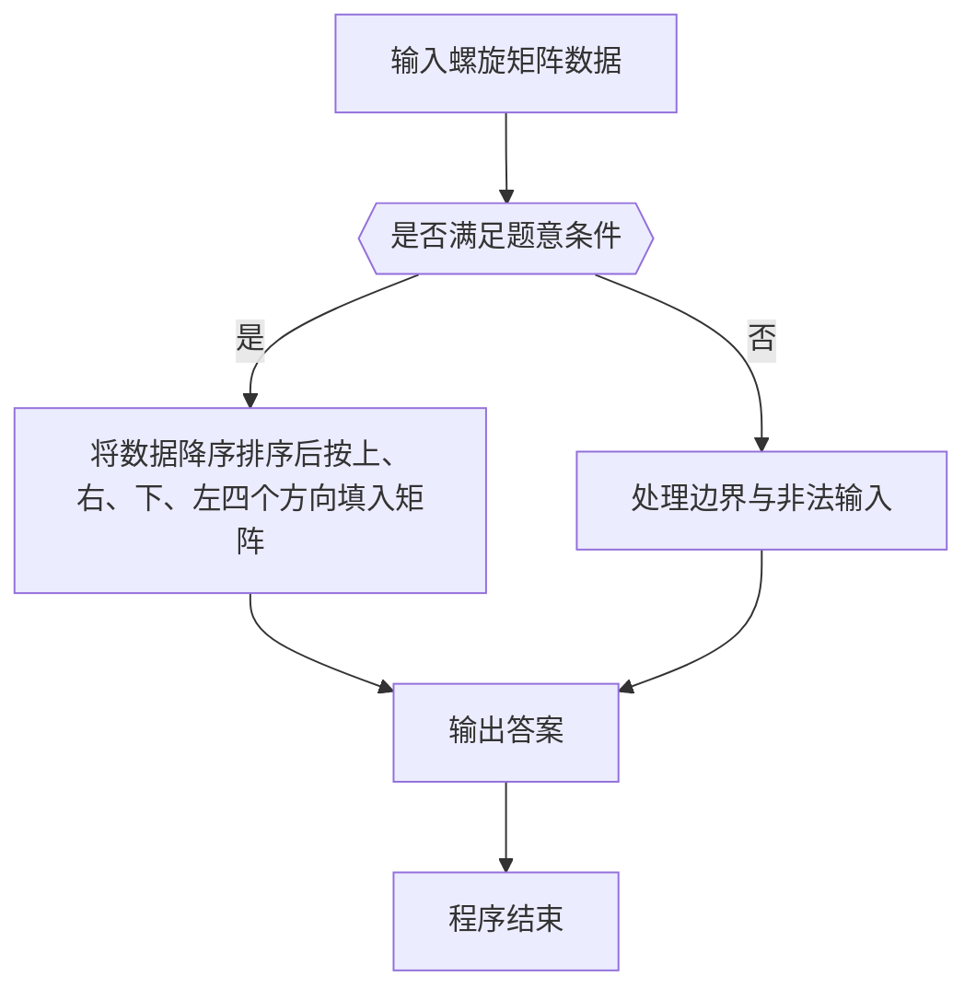

# 1050 螺旋矩阵

- **分值：** 25分

### 题目描述

本题要求将给定的 N 个正整数按非递增的顺序，填入“螺旋矩阵”。所谓“螺旋矩阵”，是指从左上角第 1 个格子开始，按顺时针螺旋方向填充。要求矩阵的规模为 m 行 n 列，满足条件：m × n 等于 N；m ≥ n；且 m-n 取所有可能值中的最小值。

### 输入格式：

输入在第 1 行中给出一个正整数 N，第 2 行给出 N 个待填充的正整数。所有数字不超过 10^4，相邻数字以空格分隔。

### 输出格式：

输出螺旋矩阵。每行 n 个数字，共 m 行。相邻数字以 1 个空格分隔，行末不得有多余空格。

### 输入样例：
```
12
37 76 20 98 76 42 53 95 60 81 58 93
```

### 输出样例：
```
98 95 93
42 37 81
53 20 76
58 60 76
```


### 解题思路

本题的核心是：将数据降序排序后按上、右、下、左四个方向填入矩阵。程序先读取题目输入，再按照上述规则完成数据处理，最后严格按照题目要求输出结果。实现时应优先根据题目约束选择合适的数据类型和数据结构，避免溢出或不必要的重复计算。

时间复杂度为 O(n log n)；空间复杂度取决于输入规模，主要用于保存题目数据和中间结果。

### 代码流程说明

1. 读取 1050 螺旋矩阵 所需的输入数据。
2. 初始化计数器、数组或其他辅助变量。
3. 将数据降序排序后按上、右、下、左四个方向填入矩阵。
4. 按题目规定的格式输出计算结果。

### 代码实现

```r
# 实现原理：本题的核心是：将数据降序排序后按上、右、下、左四个方向填入矩阵。程序先读取题目输入，再按照上述规则完成数据处理，最后严格按照题目要求输出结果。实现时应优先根据题目约束选择合适的数据类型和数据结构，避免溢出或不必要的重复计算。 时间复杂度为 O(n log n)；空间复杂度取决于输入规模，主要用于保存题目数据和中间结果。
# 代码按“读取输入—核心计算—格式化输出”的流程组织。

# 读取题目输入。
z<-scan(what=integer(),quiet=TRUE)
n<-z[1]
a<-sort(z[2:(n+1)],decreasing=TRUE)
cols<-max((1:floor(sqrt(n)))[n%%(1:floor(sqrt(n)))==0])
rows<-n%/%cols
mat<-matrix(0,rows,cols)
top<-1
bottom<-rows
left<-1
right<-cols
t<-1
# 按题意重复处理，直到满足结束条件。
while(top<=bottom&&left<=right){
  for(j in left:right){
    mat[top,j]<-a[t]
    t<-t+1
  }
  top<-top+1
  if(top<=bottom){
    for(i in top:bottom){
      mat[i,right]<-a[t]
      t<-t+1
    }
    right<-right-1
  }
  if(top<=bottom&&left<=right){
    for(j in right:left){
      mat[bottom,j]<-a[t]
      t<-t+1
    }
    bottom<-bottom-1
  }
  if(top<=bottom&&left<=right){
    for(i in bottom:top){
      mat[i,left]<-a[t]
      t<-t+1
    }
    left<-left+1
  }
}
# 遍历数据并执行题目要求的处理。
for(i in 1:rows)cat(paste(mat[i,],collapse=' '), '\n', sep='')

```

### 代码流程图



### 解题流程图



### 常见易错点

- 排序与并列名次规则要严格按题意，注意稳定顺序与并列处理。
- 输出格式必须与题目要求完全一致，包括空格、换行、大小写和特殊符号。
