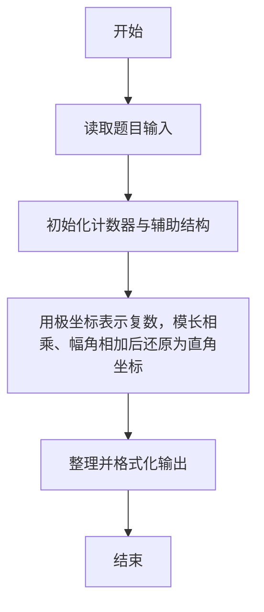
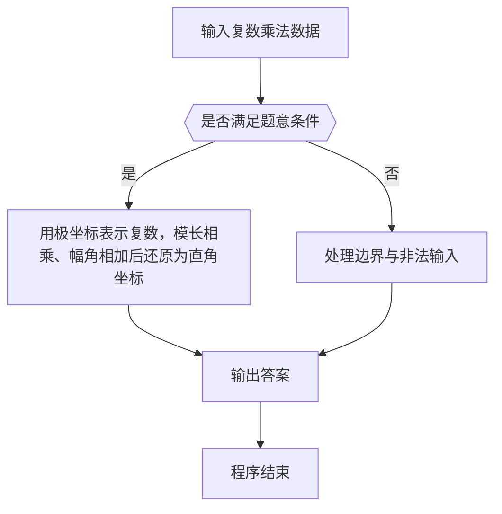

# 1051 复数乘法

- **分值：** 15分

### 题目描述

复数可以写成 (A + Bi) 的常规形式，其中 A 是实部，B 是虚部，i 是虚数单位，满足 i^2 = -1；也可以写成极坐标下的指数形式 (R × e^(Pi))，其中 R 是复数模，P 是辐角，i 是虚数单位，其等价于三角形式 R(cos (P) + i sin (P))。

现给定两个复数的 R 和 P，要求输出两数乘积的常规形式。

### 输入格式：

输入在一行中依次给出两个非零复数的 R_1, P_1, R_2, P_2，数字间以空格分隔。

### 输出格式：

在一行中按照 `A+Bi` 的格式输出两数乘积的常规形式，实部和虚部均保留 2 位小数。注意：如果 `B` 是负数，则应该写成 `A-|B|i` 的形式。

### 输入样例：
```
2.3 3.5 5.2 0.4
```

### 输出样例：
```
-8.68-8.23i
```

**鸣谢福建医科大学刘睿妤同学修正题面！**


### 解题思路

本题的核心是：用极坐标表示复数，模长相乘、幅角相加后还原为直角坐标。程序先读取题目输入，再按照上述规则完成数据处理，最后严格按照题目要求输出结果。实现时应优先根据题目约束选择合适的数据类型和数据结构，避免溢出或不必要的重复计算。

时间复杂度为 O(1)；空间复杂度取决于输入规模，主要用于保存题目数据和中间结果。

### 代码流程说明

1. 读取 1051 复数乘法 所需的输入数据。
2. 初始化计数器、数组或其他辅助变量。
3. 用极坐标表示复数，模长相乘、幅角相加后还原为直角坐标。
4. 按题目规定的格式输出计算结果。

### 代码实现

```r
# 实现原理：本题的核心是：用极坐标表示复数，模长相乘、幅角相加后还原为直角坐标。程序先读取题目输入，再按照上述规则完成数据处理，最后严格按照题目要求输出结果。实现时应优先根据题目约束选择合适的数据类型和数据结构，避免溢出或不必要的重复计算。 时间复杂度为 O(1)；空间复杂度取决于输入规模，主要用于保存题目数据和中间结果。
# 代码按“读取输入—核心计算—格式化输出”的流程组织。

# 读取题目输入。
z<-scan(what=numeric(),quiet=TRUE)
r1<-z[1]
p1<-z[2]
r2<-z[3]
p2<-z[4]
x<-r1*r2*cos(p1+p2)
y<-r1*r2*sin(p1+p2)
if(abs(x)<.005)x<-0
if(abs(y)<.005)y<-0
# 按题目要求输出结果。
cat(sprintf('%.2f%+.2fi\n',x,y))

```

### 代码流程图



### 解题流程图



### 常见易错点

- 注意输入范围与边界值，选择合适的数据类型。
- 循环与下标要严格对应题目定义，避免越界或漏算。
- 输出格式必须与题目要求完全一致，包括空格与换行。
- 输出格式必须与题目要求完全一致，包括空格、换行、大小写和特殊符号。
