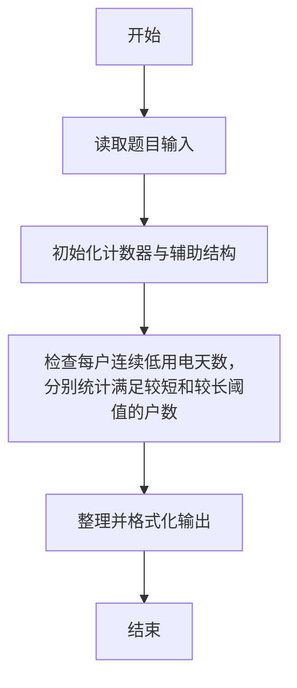
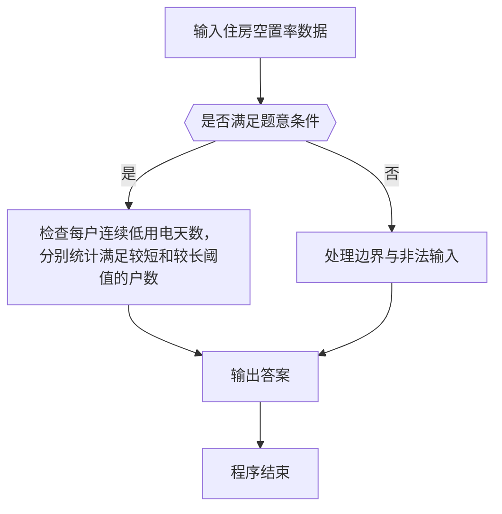

# 1053 住房空置率

- **分值：** 20分

### 题目描述

在不打扰居民的前提下，统计住房空置率的一种方法是根据每户用电量的连续变化规律进行判断。判断方法如下：

- 在观察期内，若存在超过一半的日子用电量低于某给定的阈值 e，则该住房为“可能空置”；

- 若观察期超过某给定阈值 D 天，且满足上一个条件，则该住房为“空置”。

现给定某居民区的住户用电量数据，请你统计“可能空置”的比率和“空置”比率，即以上两种状态的住房占居民区住房总套数的百分比。

### 输入格式：

输入第一行给出正整数 N（≤ 1000），为居民区住房总套数；正实数 e，即低电量阈值；正整数 D，即观察期阈值。随后 N 行，每行按以下格式给出一套住房的用电量数据：

K E_1 E_2 ⋯ E_K

其中 K 为观察的天数，E_i 为第 i 天的用电量。

### 输出格式：

在一行中输出“可能空置”的比率和“空置”比率的百分比值，其间以一个空格分隔，保留小数点后 1 位。

### 输入样例：
```
5 0.5 10
6 0.3 0.4 0.5 0.2 0.8 0.6
10 0.0 0.1 0.2 0.3 0.0 0.8 0.6 0.7 0.0 0.5
5 0.4 0.3 0.5 0.1 0.7
11 0.1 0.1 0.1 0.1 0.1 0.1 0.1 0.1 0.1 0.1 0.1
11 2 2 2 1 1 0.1 1 0.1 0.1 0.1 0.1
```

### 输出样例：
```
40.0% 20.0%
```

（样例解释：第2、3户为“可能空置”，第4户为“空置”，其他户不是空置。）


### 解题思路

本题的核心是：检查每户连续低用电天数，分别统计满足较短和较长阈值的户数。程序先读取题目输入，再按照上述规则完成数据处理，最后严格按照题目要求输出结果。实现时应优先根据题目约束选择合适的数据类型和数据结构，避免溢出或不必要的重复计算。

时间复杂度为 O(nD)；空间复杂度取决于输入规模，主要用于保存题目数据和中间结果。

### 代码流程说明

1. 读取 1053 住房空置率 所需的输入数据。
2. 初始化计数器、数组或其他辅助变量。
3. 检查每户连续低用电天数，分别统计满足较短和较长阈值的户数。
4. 按题目规定的格式输出计算结果。

### 代码实现

```r
# 实现原理：本题的核心是：检查每户连续低用电天数，分别统计满足较短和较长阈值的户数。程序先读取题目输入，再按照上述规则完成数据处理，最后严格按照题目要求输出结果。实现时应优先根据题目约束选择合适的数据类型和数据结构，避免溢出或不必要的重复计算。 时间复杂度为 O(nD)；空间复杂度取决于输入规模，主要用于保存题目数据和中间结果。
# 代码按“读取输入—核心计算—格式化输出”的流程组织。

# 读取题目输入。
z<-scan(what=numeric(),quiet=TRUE)
n<-z[1]
e<-z[2]
d<-z[3]
at<-4
sh<-lo<-0
# 遍历数据并执行题目要求的处理。
for(i in seq_len(n)){
  k<-z[at]
  x<-z[(at+1):(at+k)]
  at<-at+k+1
  low<-sum(x<e)
  if(low*2>k){
    if(k>d)lo<-lo+1 else sh<-sh+1
  }
}
# 按题目要求输出结果。
cat(sprintf('%.1f%% %.1f%%\n',100*sh/n,100*lo/n))

```

### 代码流程图



### 解题流程图



### 常见易错点

- 注意输入范围与边界值，选择合适的数据类型。
- 循环与下标要严格对应题目定义，避免越界或漏算。
- 输出格式必须与题目要求完全一致，包括空格与换行。
- 输出格式必须与题目要求完全一致，包括空格、换行、大小写和特殊符号。
