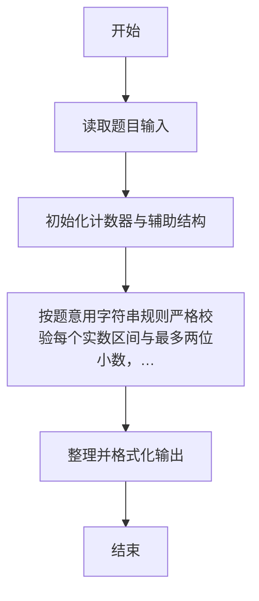
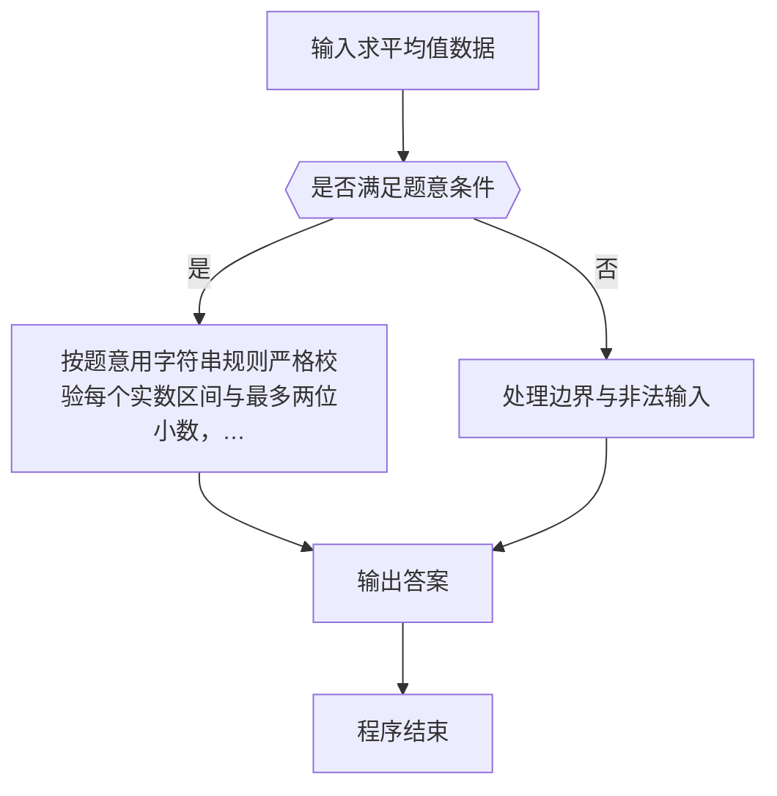

# 1054 求平均值

- **分值：** 20分

### 题目描述

本题的基本要求非常简单：给定 N 个实数，计算它们的平均值。但复杂的是有些输入数据可能是非法的。一个“合法”的输入是 [-1000, 1000] 区间内的实数，并且最多精确到小数点后 2 位。当你计算平均值的时候，不能把那些非法的数据算在内。

### 输入格式：

输入第一行给出正整数 N（≤ 100）。随后一行给出 N 个实数，数字间以一个空格分隔。

### 输出格式：

对每个非法输入，在一行中输出 `ERROR: X is not a legal number`，其中 `X` 是输入。最后在一行中输出结果：`The average of K numbers is Y`，其中 `K` 是合法输入的个数，`Y` 是它们的平均值，精确到小数点后 2 位。如果平均值无法计算，则用 `Undefined` 替换 `Y`。如果 `K` 为 1，则输出 `The average of 1 number is Y`。

### 输入样例 1：
```
7
5 -3.2 aaa 9999 2.3.4 7.123 2.35
```

### 输出样例 1：
```
ERROR: aaa is not a legal number
ERROR: 9999 is not a legal number
ERROR: 2.3.4 is not a legal number
ERROR: 7.123 is not a legal number
The average of 3 numbers is 1.38
```

### 输入样例 2：
```
2
aaa -9999
```

### 输出样例 2：
```
ERROR: aaa is not a legal number
ERROR: -9999 is not a legal number
The average of 0 numbers is Undefined
```


### 解题思路

本题的核心是：按题意用字符串规则严格校验每个实数（区间与最多两位小数），再对合法输入求平均值。程序先读取题目输入，再按照上述规则完成数据处理，最后严格按照题目要求输出结果。实现时应优先根据题目约束选择合适的数据类型和数据结构，避免溢出或不必要的重复计算。

时间复杂度为 O(n)；空间复杂度取决于输入规模，主要用于保存题目数据和中间结果。

### 代码流程说明

1. 读取 1054 求平均值 所需的输入数据。
2. 初始化计数器、数组或其他辅助变量。
3. 用字符串规则严格校验输入，验证区间与最多两位小数后统计合法数的平均值。
4. 按题目规定的格式输出计算结果。

### 代码实现

```r
# 实现原理：本题的核心是：按题意用字符串规则严格校验每个实数（区间与最多两位小数），再对合法输入求平均值。程序先读取题目输入，再按照上述规则完成数据处理，最后严格按照题目要求输出结果。实现时应优先根据题目约束选择合适的数据类型和数据结构，避免溢出或不必要的重复计算。 时间复杂度为 O(n)；空间复杂度取决于输入规模，主要用于保存题目数据和中间结果。
# 代码按“读取输入—核心计算—格式化输出”的流程组织。

# 读取题目输入。
z<-scan(what=character(),quiet=TRUE)
n<-as.integer(z[1])
sumv<-0
good<-0
# 遍历数据并执行题目要求的处理。
for(s in z[2:(n+1)]){
  v<-suppressWarnings(as.numeric(s))
  p<-sub('^[+-]','',s)
  parts<-strsplit(p,'\\.',fixed=FALSE)[[1]]
  num_ok<-grepl('^[+-]?[0-9]+(\\.[0-9]+)?$',s)
  valid<-num_ok&&!is.na(v)&&v>=-1000&&v<=1000&&length(parts)<=2&&(length(parts)==1||nchar(parts[2])>=1&&nchar(parts[2])<=2)
  # 按题目要求输出结果。
  if(!valid)cat('ERROR: ',s,' is not a legal number\n',sep='')else{
    sumv<-sumv+v
    good<-good+1
  }
}
# 按题目要求输出结果；K=1 时用 number 单数。
if(good==0)cat('The average of 0 numbers is Undefined\n')else if(good==1)cat(sprintf('The average of 1 number is %.2f\n',sumv/good))else cat(sprintf('The average of %d numbers is %.2f\n',good,sumv/good))

```

### 代码流程图



### 解题流程图



### 常见易错点

- 大整数或超长串不要用浮点/普通整型硬算，应按字符串或高精度处理。
- 浮点输出注意保留位数与四舍五入，非法数据不要计入统计。
- 输出格式必须与题目要求完全一致，包括空格、换行、大小写和特殊符号。
