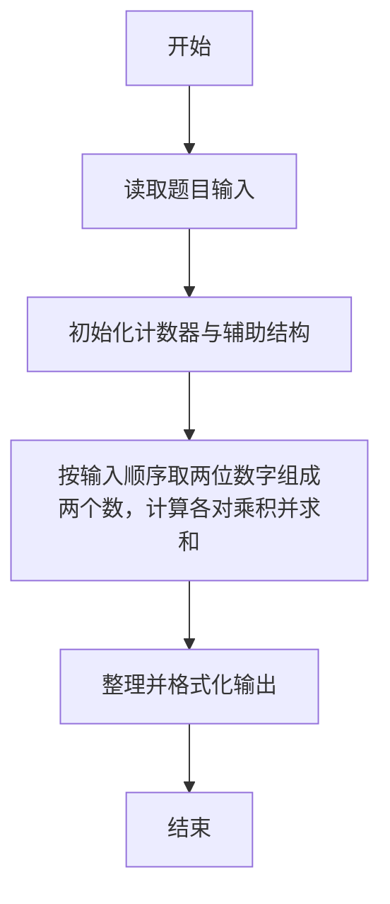
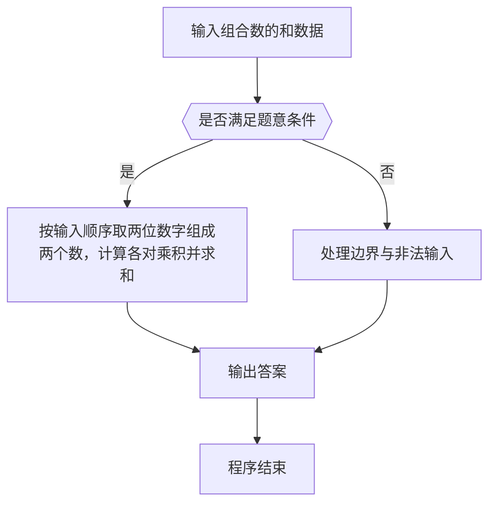

# 1056 组合数的和

- **分值：** 15分

### 题目描述

给定 N 个非 0 的个位数字，用其中任意 2 个数字都可以组合成 1 个 2 位的数字。要求所有可能组合出来的 2 位数字的和。例如给定 2、5、8，则可以组合出：25、28、52、58、82、85，它们的和为330。

### 输入格式：

输入在一行中先给出 N（1 < N<10），随后给出 N 个不同的非 0 个位数字。数字间以空格分隔。

### 输出格式：

输出所有可能组合出来的2位数字的和。

### 输入样例：
```
3 2 8 5
```

### 输出样例：
```
330
```


### 解题思路

本题的核心是：按输入顺序取两位数字组成两个数，计算各对乘积并求和。程序先读取题目输入，再按照上述规则完成数据处理，最后严格按照题目要求输出结果。实现时应优先根据题目约束选择合适的数据类型和数据结构，避免溢出或不必要的重复计算。

时间复杂度为 O(n²)；空间复杂度为 O(n)。

### 代码流程说明

1. 读取 1056 组合数的和 所需的输入数据。
2. 初始化计数器、数组或其他辅助变量。
3. 按输入顺序取两位数字组成两个数，计算各对乘积并求和。
4. 按题目规定的格式输出计算结果。

### 代码实现

```r
# 实现原理：本题的核心是：按输入顺序取两位数字组成两个数，计算各对乘积并求和。程序先读取题目输入，再按照上述规则完成数据处理，最后严格按照题目要求输出结果。实现时应优先根据题目约束选择合适的数据类型和数据结构，避免溢出或不必要的重复计算。 时间复杂度为 O(n²)；空间复杂度为 O(n)。
# 代码按“读取输入—核心计算—格式化输出”的流程组织。

# 读取题目输入。
z<-scan(what=integer(),quiet=TRUE)
n<-z[1]
a<-z[2:(n+1)]
ans<-0
# 遍历数据并执行题目要求的处理。
for(i in seq_len(n))for(j in seq_len(n))if(i!=j)ans<-ans+a[i]*10+a[j]
# 按题目要求输出结果。
cat(ans, '\n', sep='')

```

### 代码流程图



### 解题流程图



### 常见易错点

- 注意输入范围与边界值，选择合适的数据类型。
- 循环与下标要严格对应题目定义，避免越界或漏算。
- 输出格式必须与题目要求完全一致，包括空格与换行。
- 输出格式必须与题目要求完全一致，包括空格、换行、大小写和特殊符号。
