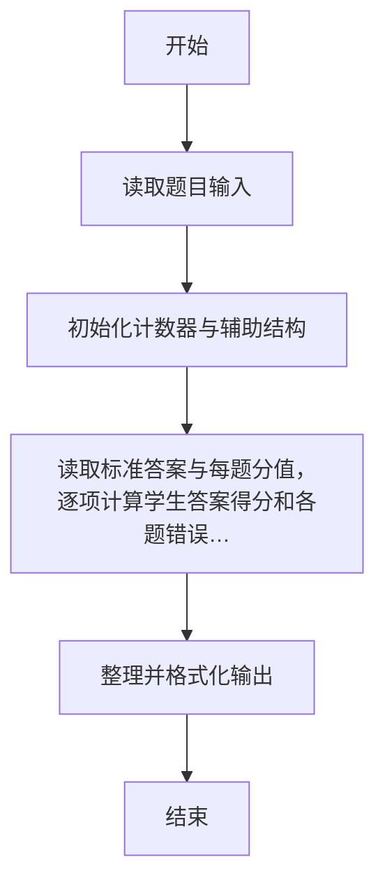
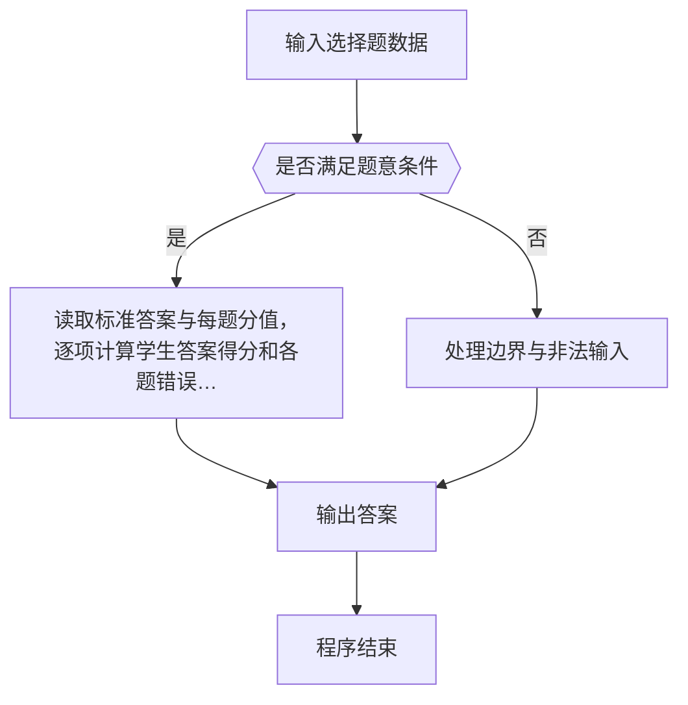

# 1058 选择题

- **分值：** 20分

### 题目描述

批改多选题是比较麻烦的事情，本题就请你写个程序帮助老师批改多选题，并且指出哪道题错的人最多。

### 输入格式：

输入在第一行给出两个正整数 N（N ≤ 1000）和 M（M ≤ 100），分别是学生人数和多选题的个数。随后 M 行，每行顺次给出一道题的满分值（不超过 5 的正整数）、选项个数（不少于 2 且不超过 5 的正整数）、正确选项个数（不超过选项个数的正整数）、所有正确选项。注意每题的选项从小写英文字母 a 开始顺次排列。各项间以 1 个空格分隔。最后 N 行，每行给出一个学生的答题情况，其每题答案格式为 `(选中的选项个数 选项1 ……)`，按题目顺序给出。注意：题目保证学生的答题情况是合法的，即不存在选中的选项数超过实际选项数的情况。

### 输出格式：

按照输入的顺序给出每个学生的得分，每个分数占一行。注意判题时只有选择全部正确才能得到该题的分数。最后一行输出错得最多的题目的错误次数和编号（题目按照输入的顺序从 1 开始编号）。如果有并列，则按编号递增顺序输出。数字间用空格分隔，行首尾不得有多余空格。如果所有题目都没有人错，则在最后一行输出 `Too simple`。

### 输入样例：
```
3 4
3 4 2 a c
2 5 1 b
5 3 2 b c
1 5 4 a b d e
(2 a c) (2 b d) (2 a c) (3 a b e)
(2 a c) (1 b) (2 a b) (4 a b d e)
(2 b d) (1 e) (2 b c) (4 a b c d)
```

### 输出样例：
```
3
6
5
2 2 3 4
```


### 解题思路

本题的核心是：读取标准答案与每题分值，逐项计算学生答案得分和各题错误人数。程序先读取题目输入，再按照上述规则完成数据处理，最后严格按照题目要求输出结果。实现时应优先根据题目约束选择合适的数据类型和数据结构，避免溢出或不必要的重复计算。

时间复杂度为 O(nm)；空间复杂度取决于输入规模，主要用于保存题目数据和中间结果。

### 代码流程说明

1. 读取 1058 选择题 所需的输入数据。
2. 初始化计数器、数组或其他辅助变量。
3. 读取标准答案与每题分值，逐项计算学生答案得分和各题错误人数。
4. 按题目规定的格式输出计算结果。

### 代码实现

```r
# 实现原理：本题的核心是：读取标准答案与每题分值，逐项计算学生答案得分和各题错误人数。程序先读取题目输入，再按照上述规则完成数据处理，最后严格按照题目要求输出结果。实现时应优先根据题目约束选择合适的数据类型和数据结构，避免溢出或不必要的重复计算。 时间复杂度为 O(nm)；空间复杂度取决于输入规模，主要用于保存题目数据和中间结果。
# 代码按“读取输入—核心计算—格式化输出”的流程组织。

# 读取题目输入。
lines<-readLines(file('stdin'),warn=FALSE)
tok<-strsplit(gsub('[()]',' ',paste(lines,collapse=' ')),' +')[[1]]
tok<-tok[nzchar(tok)]
at<-1
n<-as.integer(tok[at])
m<-as.integer(tok[at+1])
at<-at+2
score<-numeric(m)
ans<-vector('list',m)
wrong<-integer(m)
# 遍历数据并执行题目要求的处理。
for(i in seq_len(m)){
  score[i]<-as.numeric(tok[at])
  k<-as.integer(tok[at+1])
  cc<-as.integer(tok[at+2])
  at<-at+3
  ans[[i]]<-tok[at:(at+cc-1)]
  at<-at+cc
}
# 遍历数据并执行题目要求的处理。
for(q in seq_len(n)){
  total<-0
  # 遍历数据并执行题目要求的处理。
  for(i in seq_len(m)){
    k<-as.integer(tok[at])
    got<-if(k)tok[(at+1):(at+k)]else character()
    at<-at+k+1
    if(k==length(ans[[i]])&&setequal(got,ans[[i]]))total<-total+score[i]else wrong[i]<-wrong[i]+1
  }
# 按题目要求输出结果。
cat(total, '\n', sep='')
}
mx<-max(wrong)
# 按题目要求输出结果。
if(mx==0)cat('Too simple\n')else cat(paste(mx,paste(which(wrong==mx),collapse=' ')),'\n',sep='')

```

### 代码流程图



### 解题流程图



### 常见易错点

- 注意输入范围与边界值，选择合适的数据类型。
- 循环与下标要严格对应题目定义，避免越界或漏算。
- 输出格式必须与题目要求完全一致，包括空格与换行。
- 输出格式必须与题目要求完全一致，包括空格、换行、大小写和特殊符号。
