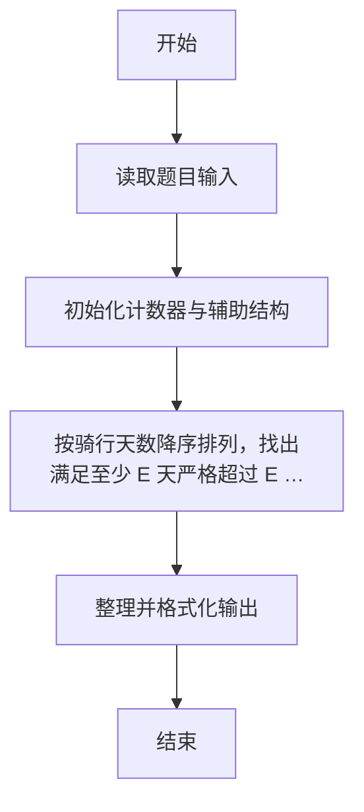
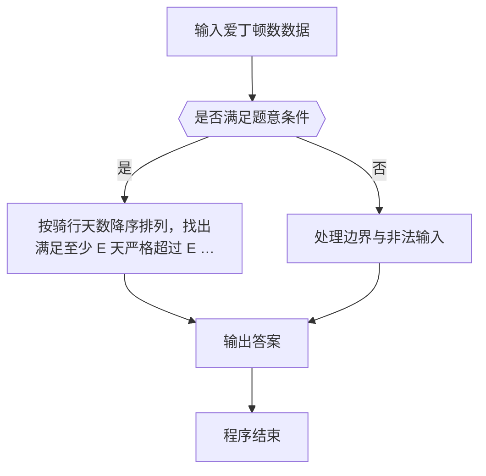

# 1060 爱丁顿数

- **分值：** 25分

### 题目描述

英国天文学家爱丁顿很喜欢骑车。据说他为了炫耀自己的骑车功力，还定义了一个“爱丁顿数” E ，即满足有 E 天骑车超过 E 英里的最大整数 E。据说爱丁顿自己的 E 等于87。

现给定某人 N 天的骑车距离，请你算出对应的爱丁顿数 E（≤ N）。

### 输入格式：

输入第一行给出一个正整数 N（N ≤ 10^5），即连续骑车的天数；第二行给出 N 个非负整数，代表每天的骑车距离。

### 输出格式：

在一行中给出 N 天的爱丁顿数。

### 输入样例：
```
10
6 7 6 9 3 10 8 2 7 8
```

### 输出样例：
```
6
```


### 解题思路

本题的核心是：按骑行天数降序排列，找出满足至少 E 天严格超过 E 英里的最大 E。程序先读取题目输入，再按照上述规则完成数据处理，最后严格按照题目要求输出结果。实现时应优先根据题目约束选择合适的数据类型和数据结构，避免溢出或不必要的重复计算。

时间复杂度为 O(n log n)；空间复杂度取决于输入规模，主要用于保存题目数据和中间结果。

### 代码流程说明

1. 读取 1060 爱丁顿数 所需的输入数据。
2. 初始化计数器、数组或其他辅助变量。
3. 按骑行天数降序排列，找出满足至少 E 天严格超过 E 英里的最大 E。
4. 按题目规定的格式输出计算结果。

### 代码实现

```r
# 实现原理：本题的核心是：按骑行天数降序排列，找出满足至少 E 天严格超过 E 英里的最大 E。程序先读取题目输入，再按照上述规则完成数据处理，最后严格按照题目要求输出结果。实现时应优先根据题目约束选择合适的数据类型和数据结构，避免溢出或不必要的重复计算。 时间复杂度为 O(n log n)；空间复杂度取决于输入规模，主要用于保存题目数据和中间结果。
# 代码按“读取输入—核心计算—格式化输出”的流程组织。

# 读取题目输入。
z<-scan(what=integer(),quiet=TRUE)
n<-z[1]
a<-sort(z[2:(n+1)],decreasing=TRUE)
e<-0
# 按题意重复处理，直到满足结束条件。
while(e<n&&a[e+1]>e+1)e<-e+1
# 按题目要求输出结果。
cat(e, '\n', sep='')

```

### 代码流程图



### 解题流程图



### 常见易错点

- 排序与并列名次规则要严格按题意，注意稳定顺序与并列处理。
- 输出格式必须与题目要求完全一致，包括空格、换行、大小写和特殊符号。
