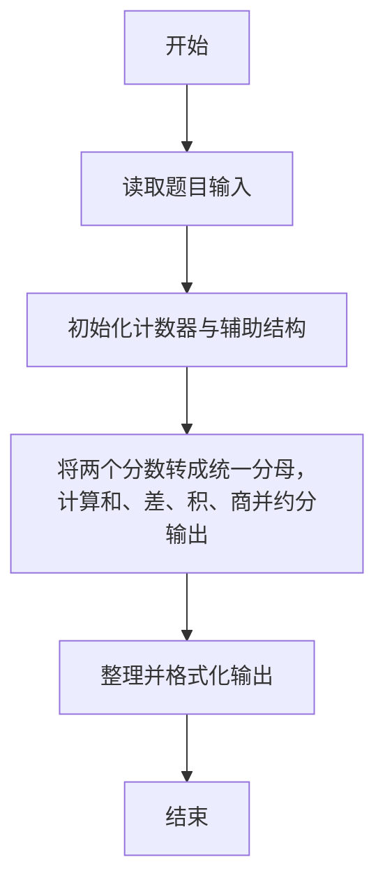
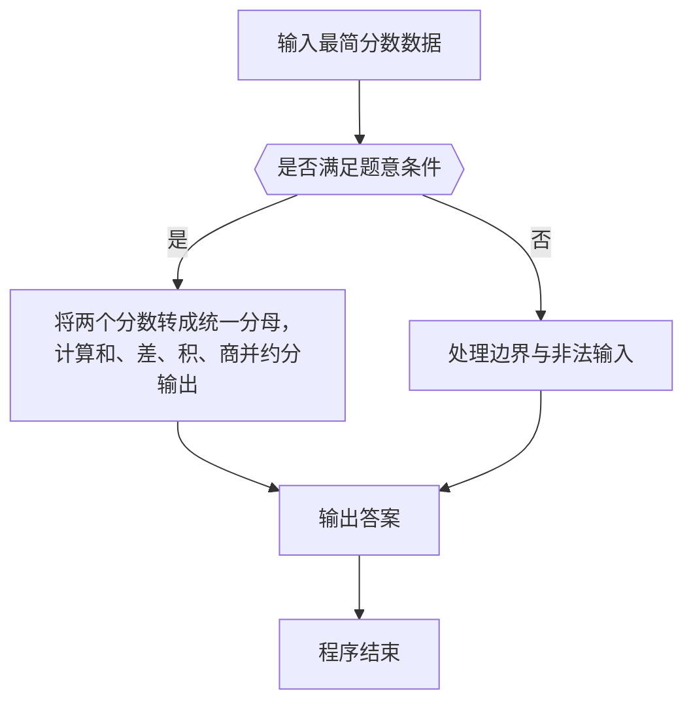

# 1062 最简分数

- **分值：** 20分

### 题目描述

一个分数一般写成两个整数相除的形式：N/M，其中 M 不为0。最简分数是指分子和分母没有公约数的分数表示形式。

现给定两个不相等的正分数 N_1/M_1 和 N_2/M_2，要求你按从小到大的顺序列出它们之间分母为 K 的最简分数。

### 输入格式：

输入在一行中按 N/M 的格式给出两个正分数，随后是一个正整数分母 K，其间以空格分隔。题目保证给出的所有整数都不超过 10000。

### 输出格式：

在一行中按 N/M 的格式列出两个给定分数之间分母为 K 的所有最简分数，按从小到大的顺序，其间以 1 个空格分隔。行首尾不得有多余空格。题目保证至少有 1 个输出。

### 输入样例：
```
7/18 13/20 12
```

### 输出样例：
```
5/12 7/12
```
**鸣谢海南师范大学王心诗慧同学修正题面！**


### 解题思路

本题的核心是：将两个分数转成统一分母，计算和、差、积、商并约分输出。程序先读取题目输入，再按照上述规则完成数据处理，最后严格按照题目要求输出结果。实现时应优先根据题目约束选择合适的数据类型和数据结构，避免溢出或不必要的重复计算。

时间复杂度为 O(k log k)；空间复杂度为 O(1)。

### 代码流程说明

1. 读取 1062 最简分数 所需的输入数据。
2. 初始化计数器、数组或其他辅助变量。
3. 将两个分数转成统一分母，计算和、差、积、商并约分输出。
4. 按题目规定的格式输出计算结果。

### 代码实现

```r
# 实现原理：本题的核心是：将两个分数转成统一分母，计算和、差、积、商并约分输出。程序先读取题目输入，再按照上述规则完成数据处理，最后严格按照题目要求输出结果。实现时应优先根据题目约束选择合适的数据类型和数据结构，避免溢出或不必要的重复计算。 时间复杂度为 O(k log k)；空间复杂度为 O(1)。
# 代码按“读取输入—核心计算—格式化输出”的流程组织。

# 读取题目输入。
z<-scan(what=character(),quiet=TRUE)
# 定义辅助函数，封装可复用的计算逻辑。
p<-function(s)as.integer(strsplit(s,'/',fixed=TRUE)[[1]])
a<-p(z[1])
b<-p(z[2])
k<-as.integer(z[3])
# 定义辅助函数，封装可复用的计算逻辑。
g<-function(a,b)if(b==0)a else Recall(b,a%%b)
out<-character()
# 遍历数据并执行题目要求的处理。
for(x in 1:(k-1))if(g(x,k)==1&&a[1]*k<x*a[2]&&x*b[2]<b[1]*k)out<-c(out,paste0(x,'/',k))
# 按题目要求输出结果。
cat(paste(out,collapse=' '), '\n', sep='')

```

### 代码流程图



### 解题流程图



### 常见易错点

- 输出格式必须与题目完全一致，包括空格、换行与单复数。
- 输出格式必须与题目要求完全一致，包括空格、换行、大小写和特殊符号。
