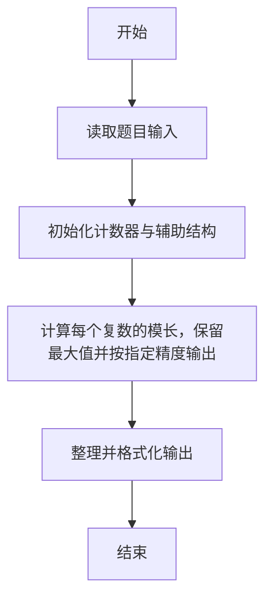
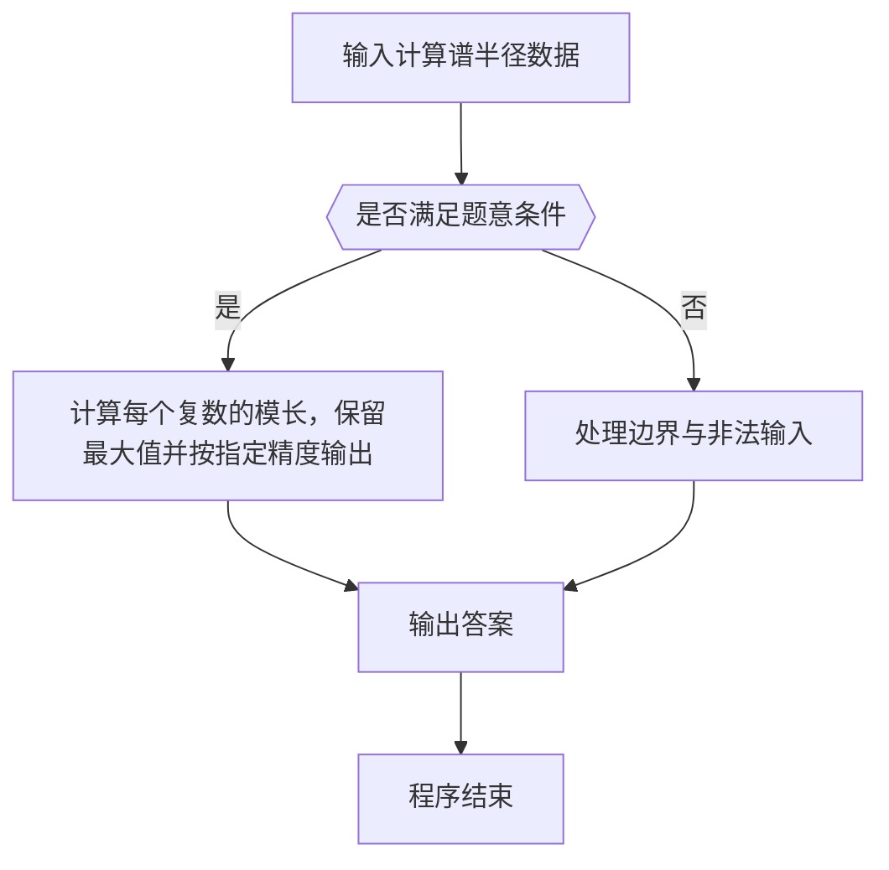

# 1063 计算谱半径

- **分值：** 20分

### 题目描述

在数学中，矩阵的“谱半径”是指其特征值的模集合的上确界。换言之，对于给定的 n 个复数特征值 a_1+b_1i,…,a_n+b_ni，它们的模为实部与虚部的平方和的开方，而“谱半径”就是最大模。

现在给定一些复数空间的特征值，请你计算并输出这些特征值的谱半径。

### 输入格式：

输入第一行给出正整数 N（N ≤ 10 000），是输入的特征值的个数。随后 N 行，每行给出 1 个特征值的实部和虚部，其间以空格分隔。注意：题目保证实部和虚部均为绝对值不超过 1000 的整数。

### 输出格式：

在一行中输出谱半径，四舍五入保留小数点后 2 位。

### 输入样例：
```
5
0 1
2 0
-1 0
3 3
0 -3
```

### 输出样例：
```
4.24
```


### 解题思路

本题的核心是：计算每个复数的模长，保留最大值并按指定精度输出。程序先读取题目输入，再按照上述规则完成数据处理，最后严格按照题目要求输出结果。实现时应优先根据题目约束选择合适的数据类型和数据结构，避免溢出或不必要的重复计算。

时间复杂度为 O(n)；空间复杂度取决于输入规模，主要用于保存题目数据和中间结果。

### 代码流程说明

1. 读取 1063 计算谱半径 所需的输入数据。
2. 初始化计数器、数组或其他辅助变量。
3. 计算每个复数的模长，保留最大值并按指定精度输出。
4. 按题目规定的格式输出计算结果。

### 代码实现

```r
# 实现原理：本题的核心是：计算每个复数的模长，保留最大值并按指定精度输出。程序先读取题目输入，再按照上述规则完成数据处理，最后严格按照题目要求输出结果。实现时应优先根据题目约束选择合适的数据类型和数据结构，避免溢出或不必要的重复计算。 时间复杂度为 O(n)；空间复杂度取决于输入规模，主要用于保存题目数据和中间结果。
# 代码按“读取输入—核心计算—格式化输出”的流程组织。

# 读取题目输入。
z<-scan(what=numeric(),quiet=TRUE)
n<-z[1]
at<-2
best<-0
# 遍历数据并执行题目要求的处理。
for(i in seq_len(n)){
  x<-z[at]
  y<-z[at+1]
  at<-at+2
  best<-max(best,sqrt(x*x+y*y))
}
# 按题目要求输出结果。
cat(sprintf('%.2f\n',best))

```

### 代码流程图



### 解题流程图



### 常见易错点

- 浮点输出注意保留位数与四舍五入，非法数据不要计入统计。
- 输出格式必须与题目完全一致，包括空格、换行与单复数。
- 输出格式必须与题目要求完全一致，包括空格、换行、大小写和特殊符号。
