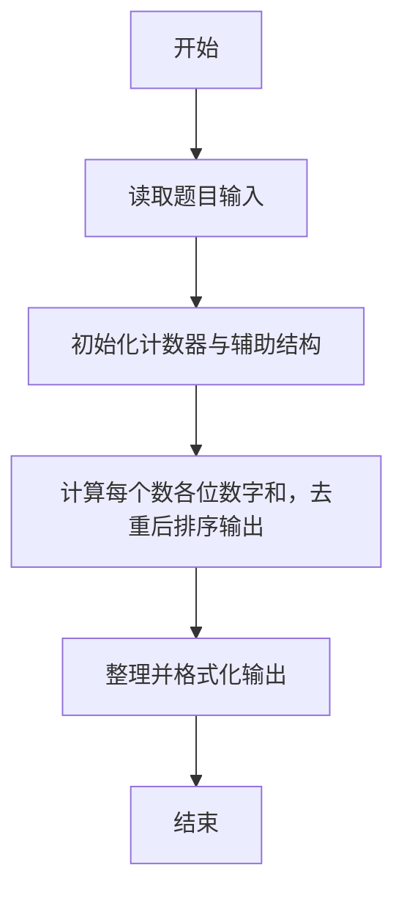
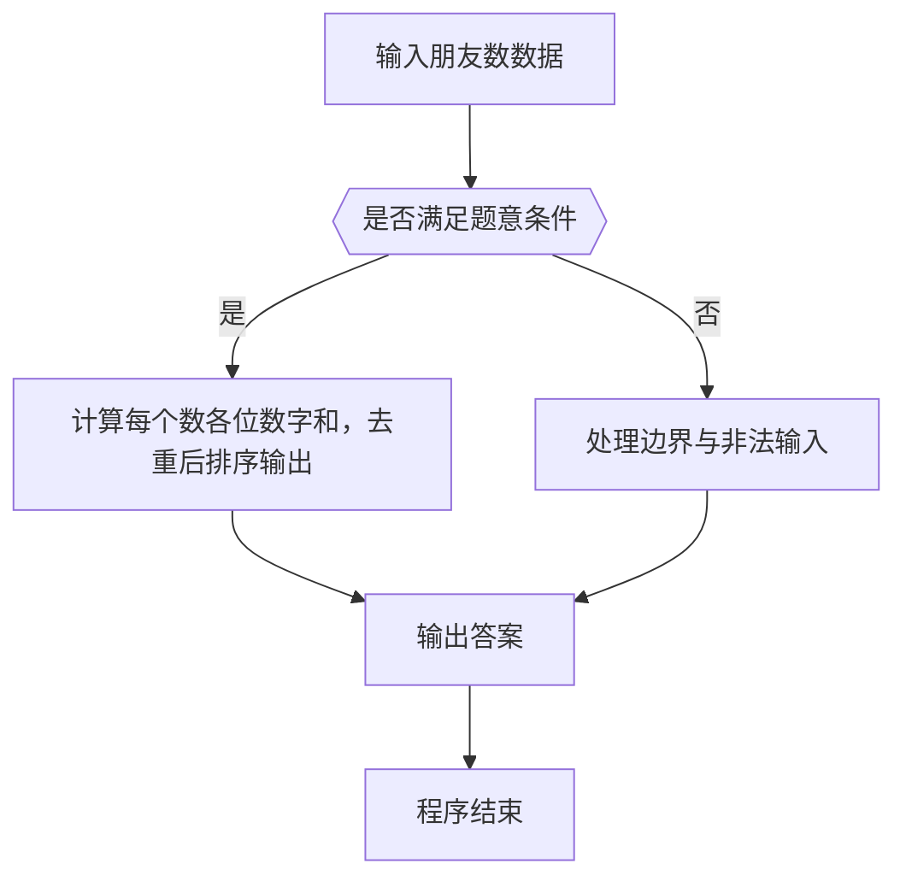

# 1064 朋友数

- **分值：** 20分

### 题目描述

如果两个整数各位数字的和是一样的，则被称为是“朋友数”，而那个公共的和就是它们的“朋友证号”。例如 123 和 51 就是朋友数，因为 1+2+3 = 5+1 = 6，而 6 就是它们的朋友证号。给定一些整数，要求你统计一下它们中有多少个不同的朋友证号。

### 输入格式：

输入第一行给出正整数 N。随后一行给出 N 个正整数，数字间以空格分隔。题目保证所有数字小于 10^4。

### 输出格式：

首先第一行输出给定数字中不同的朋友证号的个数；随后一行按递增顺序输出这些朋友证号，数字间隔一个空格，且行末不得有多余空格。

### 输入样例：
```
8
123 899 51 998 27 33 36 12
```

### 输出样例：
```
4
3 6 9 26
```


### 解题思路

本题的核心是：计算每个数各位数字和，去重后排序输出。程序先读取题目输入，再按照上述规则完成数据处理，最后严格按照题目要求输出结果。实现时应优先根据题目约束选择合适的数据类型和数据结构，避免溢出或不必要的重复计算。

时间复杂度为 O(nL)；空间复杂度取决于输入规模，主要用于保存题目数据和中间结果。

### 代码流程说明

1. 读取 1064 朋友数 所需的输入数据。
2. 初始化计数器、数组或其他辅助变量。
3. 计算每个数各位数字和，去重后排序输出。
4. 按题目规定的格式输出计算结果。

### 代码实现

```r
# 实现原理：本题的核心是：计算每个数各位数字和，去重后排序输出。程序先读取题目输入，再按照上述规则完成数据处理，最后严格按照题目要求输出结果。实现时应优先根据题目约束选择合适的数据类型和数据结构，避免溢出或不必要的重复计算。 时间复杂度为 O(nL)；空间复杂度取决于输入规模，主要用于保存题目数据和中间结果。
# 代码按“读取输入—核心计算—格式化输出”的流程组织。

# 读取题目输入。
z<-scan(what=character(),quiet=TRUE)
n<-as.integer(z[1])
a<-integer()
# 遍历数据并执行题目要求的处理。
for(s in z[2:(n+1)])a<-unique(c(a,sum(as.integer(strsplit(s,'')[[1]]))))
a<-sort(a)
# 按题目要求输出结果。
cat(length(a),'\n',paste(a,collapse=' '),'\n',sep='')

```

### 代码流程图



### 解题流程图



### 常见易错点

- 排序与并列名次规则要严格按题意，注意稳定顺序与并列处理。
- 输出格式必须与题目完全一致，包括空格、换行与单复数。
- 输出格式必须与题目要求完全一致，包括空格、换行、大小写和特殊符号。
