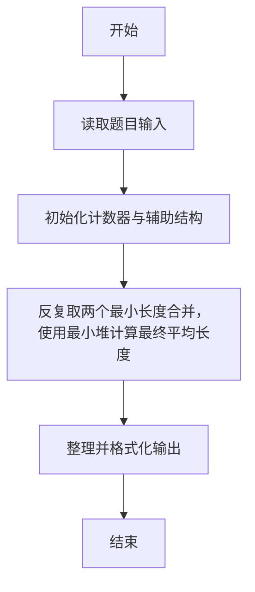
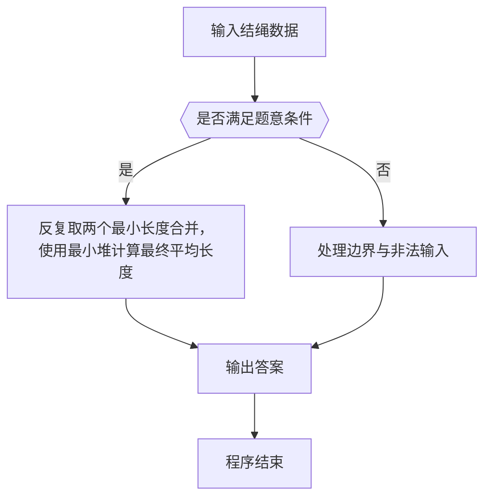

# 1070 结绳

- **分值：** 25分

### 题目描述

给定一段一段的绳子，你需要把它们串成一条绳。每次串连的时候，是把两段绳子对折，再如下图所示套接在一起。这样得到的绳子又被当成是另一段绳子，可以再次对折去跟另一段绳子串连。每次串连后，原来两段绳子的长度就会减半。


给定 N 段绳子的长度，你需要找出它们能串成的绳子的最大长度。

### 输入格式：

每个输入包含 1 个测试用例。每个测试用例第 1 行给出正整数 N（2 ≤ N ≤ 10^4）；第 2 行给出 N 个正整数，即原始绳段的长度，数字间以空格分隔。所有整数都不超过 10^4。

### 输出格式：

在一行中输出能够串成的绳子的最大长度。结果向下取整，即取为不超过最大长度的最近整数。

### 输入样例：
```
8
10 15 12 3 4 13 1 15
```

### 输出样例：
```
14
```


### 解题思路

本题的核心是：反复取两个最小长度合并，使用最小堆计算最终平均长度。程序先读取题目输入，再按照上述规则完成数据处理，最后严格按照题目要求输出结果。实现时应优先根据题目约束选择合适的数据类型和数据结构，避免溢出或不必要的重复计算。

时间复杂度为 O(n log n)；空间复杂度取决于输入规模，主要用于保存题目数据和中间结果。

### 代码流程说明

1. 读取 1070 结绳 所需的输入数据。
2. 初始化计数器、数组或其他辅助变量。
3. 反复取两个最小长度合并，使用最小堆计算最终平均长度。
4. 按题目规定的格式输出计算结果。

### 代码实现

```r
# 实现原理：本题的核心是：反复取两个最小长度合并，使用最小堆计算最终平均长度。程序先读取题目输入，再按照上述规则完成数据处理，最后严格按照题目要求输出结果。实现时应优先根据题目约束选择合适的数据类型和数据结构，避免溢出或不必要的重复计算。 时间复杂度为 O(n log n)；空间复杂度取决于输入规模，主要用于保存题目数据和中间结果。
# 代码按“读取输入—核心计算—格式化输出”的流程组织。

# 读取题目输入。
a<-sort(scan(what=numeric(),quiet=TRUE))
# 按题意重复处理，直到满足结束条件。
while(length(a)>1){
  a<-sort(c(a[-c(1,2)],mean(a[1:2])))
}
# 按题目要求输出结果。
cat(as.integer(a[1]), '\n', sep='')

```

### 代码流程图



### 解题流程图



### 常见易错点

- 浮点输出注意保留位数与四舍五入，非法数据不要计入统计。
- 输出格式必须与题目要求完全一致，包括空格、换行、大小写和特殊符号。
