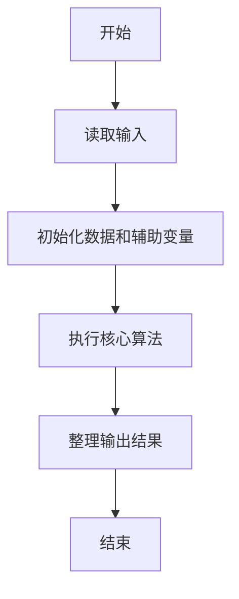
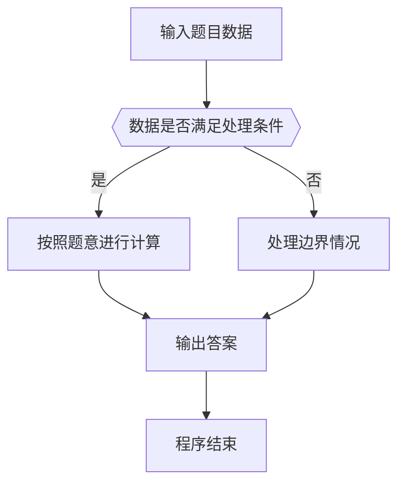

# 1074 宇宙无敌加法器

- **分值：** 20分

### 题目描述

地球人习惯使用十进制数，并且默认一个数字的每一位都是十进制的。而在 PAT 星人开挂的世界里，每个数字的每一位都是不同进制的，这种神奇的数字称为“PAT数”。每个 PAT 星人都必须熟记各位数字的进制表，例如“……0527”就表示最低位是 7 进制数、第 2 位是 2 进制数、第 3 位是 5 进制数、第 4 位是 10 进制数，等等。每一位的进制 d 或者是 0（表示十进制）、或者是 [2，9] 区间内的整数。理论上这个进制表应该包含无穷多位数字，但从实际应用出发，PAT 星人通常只需要记住前 20 位就够用了，以后各位默认为 10 进制。

在这样的数字系统中，即使是简单的加法运算也变得不简单。例如对应进制表“0527”，该如何计算“6203 + 415”呢？我们得首先计算最低位：3 + 5 = 8；因为最低位是 7 进制的，所以我们得到 1 和 1 个进位。第 2 位是：0 + 1 + 1（进位）= 2；因为此位是 2 进制的，所以我们得到 0 和 1 个进位。第 3 位是：2 + 4 + 1（进位）= 7；因为此位是 5 进制的，所以我们得到 2 和 1 个进位。第 4 位是：6 + 1（进位）= 7；因为此位是 10 进制的，所以我们就得到 7。最后我们得到：6203 + 415 = 7201。

### 输入格式：

输入首先在第一行给出一个 $N$ 位的进制表（$0<N\le 20$），以回车结束。随后两行，每行给出一个不超过 $N$ 位的非负 PAT 数。

### 输出格式：

在一行中输出两个 PAT 数之和。

### 输入样例：
```
30527
06203
415
```

### 输出样例：
```
7201
```


### 解题思路

本题的核心是：逐位从低位相加，使用当前位进制处理余数和进位；进制 0 按 10 处理。程序先读取题目输入，再按照上述规则完成数据处理，最后严格按照题目要求输出结果。实现时应优先根据题目约束选择合适的数据类型和数据结构，避免溢出或不必要的重复计算。

时间复杂度为 O(L)；空间复杂度取决于输入规模，主要用于保存题目数据和中间结果。

### 代码流程说明

1. 读取 1074 宇宙无敌加法器 所需的输入数据。
2. 初始化计数器、数组或其他辅助变量。
3. 逐位从低位相加，使用当前位进制处理余数和进位；进制 0 按 10 处理。
4. 按题目规定的格式输出计算结果。

### 代码实现

```r
# 实现原理：本题的核心是：逐位从低位相加，使用当前位进制处理余数和进位；进制 0 按 10 处理。程序先读取题目输入，再按照上述规则完成数据处理，最后严格按照题目要求输出结果。实现时应优先根据题目约束选择合适的数据类型和数据结构，避免溢出或不必要的重复计算。 时间复杂度为 O(L)；空间复杂度取决于输入规模，主要用于保存题目数据和中间结果。
# 代码按“读取输入—核心计算—格式化输出”的流程组织。

# 读取题目输入。
z<-scan(what=character(),quiet=TRUE)
base<-strsplit(z[1],'')[[1]]
a<-strsplit(z[2],'')[[1]]
b<-strsplit(z[3],'')[[1]]
# 定义辅助函数，封装可复用的计算逻辑。
val<-function(x){
  if(x<='9')as.integer(x)else match(x,letters)+9
}
# 定义辅助函数，封装可复用的计算逻辑。
dig<-function(x)if(x<10)as.character(x)else letters[x-9]
out<-character()
carry<-0
# 遍历数据并执行题目要求的处理。
for(i in 0:(max(length(a),length(b),length(base))-1)){
  xx<-if(i<length(a))val(a[length(a)-i])else 0
  yy<-if(i<length(b))val(b[length(b)-i])else 0
  r<-if(i<length(base))val(base[length(base)-i])else 10
  if(r==0)r<-10
  v<-xx+yy+carry
  out<-c(out,dig(v%%r))
  carry<-v%/%r
}
# 按题意重复处理，直到满足结束条件。
while(length(out)>1&&out[length(out)]=='0')out<-out[-length(out)]
# 按题目要求输出结果。
cat(paste(rev(out),collapse=''),'\n')
```

### 代码流程图



### 解题流程图



### 常见易错点

- 注意输入数据的范围，选择足够大的整数类型，并正确处理边界值。
- 循环、数组下标和字符串结束位置要严格对应题目定义，避免越界。
- 输出格式必须与题目要求完全一致，包括空格、换行、大小写和特殊符号。
- 如果存在排序、去重、进位、约分或四舍五入等操作，应在输出前统一完成。
