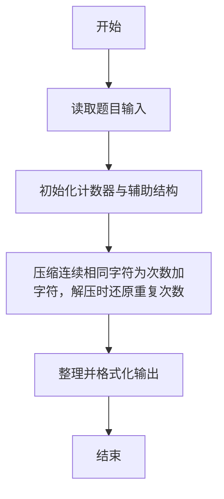
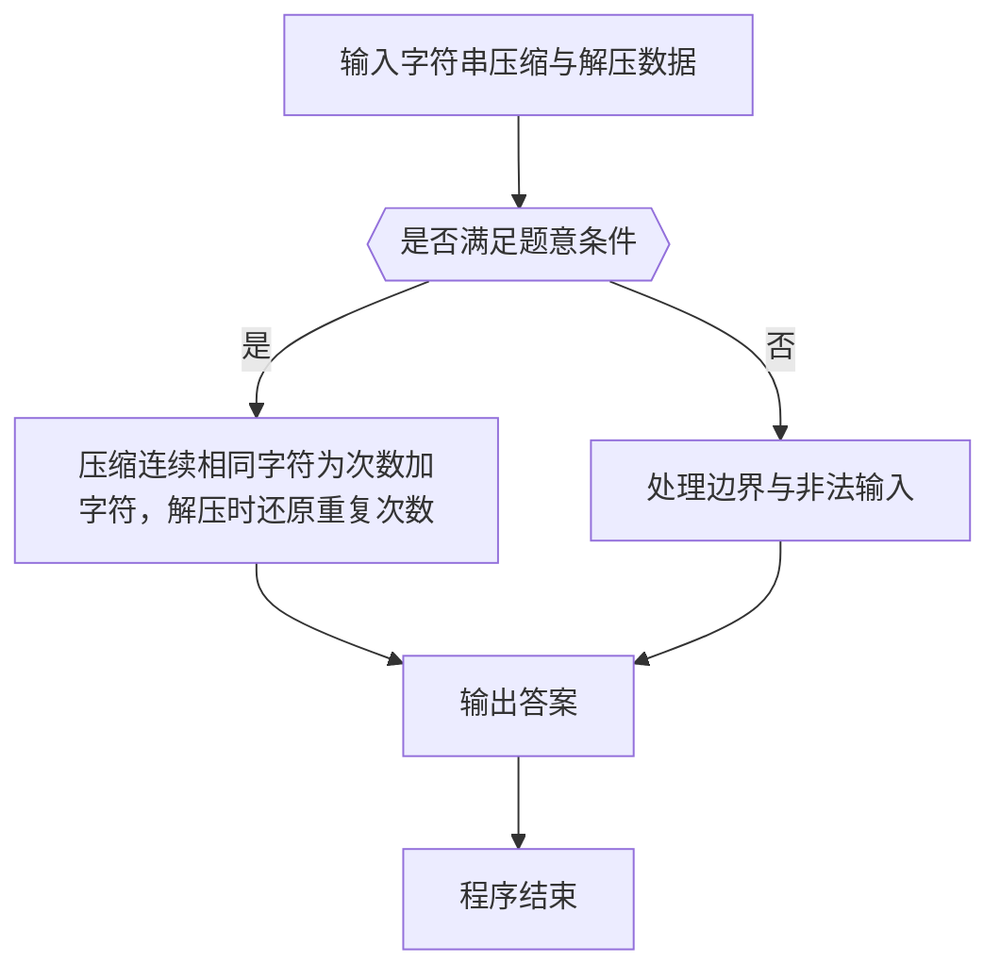

# 1078 字符串压缩与解压

- **分值：** 20分

### 题目描述

文本压缩有很多种方法，这里我们只考虑最简单的一种：把由相同字符组成的一个连续的片段用这个字符和片段中含有这个字符的个数来表示。例如 `ccccc` 就用 `5c` 来表示。如果字符没有重复，就原样输出。例如 `aba` 压缩后仍然是 `aba`。

解压方法就是反过来，把形如 `5c` 这样的表示恢复为 `ccccc`。

本题需要你根据压缩或解压的要求，对给定字符串进行处理。这里我们简单地假设原始字符串是完全由英文字母和空格组成的非空字符串。

### 输入格式：

输入第一行给出一个字符，如果是 `C` 就表示下面的字符串需要被压缩；如果是 `D` 就表示下面的字符串需要被解压。第二行给出需要被压缩或解压的不超过 1000 个字符的字符串，以回车结尾。题目保证字符重复个数在整型范围内，且输出文件不超过 1MB。

### 输出格式：

根据要求压缩或解压字符串，并在一行中输出结果。

### 输入样例 1：
```
C
TTTTThhiiiis isssss a   tesssst CAaaa as
```

### 输出样例 1：
```
5T2h4is i5s a3 te4st CA3a as
```

### 输入样例 2：
```
D
5T2h4is i5s a3 te4st CA3a as10Z
```

### 输出样例 2：
```
TTTTThhiiiis isssss a   tesssst CAaaa asZZZZZZZZZZ
```


### 解题思路

本题的核心是：压缩连续相同字符为次数加字符，解压时还原重复次数。程序先读取题目输入，再按照上述规则完成数据处理，最后严格按照题目要求输出结果。实现时应优先根据题目约束选择合适的数据类型和数据结构，避免溢出或不必要的重复计算。

时间复杂度为 O(L)；空间复杂度取决于输入规模，主要用于保存题目数据和中间结果。

### 代码流程说明

1. 读取 1078 字符串压缩与解压 所需的输入数据。
2. 初始化计数器、数组或其他辅助变量。
3. 压缩连续相同字符为次数加字符，解压时还原重复次数。
4. 按题目规定的格式输出计算结果。

### 代码实现

```r
# 实现原理：本题的核心是：压缩连续相同字符为次数加字符，解压时还原重复次数。程序先读取题目输入，再按照上述规则完成数据处理，最后严格按照题目要求输出结果。实现时应优先根据题目约束选择合适的数据类型和数据结构，避免溢出或不必要的重复计算。 时间复杂度为 O(L)；空间复杂度取决于输入规模，主要用于保存题目数据和中间结果。
# 代码按“读取输入—核心计算—格式化输出”的流程组织。

# 读取题目输入。
lines<-readLines(file('stdin'),warn=FALSE)
mode<-trimws(lines[1])
s<-if(length(lines)>1)paste(lines[-1],collapse='\n')else''
if(mode=='C'){
  i<-1
  # 按题意重复处理，直到满足结束条件。
  while(i<=nchar(s)){
    j<-i+1
    # 按题意重复处理，直到满足结束条件。
    while(j<=nchar(s)&&substr(s,j,j)==substr(s,i,i))j<-j+1
    # 按题目要求输出结果。
    if(j-i>1)cat(j-i)
    # 按题目要求输出结果。
    cat(substr(s,i,i))
    i<-j
  }
}else{
i<-1
# 按题意重复处理，直到满足结束条件。
while(i<=nchar(s)){
  j<-i
  # 按题意重复处理，直到满足结束条件。
  while(j<=nchar(s)&&grepl('[0-9]',substr(s,j,j)))j<-j+1
  c<-if(j>i)as.integer(substr(s,i,j-1))else 1
  # 按题目要求输出结果。
  if(j<=nchar(s))cat(strrep(substr(s,j,j),c))
  i<-j+1
}
}

```

### 代码流程图



### 解题流程图



### 常见易错点

- 注意输入范围与边界值，选择合适的数据类型。
- 循环与下标要严格对应题目定义，避免越界或漏算。
- 输出格式必须与题目要求完全一致，包括空格与换行。
- 输出格式必须与题目要求完全一致，包括空格、换行、大小写和特殊符号。
