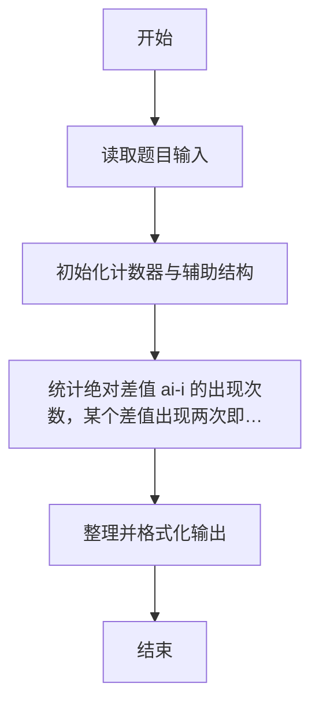
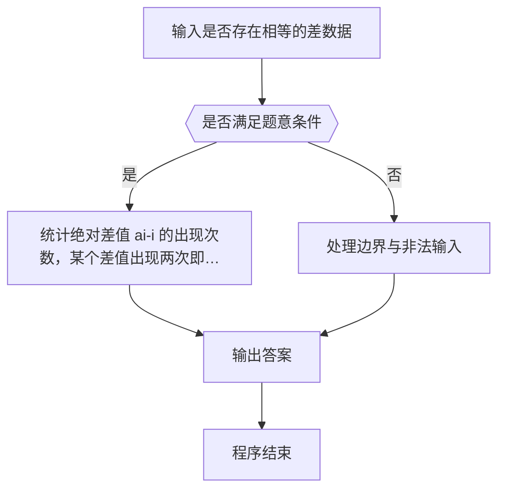

# 1083 是否存在相等的差

- **分值：** 20分

### 题目描述

给定 N 张卡片，正面分别写上 1、2、……、N，然后全部翻面，洗牌，在背面分别写上 1、2、……、N。将每张牌的正反两面数字相减（大减小），得到 N 个非负差值，其中是否存在相等的差？

### 输入格式：

输入第一行给出一个正整数 N（2 ≤ N ≤ 10 000），随后一行给出 1 到 N 的一个洗牌后的排列，第 i 个数表示正面写了 i 的那张卡片背面的数字。

### 输出格式：

按照“差值 重复次数”的格式从大到小输出重复的差值及其重复的次数，每行输出一个结果。

### 输入样例：
```
8
3 5 8 6 2 1 4 7
```

### 输出样例：
```
5 2
3 3
2 2
```


### 解题思路

本题的核心是：统计绝对差值 |a[i]-i| 的出现次数，某个差值出现两次即可说明存在满足条件的数对。程序先读取题目输入，再按照上述规则完成数据处理，最后严格按照题目要求输出结果。实现时应优先根据题目约束选择合适的数据类型和数据结构，避免溢出或不必要的重复计算。

时间复杂度为 O(n)；空间复杂度取决于输入规模，主要用于保存题目数据和中间结果。

### 代码流程说明

1. 读取 1083 是否存在相等的差 所需的输入数据。
2. 初始化计数器、数组或其他辅助变量。
3. 统计绝对差值 |a[i]-i| 的出现次数，某个差值出现两次即可说明存在满足条件的数对。
4. 按题目规定的格式输出计算结果。

### 代码实现

```r
# 实现原理：本题的核心是：统计绝对差值 $|a[i]-i|$ 的出现次数，某个差值出现两次即可说明存在满足条件的数对。程序先读取题目输入，再按照上述规则完成数据处理，最后严格按照题目要求输出结果。实现时应优先根据题目约束选择合适的数据类型和数据结构，避免溢出或不必要的重复计算。 时间复杂度为 O(n)；空间复杂度取决于输入规模，主要用于保存题目数据和中间结果。
# 代码按“读取输入—核心计算—格式化输出”的流程组织。

# 读取题目输入。
z<-scan(what=integer(),quiet=TRUE)
n<-z[1]
d<-abs(z[2:(n+1)]-seq_len(n))
c<-table(d)
# 遍历数据并执行题目要求的处理。
for(i in n:0)if(!is.na(c[as.character(i)])&&c[as.character(i)]>1)cat(paste(i,c[as.character(i)]), '\n', sep='')

```

### 代码流程图



### 解题流程图



### 常见易错点

- 注意输入范围与边界值，选择合适的数据类型。
- 循环与下标要严格对应题目定义，避免越界或漏算。
- 输出格式必须与题目要求完全一致，包括空格与换行。
- 输出格式必须与题目要求完全一致，包括空格、换行、大小写和特殊符号。
