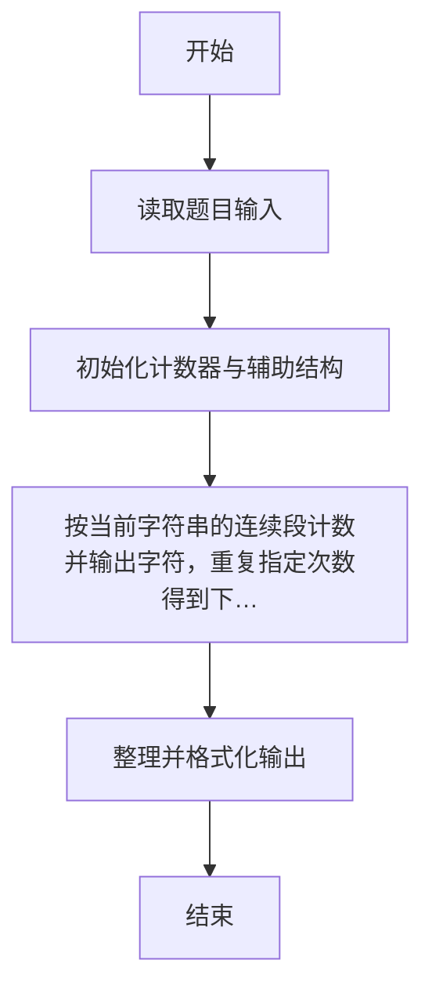
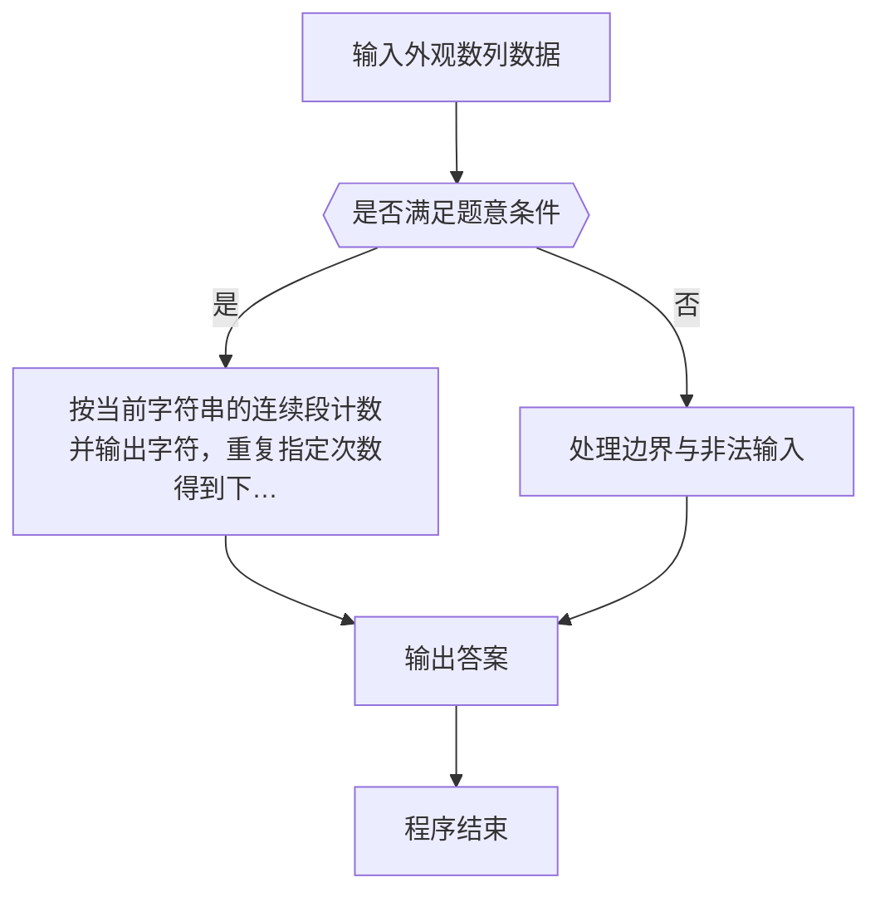

# 1084 外观数列

- **分值：** 20分

### 题目描述

外观数列是指具有以下特点的整数序列：

```
d, d1, d111, d113, d11231, d112213111, ...
```

它从不等于 1 的数字 `d` 开始，序列的第 n+1 项是对第 n 项的描述。比如第 2 项表示第 1 项有 1 个 `d`，所以就是 `d1`；第 2 项是 1 个 `d`（对应 `d1`）和 1 个 1（对应 11），所以第 3 项就是 `d111`。又比如第 4 项是 `d113`，其描述就是 1 个 `d`，2 个 1，1 个 3，所以下一项就是 `d11231`。当然这个定义对 `d` = 1 也成立。本题要求你推算任意给定数字 `d` 的外观数列的第 N 项。

### 输入格式：

输入第一行给出 [0,9] 范围内的一个整数 d、以及一个正整数 N（N ≤ 40），用空格分隔。

### 输出格式：

在一行中给出数字 `d` 的外观数列的第 N 项。

### 输入样例：
```
1 8
```

### 输出样例：
```
1123123111
```


### 解题思路

本题的核心是：按当前字符串的连续段计数并输出字符，重复指定次数得到下一项。程序先读取题目输入，再按照上述规则完成数据处理，最后严格按照题目要求输出结果。实现时应优先根据题目约束选择合适的数据类型和数据结构，避免溢出或不必要的重复计算。

时间复杂度为 O(kL)；空间复杂度取决于输入规模，主要用于保存题目数据和中间结果。

### 代码流程说明

1. 读取 1084 外观数列 所需的输入数据。
2. 初始化计数器、数组或其他辅助变量。
3. 按当前字符串的连续段计数并输出字符，重复指定次数得到下一项。
4. 按题目规定的格式输出计算结果。

### 代码实现

```r
# 实现原理：本题的核心是：按当前字符串的连续段计数并输出字符，重复指定次数得到下一项。程序先读取题目输入，再按照上述规则完成数据处理，最后严格按照题目要求输出结果。实现时应优先根据题目约束选择合适的数据类型和数据结构，避免溢出或不必要的重复计算。 时间复杂度为 O(kL)；空间复杂度取决于输入规模，主要用于保存题目数据和中间结果。
# 代码按“读取输入—核心计算—格式化输出”的流程组织。

# 读取题目输入。
z<-scan(what=character(),quiet=TRUE)
s<-z[1]
n<-as.integer(z[2])
if(n>1)for(q in 2:n){
  ch<-strsplit(s,'')[[1]]
  out<-character()
  i<-1
  # 按题意重复处理，直到满足结束条件。
  while(i<=length(ch)){
    j<-i
    # 按题意重复处理，直到满足结束条件。
    while(j<=length(ch)&&ch[j]==ch[i])j<-j+1
    out<-c(out,ch[i],as.character(j-i))
    i<-j
  }
s<-paste(out,collapse='')
}
# 按题目要求输出结果。
cat(s, '\n', sep='')

```

### 代码流程图



### 解题流程图



### 常见易错点

- 大整数或超长串不要用浮点/普通整型硬算，应按字符串或高精度处理。
- 输出格式必须与题目完全一致，包括空格、换行与单复数。
- 输出格式必须与题目要求完全一致，包括空格、换行、大小写和特殊符号。
