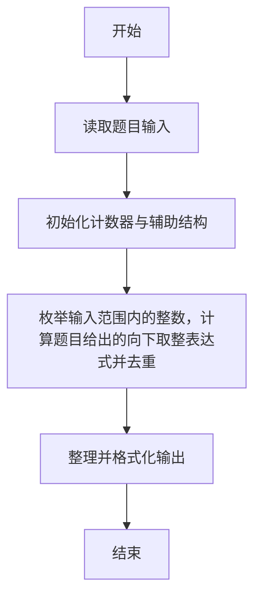
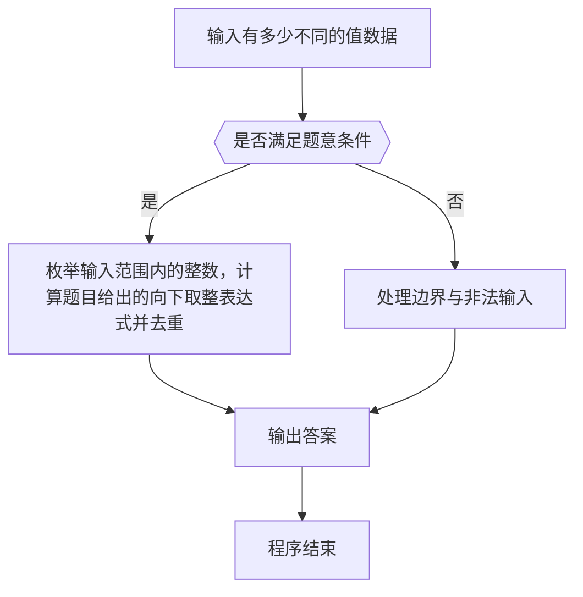

# 1087 有多少不同的值

- **分值：** 20分

### 题目描述

当自然数 n 依次取 1、2、3、……、N 时，算式 ⌊n/2⌋ +⌊n/3⌋ +⌊n/5⌋ 有多少个不同的值？（注：⌊x⌋ 为取整函数，表示不超过 x 的最大自然数，即 x 的整数部分。）

### 输入格式：

输入给出一个正整数 N（2 ≤ N ≤ 10^4）。

### 输出格式：

在一行中输出题面中算式取到的不同值的个数。

### 输入样例：
```
2017
```

### 输出样例：
```
1480
```


### 解题思路

本题的核心是：枚举输入范围内的整数，计算题目给出的向下取整表达式并去重。程序先读取题目输入，再按照上述规则完成数据处理，最后严格按照题目要求输出结果。实现时应优先根据题目约束选择合适的数据类型和数据结构，避免溢出或不必要的重复计算。

时间复杂度为 O(n)；空间复杂度为 O(n)。

### 代码流程说明

1. 读取 1087 有多少不同的值 所需的输入数据。
2. 初始化计数器、数组或其他辅助变量。
3. 枚举输入范围内的整数，计算题目给出的向下取整表达式并去重。
4. 按题目规定的格式输出计算结果。

### 代码实现

```r
# 实现原理：本题的核心是：枚举输入范围内的整数，计算题目给出的向下取整表达式并去重。程序先读取题目输入，再按照上述规则完成数据处理，最后严格按照题目要求输出结果。实现时应优先根据题目约束选择合适的数据类型和数据结构，避免溢出或不必要的重复计算。 时间复杂度为 O(n)；空间复杂度为 O(n)。
# 代码按“读取输入—核心计算—格式化输出”的流程组织。

# 读取题目输入。
n<-scan(what=integer(),quiet=TRUE)[1]
# 按题目要求输出结果。
cat(length(unique(seq_len(n)%/%2+seq_len(n)%/%3+seq_len(n)%/%5)), '\n', sep='')

```

### 代码流程图



### 解题流程图



### 常见易错点

- 注意输入范围与边界值，选择合适的数据类型。
- 循环与下标要严格对应题目定义，避免越界或漏算。
- 输出格式必须与题目要求完全一致，包括空格与换行。
- 输出格式必须与题目要求完全一致，包括空格、换行、大小写和特殊符号。
