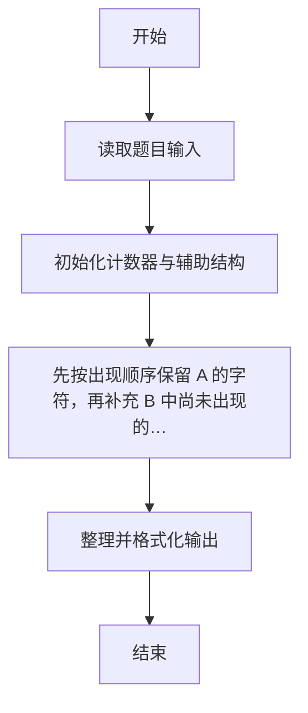
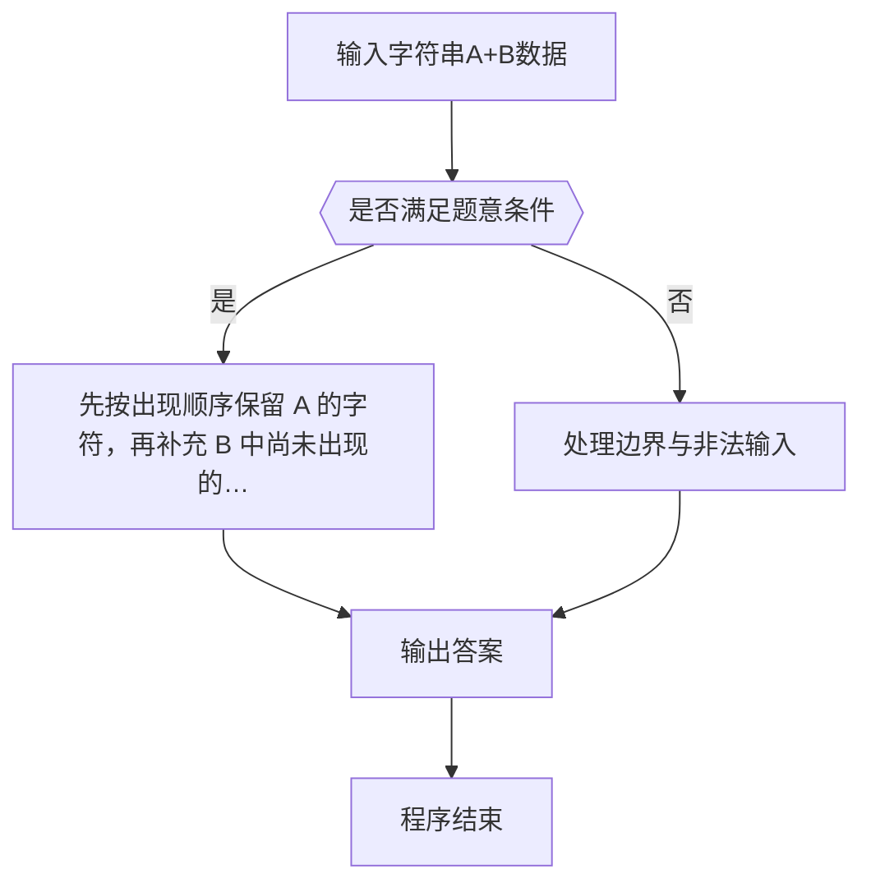

# 1093 字符串A+B

- **分值：** 20分

### 题目描述

给定两个字符串 A 和 B，本题要求你输出 A+B，即两个字符串的并集。要求先输出 A，再输出 B，但**重复的字符必须被剔除**。

### 输入格式：

输入在两行中分别给出 A 和 B，均为长度不超过 10^6的、由可见 ASCII 字符 (即码值为32~126)和空格组成的、由回车标识结束的非空字符串。

### 输出格式：

在一行中输出题面要求的 A 和 B 的和。

### 输入样例：
```
This is a sample test
to show you_How it works
```

### 输出样例：
```
This ampletowyu_Hrk
```


### 解题思路

本题的核心是：先按出现顺序保留 A 的字符，再补充 B 中尚未出现的字符。程序先读取题目输入，再按照上述规则完成数据处理，最后严格按照题目要求输出结果。实现时应优先根据题目约束选择合适的数据类型和数据结构，避免溢出或不必要的重复计算。

时间复杂度为 O(L)；空间复杂度取决于输入规模，主要用于保存题目数据和中间结果。

### 代码流程说明

1. 读取 1093 字符串A+B 所需的输入数据。
2. 初始化计数器、数组或其他辅助变量。
3. 先按出现顺序保留 A 的字符，再补充 B 中尚未出现的字符。
4. 按题目规定的格式输出计算结果。

### 代码实现

```r
# 实现原理：本题的核心是：先按出现顺序保留 A 的字符，再补充 B 中尚未出现的字符。程序先读取题目输入，再按照上述规则完成数据处理，最后严格按照题目要求输出结果。实现时应优先根据题目约束选择合适的数据类型和数据结构，避免溢出或不必要的重复计算。 时间复杂度为 O(L)；空间复杂度取决于输入规模，主要用于保存题目数据和中间结果。
# 代码按“读取输入—核心计算—格式化输出”的流程组织。

# 读取题目输入。
lines<-readLines(file('stdin'),n=2)
seen<-unique(strsplit(paste(lines,collapse=''),'')[[1]])
out<-character()
# 遍历数据并执行题目要求的处理。
for(line in lines)for(c in strsplit(line,'')[[1]])if(c%in%seen){
  out<-c(out,c)
  seen<-seen[seen!=c]
}
# 按题目要求输出结果。
cat(paste(out,collapse=''),'\n',sep='')

```

### 代码流程图



### 解题流程图



### 常见易错点

- 浮点输出注意保留位数与四舍五入，非法数据不要计入统计。
- 输出格式必须与题目要求完全一致，包括空格、换行、大小写和特殊符号。
