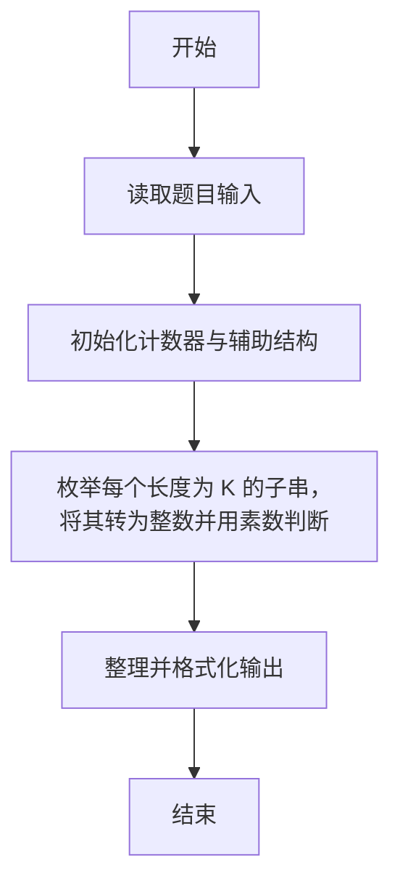
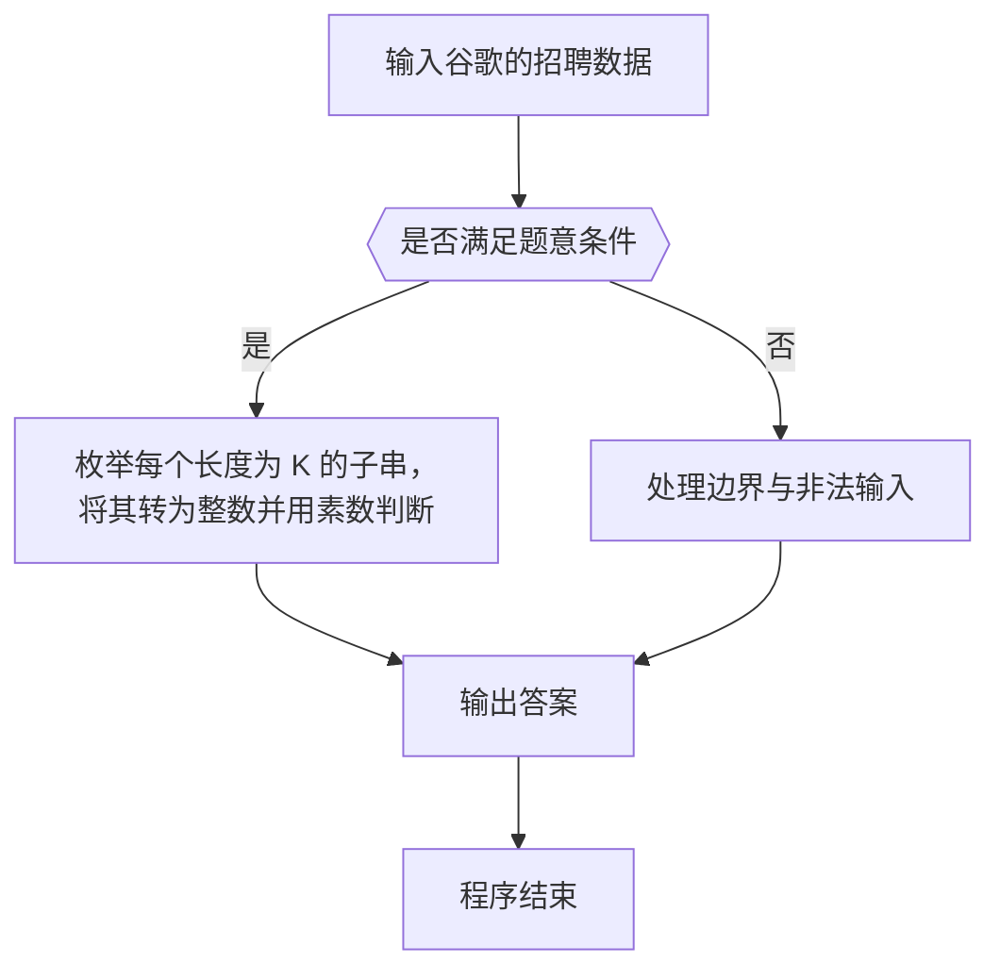

# 1094 谷歌的招聘

- **分值：** 20分

### 题目描述

2004 年 7 月，谷歌在硅谷的 101 号公路边竖立了一块巨大的广告牌（如下图）用于招聘。内容超级简单，就是一个以 .com 结尾的网址，而前面的网址是一个 10 位素数，这个素数是自然常数 e 中最早出现的 10 位连续数字。能找出这个素数的人，就可以通过访问谷歌的这个网站进入招聘流程的下一步。


自然常数 e 是一个著名的超越数，前面若干位写出来是这样的：e = 2.71828182845904523536028747135266249775724709369995957496696762772407663035354759457138217852516642**7427466391**932003059921... 其中粗体标出的 10 位数就是答案。

本题要求你编程解决一个更通用的问题：从任一给定的长度为 L 的数字中，找出最早出现的 K 位连续数字所组成的素数。

### 输入格式：

输入在第一行给出 2 个正整数，分别是 L（不超过 1000 的正整数，为数字长度）和 K（小于 10 的正整数）。接下来一行给出一个长度为 L 的正整数 N。

### 输出格式：

在一行中输出 N 中最早出现的 K 位连续数字所组成的素数。如果这样的素数不存在，则输出 `404`。注意，原始数字中的前导零也计算在位数之内。例如在 200236 中找 4 位素数，0023 算是解；但第一位 2 不能被当成 0002 输出，因为在原始数字中不存在这个 2 的前导零。

### 输入样例 1：
```
20 5
23654987725541023819
```

### 输出样例 1：
```
49877
```

### 输入样例 2：
```
10 3
2468001680
```

### 输出样例 2：
```
404
```

**鸣谢用户 大冰 补充数据！**


### 解题思路

本题的核心是：枚举每个长度为 K 的子串，将其转为整数并用素数判断。程序先读取题目输入，再按照上述规则完成数据处理，最后严格按照题目要求输出结果。实现时应优先根据题目约束选择合适的数据类型和数据结构，避免溢出或不必要的重复计算。

时间复杂度为 O(nK√v)；空间复杂度取决于输入规模，主要用于保存题目数据和中间结果。

### 代码流程说明

1. 读取 1094 谷歌的招聘 所需的输入数据。
2. 初始化计数器、数组或其他辅助变量。
3. 枚举每个长度为 K 的子串，将其转为整数并用素数判断。
4. 按题目规定的格式输出计算结果。

### 代码实现

```r
# 实现原理：本题的核心是：枚举每个长度为 K 的子串，将其转为整数并用素数判断。程序先读取题目输入，再按照上述规则完成数据处理，最后严格按照题目要求输出结果。实现时应优先根据题目约束选择合适的数据类型和数据结构，避免溢出或不必要的重复计算。 时间复杂度为 O(nK√v)；空间复杂度取决于输入规模，主要用于保存题目数据和中间结果。
# 代码按“读取输入—核心计算—格式化输出”的流程组织。

# 读取题目输入。
z<-scan(what=character(),quiet=TRUE)
l<-as.integer(z[1])
k<-as.integer(z[2])
s<-z[3]
# 定义辅助函数，封装可复用的计算逻辑。
prime<-function(x){
  if(x<2)return(FALSE)
  if(x<4)return(TRUE)
  all(x%%(2:floor(sqrt(x)))!=0)
}
ans<-404
# 遍历数据并执行题目要求的处理。
for(i in 1:(l-k+1)){
  xx<-substr(s,i,i+k-1)
  if(prime(as.integer(xx))){
    ans<-xx
    break
  }
}
# 按题目要求输出结果。
cat(ans, '\n', sep='')

```

### 代码流程图



### 解题流程图



### 常见易错点

- 素数判断注意 1 不是素数，边界与取整平方根范围要正确。
- 输出格式必须与题目要求完全一致，包括空格、换行、大小写和特殊符号。
