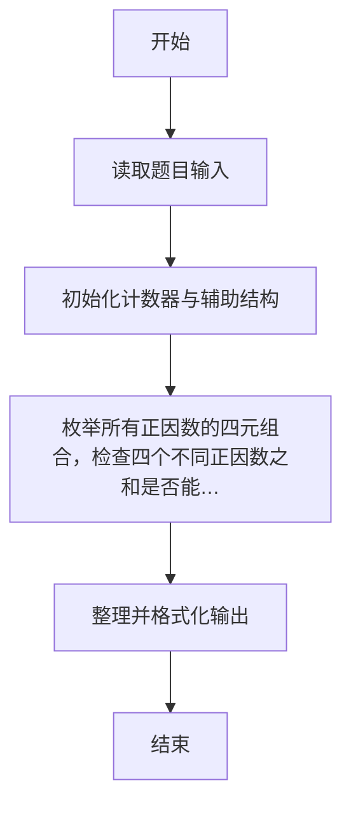
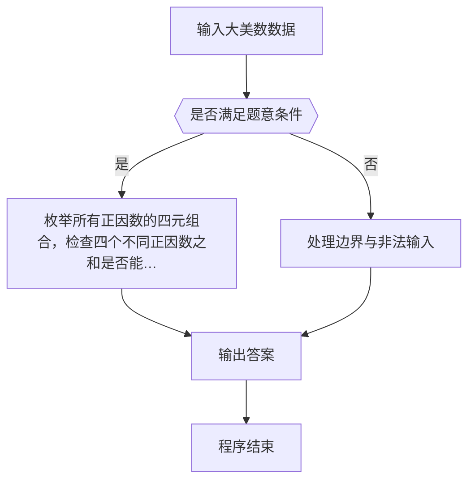

# 1096 大美数

- **分值：** 15分

### 题目描述

若正整数 N 可以整除它的 4 个不同正因数之和，则称这样的正整数为“大美数”。本题就要求你判断任一给定的正整数是否是“大美数”。

### 输入格式：

输入在第一行中给出正整数 K（≤ 10），随后一行给出 K 个待检测的、不超过 10^4 的正整数。

### 输出格式：

对每个需要检测的数字，如果它是大美数就在一行中输出 `Yes`，否则输出 `No`。

### 输入样例：
```
3
18 29 40
```

### 输出样例：
```
Yes
No
Yes
```


### 解题思路

本题的核心是：枚举所有正因数的四元组合，检查四个不同正因数之和是否能被原数整除。程序先读取题目输入，再按照上述规则完成数据处理，最后严格按照题目要求输出结果。实现时应优先根据题目约束选择合适的数据类型和数据结构，避免溢出或不必要的重复计算。

时间复杂度为 O(n+d⁴)，其中 d 为正因数个数；空间复杂度为 O(d)。

### 代码流程说明

1. 读取 1096 大美数 所需的输入数据。
2. 初始化计数器、数组或其他辅助变量。
3. 枚举所有正因数的四元组合，检查四个不同正因数之和是否能被原数整除。
4. 按题目规定的格式输出计算结果。

### 代码实现

```r
# 实现原理：本题的核心是：枚举所有正因数的四元组合，检查四个不同正因数之和是否能被原数整除。程序先读取题目输入，再按照上述规则完成数据处理，最后严格按照题目要求输出结果。实现时应优先根据题目约束选择合适的数据类型和数据结构，避免溢出或不必要的重复计算。 时间复杂度为 O(n+d⁴)，其中 d 为正因数个数；空间复杂度为 O(d)。
# 代码按“读取输入—核心计算—格式化输出”的流程组织。

# 读取题目输入。
z<-scan(what=integer(),quiet=TRUE)
n<-z[1]
# 遍历数据并执行题目要求的处理。
for(x in z[2:(n+1)]){
  d<-(1:x)[x%%(1:x)==0]
  ok<-FALSE
  if(length(d)>=4)for(i in 1:(length(d)-3))for(j in (i+1):(length(d)-2))for(k in (j+1):(length(d)-1))for(l in (k+1):length(d))if((d[i]+d[j]+d[k]+d[l])%%x==0)ok<-TRUE
  # 按题目要求输出结果。
  cat(if(ok)'Yes\n'else'No\n')
}

```

### 代码流程图



### 解题流程图



### 常见易错点

- 注意输入范围与边界值，选择合适的数据类型。
- 循环与下标要严格对应题目定义，避免越界或漏算。
- 输出格式必须与题目要求完全一致，包括空格与换行。
- 输出格式必须与题目要求完全一致，包括空格、换行、大小写和特殊符号。
