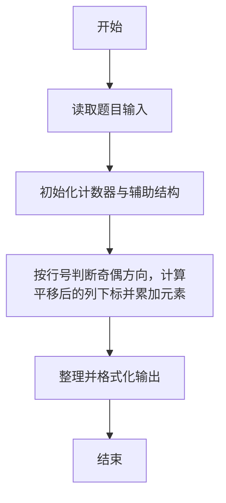
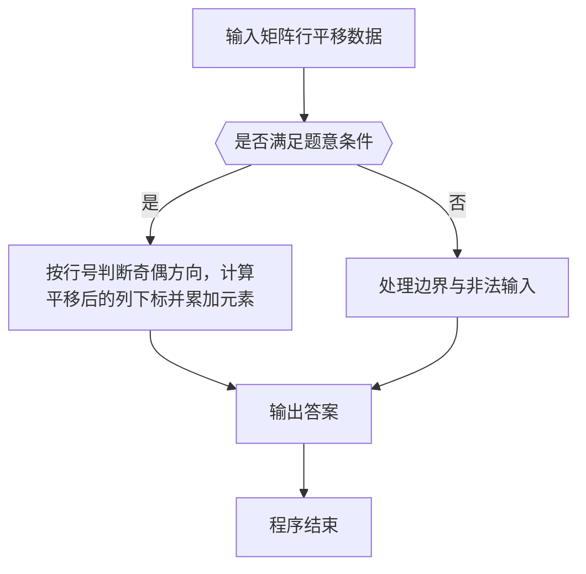

# 1097 矩阵行平移

- **分值：** 20分

### 题目描述

给定一个 n × n 的整数矩阵。对任一给定的正整数 k < n，我们将矩阵的奇数行的元素整体向右依次平移 1、……、k、1、……、k、…… 个位置，平移空出的位置用整数 x 补。你需要计算出结果矩阵的每一列元素的和。

### 输入格式：

输入第一行给出 3 个正整数：n（n < 100）、k（k < n）、x（x < 100），分别如题面所述。

接下来 n 行，每行给出 n 个不超过 100 的正整数，为矩阵元素的值。数字间以空格分隔。

### 输出格式：

在一行中输出平移后第 1 到 n 列元素的和。数字间以 1 个空格分隔，行首尾不得有多余空格。

### 输入样例：
```
7 2 99
11 87 23 67 20 75 89
37 94 27 91 63 50 11
44 38 50 26 40 26 24
73 85 63 28 62 18 68
15 83 27 97 88 25 43
23 78 98 20 30 81 99
77 36 48 59 25 34 22
```

### 输出样例：
```
529 481 479 263 417 342 343
```

**样例解读**

需要平移的是第 1、3、5、7 行。给定 k=2，应该将这三列顺次整体向右平移 1、2、1、2 位（如果有更多行，就应该按照 1、2、1、2、1、2 …… 这个规律顺次向右平移），左端的空位用 99 来填充。平移后的矩阵变成：
```
99 11 87 23 67 20 75
37 94 27 91 63 50 11
99 99 44 38 50 26 40
73 85 63 28 62 18 68
99 15 83 27 97 88 25
23 78 98 20 30 81 99
99 99 77 36 48 59 25
```


### 解题思路

本题的核心是：按行号判断奇偶方向，计算平移后的列下标并累加元素。程序先读取题目输入，再按照上述规则完成数据处理，最后严格按照题目要求输出结果。实现时应优先根据题目约束选择合适的数据类型和数据结构，避免溢出或不必要的重复计算。

时间复杂度为 O(RC)；空间复杂度取决于输入规模，主要用于保存题目数据和中间结果。

### 代码流程说明

1. 读取 1097 矩阵行平移 所需的输入数据。
2. 初始化计数器、数组或其他辅助变量。
3. 按行号判断奇偶方向，计算平移后的列下标并累加元素。
4. 按题目规定的格式输出计算结果。

### 代码实现

```r
# 实现原理：本题的核心是：按行号判断奇偶方向，计算平移后的列下标并累加元素。程序先读取题目输入，再按照上述规则完成数据处理，最后严格按照题目要求输出结果。实现时应优先根据题目约束选择合适的数据类型和数据结构，避免溢出或不必要的重复计算。 时间复杂度为 O(RC)；空间复杂度取决于输入规模，主要用于保存题目数据和中间结果。
# 代码按“读取输入—核心计算—格式化输出”的流程组织。

# 读取题目输入。
z<-scan(what=integer(),quiet=TRUE)
n<-z[1]
k<-z[2]
x<-z[3]
a<-matrix(z[4:(n*n+3)],n,n,byrow=TRUE)
ans<-integer(n)
# 遍历数据并执行题目要求的处理。
for(i in 1:n){
  shift<-if(i%%2==1)((i-1)%/%2)%%k+1 else 0
  # 遍历数据并执行题目要求的处理。
  for(j in 1:n)ans[j]<-ans[j]+if(i%%2==1&&j<=shift)x else a[i,j-shift]
}
# 按题目要求输出结果。
cat(paste(ans,collapse=' '), '\n', sep='')

```

### 代码流程图



### 解题流程图



### 常见易错点

- 素数判断注意 1 不是素数，边界与取整平方根范围要正确。
- 输出格式必须与题目要求完全一致，包括空格、换行、大小写和特殊符号。
