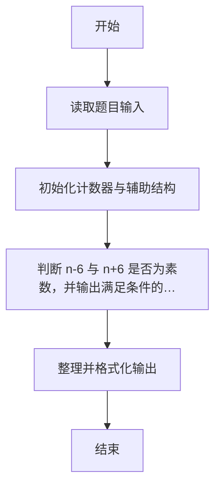
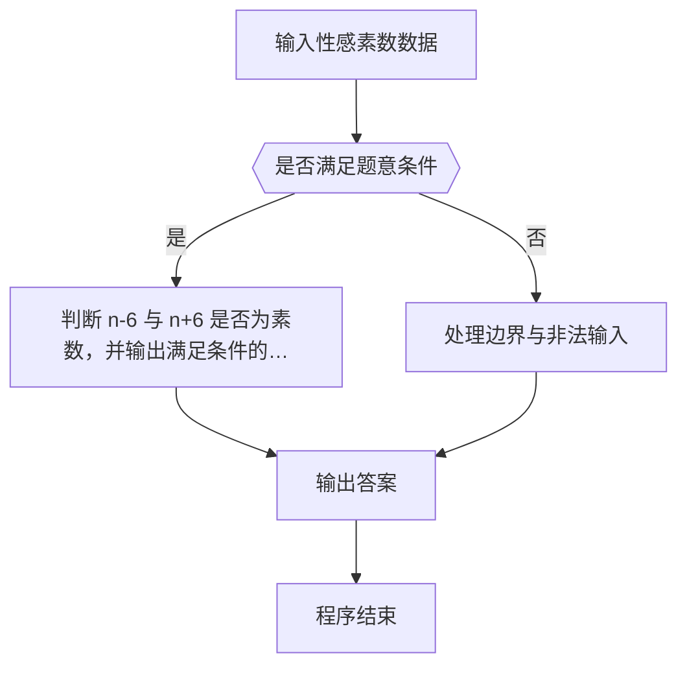

# 1099 性感素数

- **分值：** 20分

### 题目描述

“性感素数”是指形如 (p,p+6) 这样的一对素数。之所以叫这个名字，是因为拉丁语管“六”叫“sex”（即英语的“性感”）。（原文摘自 http://mathworld.wolfram.com/SexyPrimes.html）

现给定一个整数，请你判断其是否为一个性感素数。

### 输入格式：

输入在一行中给出一个正整数 N（N ≤ 10^8）。

### 输出格式：

若 N 是一个性感素数，则在一行中输出 `Yes`，并在第二行输出与 N 配对的另一个性感素数（若这样的数不唯一，输出较小的那个）。若 N 不是性感素数，则在一行中输出 `No`，然后在第二行输出大于 N 的最小性感素数。

### 输入样例 1：
```
47
```

### 输出样例 1：
```
Yes
41
```

### 输入样例 2：
```
21
```

### 输出样例 2：
```
No
23
```


### 解题思路

本题的核心是：判断 n-6 与 n+6 是否为素数，并输出满足条件的邻居。程序先读取题目输入，再按照上述规则完成数据处理，最后严格按照题目要求输出结果。实现时应优先根据题目约束选择合适的数据类型和数据结构，避免溢出或不必要的重复计算。

时间复杂度为 O(√n)；空间复杂度取决于输入规模，主要用于保存题目数据和中间结果。

### 代码流程说明

1. 读取 1099 性感素数 所需的输入数据。
2. 初始化计数器、数组或其他辅助变量。
3. 判断 n-6 与 n+6 是否为素数，并输出满足条件的邻居。
4. 按题目规定的格式输出计算结果。

### 代码实现

```r
# 实现原理：本题的核心是：判断 n-6 与 n+6 是否为素数，并输出满足条件的邻居。程序先读取题目输入，再按照上述规则完成数据处理，最后严格按照题目要求输出结果。实现时应优先根据题目约束选择合适的数据类型和数据结构，避免溢出或不必要的重复计算。 时间复杂度为 O(√n)；空间复杂度取决于输入规模，主要用于保存题目数据和中间结果。
# 代码按“读取输入—核心计算—格式化输出”的流程组织。

# 读取题目输入。
n<-scan(what=integer(),quiet=TRUE)[1]
# 定义辅助函数，封装可复用的计算逻辑。
prime<-function(x){
  if(x<2)return(FALSE)
  if(x<4)return(TRUE)
  all(x%%(2:floor(sqrt(x)))!=0)
}
# 按题目要求输出结果。
if(prime(n-6))cat('Yes\n',n-6,'\n',sep='')else if(prime(n+6))cat('Yes\n',n+6,'\n',sep='')else{
  next_prime<-n+1
  while(!(prime(next_prime)&&prime(next_prime-6)))next_prime<-next_prime+1
  cat('No\n',next_prime,'\n',sep='')
}

```

### 代码流程图



### 解题流程图



### 常见易错点

- 素数判断注意 1 不是素数，边界与取整平方根范围要正确。
- 输出格式必须与题目完全一致，包括空格、换行与单复数。
- 输出格式必须与题目要求完全一致，包括空格、换行、大小写和特殊符号。
