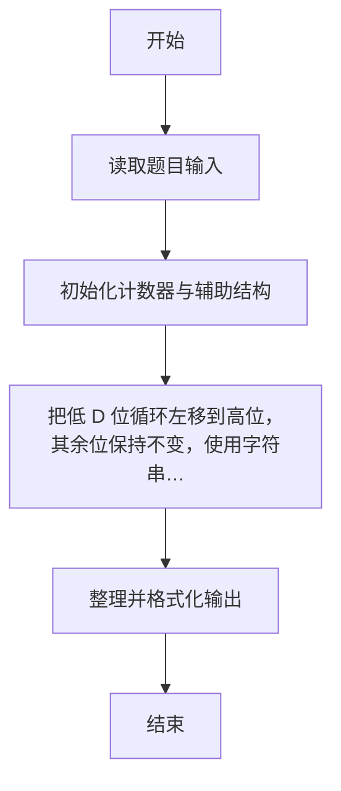
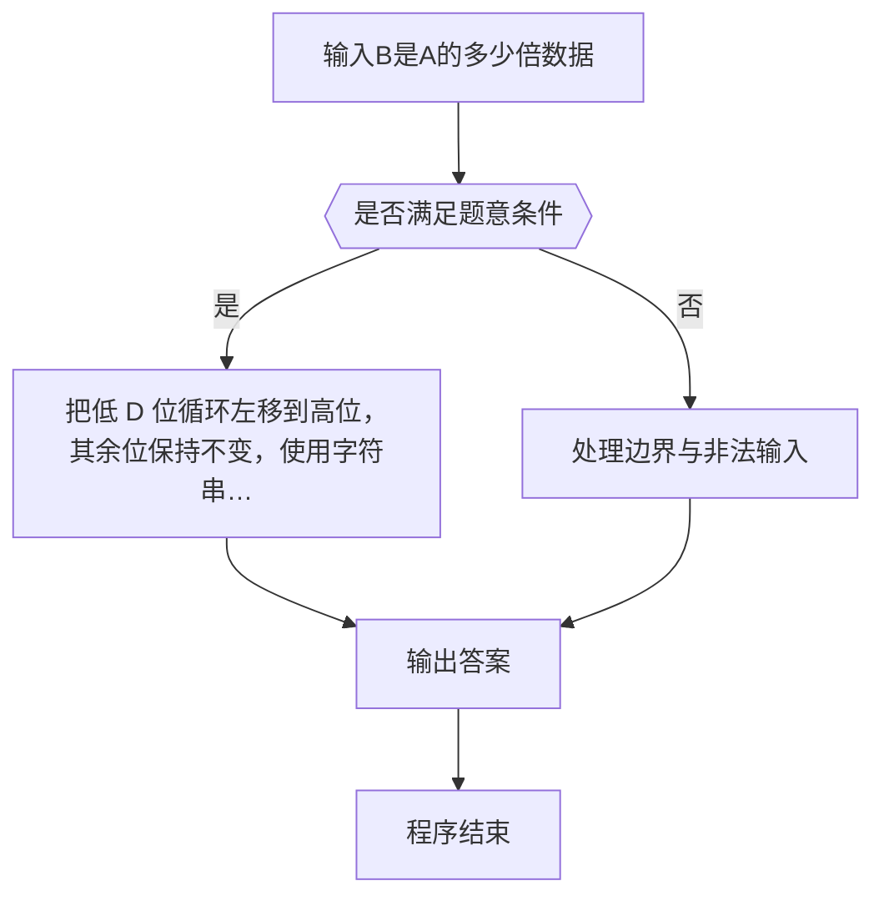

# 1101 B是A的多少倍

- **分值：** 15分

### 题目描述

设一个数 A 的最低 D 位形成的数是 a_d。如果把 a_d 截下来移到 A 的最高位前面，就形成了一个新的数 B。B 是 A 的多少倍？例如将 12345 的最低 2 位 45 截下来放到 123 的前面，就得到 45123，它约是 12345 的 3.66 倍。

### 输入格式：

输入在一行中给出一个正整数 A（≤ 10^9）和要截取的位数 D。题目保证 D 不超过 A 的总位数。

### 输出格式：

计算 B 是 A 的多少倍，输出小数点后 2 位。

### 输入样例 1：
```
12345 2
```

### 输出样例 1：
```
3.66
```

### 输入样例 2：
```
12345 5
```

### 输出样例 2：
```
1.00
```


### 解题思路

本题的核心是：把低 D 位循环左移到高位，其余位保持不变，使用字符串避免位数限制。程序先读取题目输入，再按照上述规则完成数据处理，最后严格按照题目要求输出结果。实现时应优先根据题目约束选择合适的数据类型和数据结构，避免溢出或不必要的重复计算。

时间复杂度为 O(L)；空间复杂度取决于输入规模，主要用于保存题目数据和中间结果。

### 代码流程说明

1. 读取 1101 B是A的多少倍 所需的输入数据。
2. 初始化计数器、数组或其他辅助变量。
3. 把低 D 位循环左移到高位，其余位保持不变，使用字符串避免位数限制。
4. 按题目规定的格式输出计算结果。

### 代码实现

```r
# 实现原理：本题的核心是：把低 D 位循环左移到高位，其余位保持不变，使用字符串避免位数限制。程序先读取题目输入，再按照上述规则完成数据处理，最后严格按照题目要求输出结果。实现时应优先根据题目约束选择合适的数据类型和数据结构，避免溢出或不必要的重复计算。 时间复杂度为 O(L)；空间复杂度取决于输入规模，主要用于保存题目数据和中间结果。
# 代码按“读取输入—核心计算—格式化输出”的流程组织。

# 读取题目输入。
z<-scan(what=character(),quiet=TRUE)
a<-z[1]
d<-as.integer(z[2])
b<-paste0(substr(a,nchar(a)-d+1,nchar(a)),substr(a,1,nchar(a)-d))
# 按题目要求输出结果。
cat(sprintf('%.2f\n',as.numeric(b)/as.numeric(a)))

```

### 代码流程图



### 解题流程图



### 常见易错点

- 大整数或超长串不要用浮点/普通整型硬算，应按字符串或高精度处理。
- 输出格式必须与题目要求完全一致，包括空格、换行、大小写和特殊符号。
