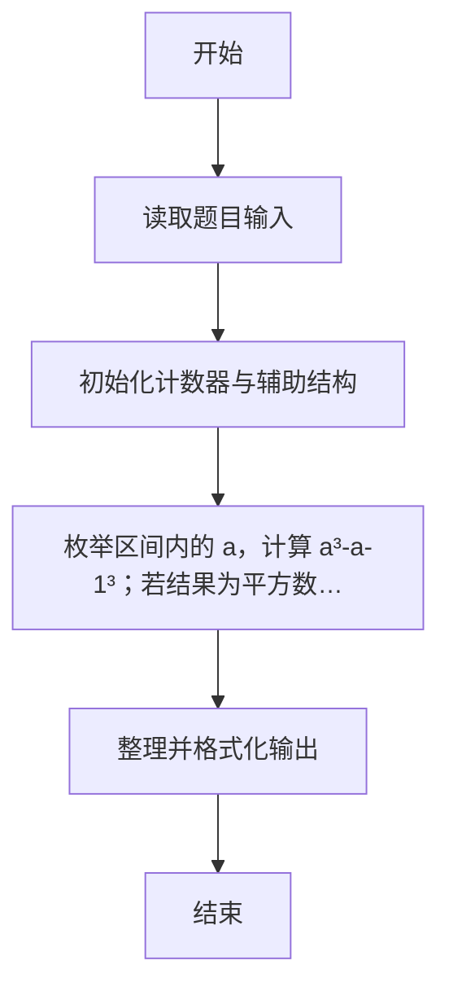
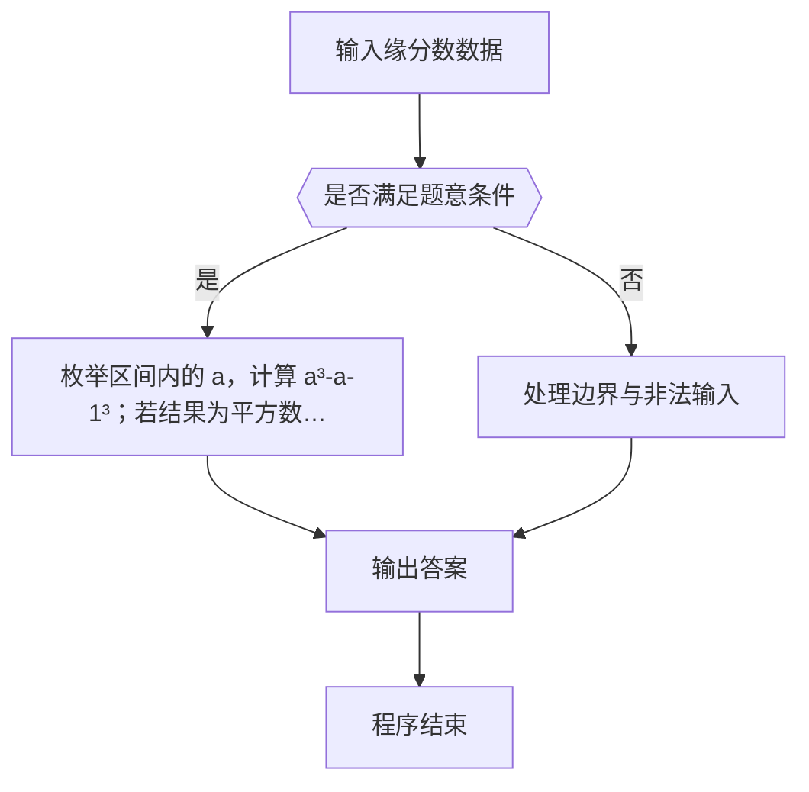

# 1103 缘分数

- **分值：** 20分

### 题目描述

所谓**缘分数**是指这样一对正整数 a 和 b，其中 a 和它的小弟 a-1 的立方差正好是另一个整数 c 的平方，而 c 正好是 b 和它的小弟 b-1 的平方和。例如 8^3 - 7^3 = 169 = 13^2，而 13 = 3^2 + 2^2，于是 8 和 3 就是一对缘分数。

给定 a 所在的区间 [m,n]，是否存在缘分数？

### 输入格式：

输入给出区间的两个端点 0 < m<n ≤ 25000，其间以空格分隔。

### 输出格式：

按照 a 从小到大的顺序，每行输出一对缘分数，数字间以空格分隔。如果无解，则输出 `No Solution`。

### 输入样例 1：
```
8 200
```

### 输出样例 1：
```
8 3
105 10
```

### 输入样例 2：
```
9 100
```

### 输出样例 2：
```
No Solution
```


### 解题思路

本题的核心是：枚举区间内的 a，计算 a³-(a-1)³；若结果为平方数，再检查其平方根能否表示为两个平方数之和。程序先读取题目输入，再按照上述规则完成数据处理，最后严格按照题目要求输出结果。实现时应优先根据题目约束选择合适的数据类型和数据结构，避免溢出或不必要的重复计算。

时间复杂度为 O((n-m)n)；空间复杂度取决于输入规模，主要用于保存题目数据和中间结果。

### 代码流程说明

1. 读取 1103 缘分数 所需的输入数据。
2. 初始化计数器、数组或其他辅助变量。
3. 枚举区间内的 a，计算 a³-(a-1)³；若结果为平方数，再检查其平方根能否表示为两个平方数之和。
4. 按题目规定的格式输出计算结果。

### 代码实现

```r
# 实现原理：本题的核心是：枚举区间内的 a，计算 a³-(a-1)³；若结果为平方数，再检查其平方根能否表示为两个平方数之和。程序先读取题目输入，再按照上述规则完成数据处理，最后严格按照题目要求输出结果。实现时应优先根据题目约束选择合适的数据类型和数据结构，避免溢出或不必要的重复计算。 时间复杂度为 O((n-m)n)；空间复杂度取决于输入规模，主要用于保存题目数据和中间结果。
# 代码按“读取输入—核心计算—格式化输出”的流程组织。

# 读取题目输入。
z<-scan(what=integer(),quiet=TRUE)
m<-z[1]
n<-z[2]
found<-FALSE
# 遍历数据并执行题目要求的处理。
for(a in m:n){
  v<-a^3-(a-1)^3
  c<-sqrt(v)
  # 按题目要求输出结果。
  if(c==floor(c))for(b in 1:floor(sqrt(c)))if(b^2+(b-1)^2==c){
    cat(paste(a,b), '\n', sep='')
    found<-TRUE
    break
  }
}
# 按题目要求输出结果。
if(!found)cat('No Solution\n')

```

### 代码流程图



### 解题流程图



### 常见易错点

- 注意输入范围与边界值，选择合适的数据类型。
- 循环与下标要严格对应题目定义，避免越界或漏算。
- 输出格式必须与题目要求完全一致，包括空格与换行。
- 输出格式必须与题目要求完全一致，包括空格、换行、大小写和特殊符号。
