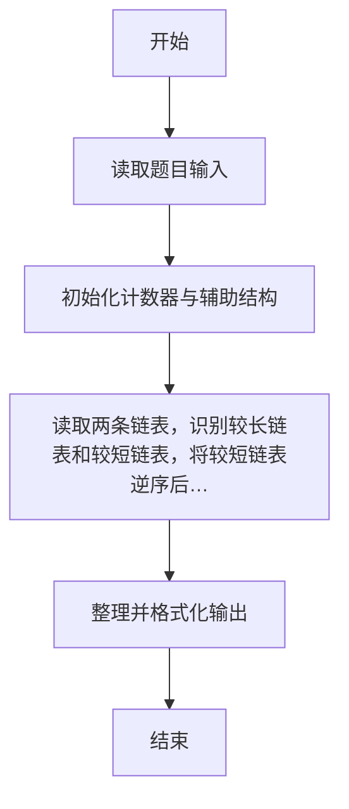
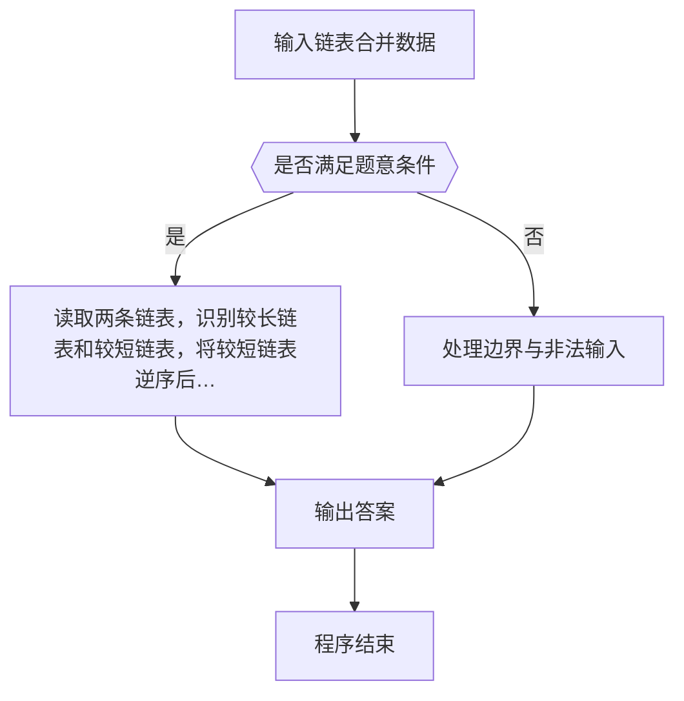

# 1105 链表合并

- **分值：** 25分

### 题目描述

给定两个单链表 L_1 = a_1 → a_2 → ⋯ → a_n-1 → a_n 和 L_2 = b_1 → b_2 → ⋯ → b_m-1 → b_m。如果 n ≥ 2m，你的任务是将比较短的那个链表逆序，然后将之并入比较长的那个链表，得到一个形如 a_1 → a_2 → b_m → a_3 → a_4 → b_m-1 ⋯ 的结果。例如给定两个链表分别为 6 → 7 和 1 → 2 → 3 → 4 → 5，你应该输出 1 → 2 → 7 → 3 → 4 → 6 → 5。

### 输入格式：

输入首先在第一行中给出两个链表 L_1 和 L_2 的头结点的地址，以及正整数
N（N ≤ 10^5），即给定的结点总数。一个结点的地址是一个 5 位数的非负整数，空地址 NULL 用 `-1` 表示。

随后 N 行，每行按以下格式给出一个结点的信息：

```
Address Data Next
```

其中 `Address` 是结点的地址，`Data` 是不超过 10^5 的正整数，`Next` 是下一个结点的地址。题目保证没有空链表，并且较长的链表至少是较短链表的两倍长。

### 输出格式：

按顺序输出结果链表，每个结点占一行，格式与输入相同。

### 输入样例：
```
00100 01000 7
02233 2 34891
00100 6 00001
34891 3 10086
01000 1 02233
00033 5 -1
10086 4 00033
00001 7 -1
```

### 输出样例：
```
01000 1 02233
02233 2 00001
00001 7 34891
34891 3 10086
10086 4 00100
00100 6 00033
00033 5 -1
```


### 解题思路

本题的核心是：读取两条链表，识别较长链表和较短链表，将较短链表逆序后按每两个长链表结点插入一个短链表结点的规则交错输出。程序先读取题目输入，再按照上述规则完成数据处理，最后严格按照题目要求输出结果。实现时应优先根据题目约束选择合适的数据类型和数据结构，避免溢出或不必要的重复计算。

时间复杂度为 O(n+m)；空间复杂度取决于输入规模，主要用于保存题目数据和中间结果。

### 代码流程说明

1. 读取 1105 链表合并 所需的输入数据。
2. 初始化计数器、数组或其他辅助变量。
3. 识别长短链表，将短链表逆序后与长链表交错合并并输出。
4. 按题目规定的格式输出计算结果。

### 代码实现

```r
# 实现原理：读取两条链表，识别较长链表和较短链表，将较短链表逆序后按每两个长链表结点插入一个短链表结点的规则交错输出。时间复杂度为 O(n+m)，空间复杂度为 O(n+m)。
# 代码按“读取输入—核心计算—格式化输出”的流程组织。

# 读取题目输入。
z<-scan(what=character(),quiet=TRUE)
h1<-z[1]
h2<-z[2]
n<-as.integer(z[3])
at<-4
val<-nx<-list()
# 遍历数据并执行题目要求的处理。
for(i in seq_len(n)){
  ad<-z[at]
  val[[ad]]<-z[at+1]
  nx[[ad]]<-z[at+2]
  at<-at+3
}
# 定义辅助函数，封装可复用的计算逻辑。
walk<-function(h){
  r<-character()
  # 按题意重复处理，直到满足结束条件。
  while(h!='-1'){
    r<-c(r,h)
    h<-nx[[h]]
  }
r
}
a<-walk(h1)
b<-walk(h2)
if(length(a)>=length(b)){
  long<-a
  short<-rev(b)
}else{
  long<-b
  short<-rev(a)
}
o<-character()
j<-1
# 遍历数据并执行题目要求的处理。
for(i in seq_along(long)){
  o<-c(o,long[i])
  if(i%%2==0&&j<=length(short)){
    o<-c(o,short[j])
    j<-j+1
  }
}
if(j<=length(short))o<-c(o,short[j:length(short)])
# 遍历数据并执行题目要求的处理。
for(i in seq_along(o))cat(paste(o[i],val[[o[i]]],if(i<length(o))o[i+1]else'-1'), '\n', sep='')

```

### 代码流程图



### 解题流程图



### 常见易错点

- 链表处理需按地址串成有效链，注意末结点 -1 与不足一组时不反转/仍成块。
- 输出格式必须与题目完全一致，包括空格、换行与单复数。
- 输出格式必须与题目要求完全一致，包括空格、换行、大小写和特殊符号。
