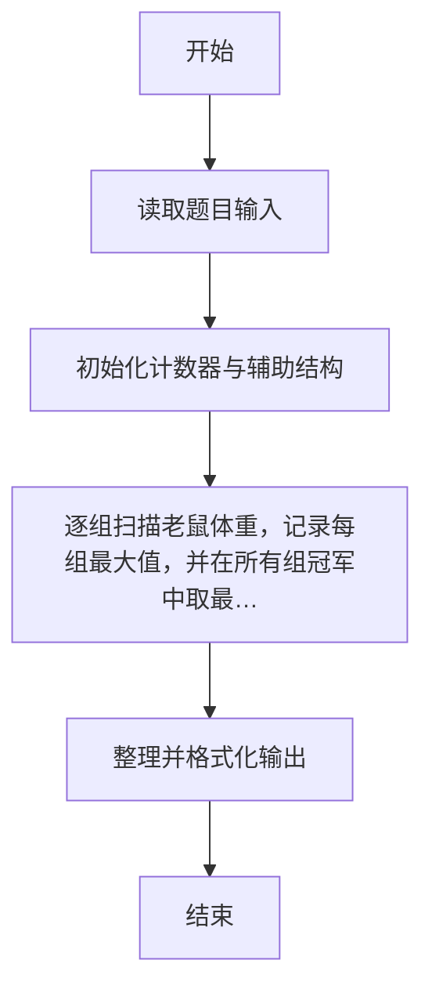
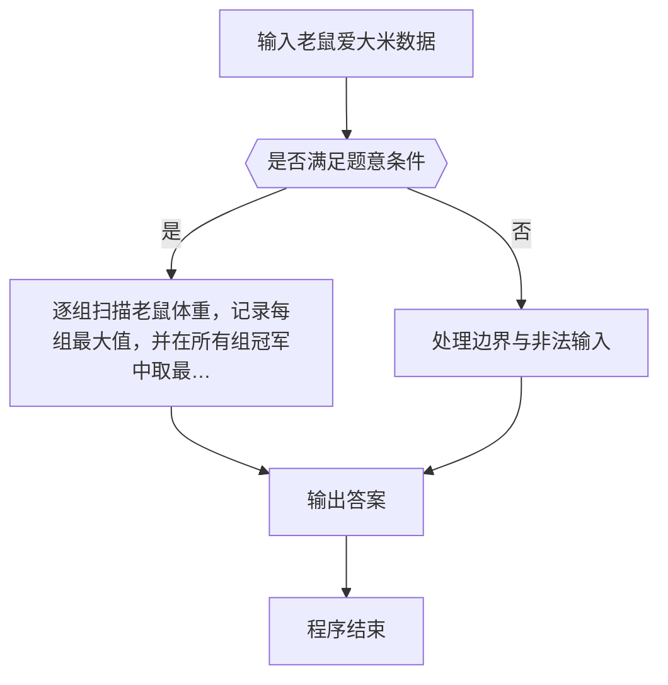

# 1107 老鼠爱大米

- **分值：** 20分

### 题目描述

翁恺老师曾经设计过一款 Java 挑战游戏，叫“老鼠爱大米”（或许因为他的外号叫“胖胖鼠”）。每个玩家用 Java 代码控制一只鼠，目标是抢吃尽可能多的大米让自己变成胖胖鼠，最胖的那只就是冠军。

因为游戏时间不能太长，我们把玩家分成 N 组，每组 M 只老鼠同场竞技，然后从 N 个分组冠军中直接选出最胖的冠军胖胖鼠。现在就请你写个程序来得到冠军的体重。

### 输入格式：

输入在第一行中给出 2 个正整数：N（≤ 100）为组数，M（≤ 10）为每组玩家个数。随后 N 行，每行给出一组玩家控制的 M 只老鼠最后的体重，均为不超过 10^4 的非负整数。数字间以空格分隔。

### 输出格式：

首先在第一行顺次输出各组冠军的体重，数字间以 1 个空格分隔，行首尾不得有多余空格。随后在第二行输出冠军胖胖鼠的体重。

### 输入样例：
```
3 5
62 53 88 72 81
12 31 9 0 2
91 42 39 6 48
```

### 输出样例：
```
88 31 91
91
```


### 解题思路

本题的核心是：逐组扫描老鼠体重，记录每组最大值，并在所有组冠军中取最大者。程序先读取题目输入，再按照上述规则完成数据处理，最后严格按照题目要求输出结果。实现时应优先根据题目约束选择合适的数据类型和数据结构，避免溢出或不必要的重复计算。

时间复杂度为 O(NM)；空间复杂度取决于输入规模，主要用于保存题目数据和中间结果。

### 代码流程说明

1. 读取 1107 老鼠爱大米 所需的输入数据。
2. 初始化计数器、数组或其他辅助变量。
3. 逐组扫描老鼠体重，记录每组最大值，并在所有组冠军中取最大者。
4. 按题目规定的格式输出计算结果。

### 代码实现

```r
# 实现原理：本题的核心是：逐组扫描老鼠体重，记录每组最大值，并在所有组冠军中取最大者。程序先读取题目输入，再按照上述规则完成数据处理，最后严格按照题目要求输出结果。实现时应优先根据题目约束选择合适的数据类型和数据结构，避免溢出或不必要的重复计算。 时间复杂度为 O(NM)；空间复杂度取决于输入规模，主要用于保存题目数据和中间结果。
# 代码按“读取输入—核心计算—格式化输出”的流程组织。

# 读取题目输入。
z<-scan(what=integer(),quiet=TRUE)
n<-z[1]
m<-z[2]
a<-numeric(n)
at<-3
# 遍历数据并执行题目要求的处理。
for(i in seq_len(n)){
  a[i]<-max(z[at:(at+m-1)])
  at<-at+m
}
# 按题目要求输出结果。
cat(paste(a,collapse=' '),'\n',max(a),'\n',sep='')

```

### 代码流程图



### 解题流程图



### 常见易错点

- 注意输入范围与边界值，选择合适的数据类型。
- 循环与下标要严格对应题目定义，避免越界或漏算。
- 输出格式必须与题目要求完全一致，包括空格与换行。
- 输出格式必须与题目要求完全一致，包括空格、换行、大小写和特殊符号。
