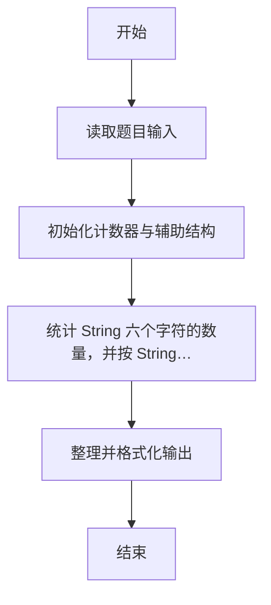
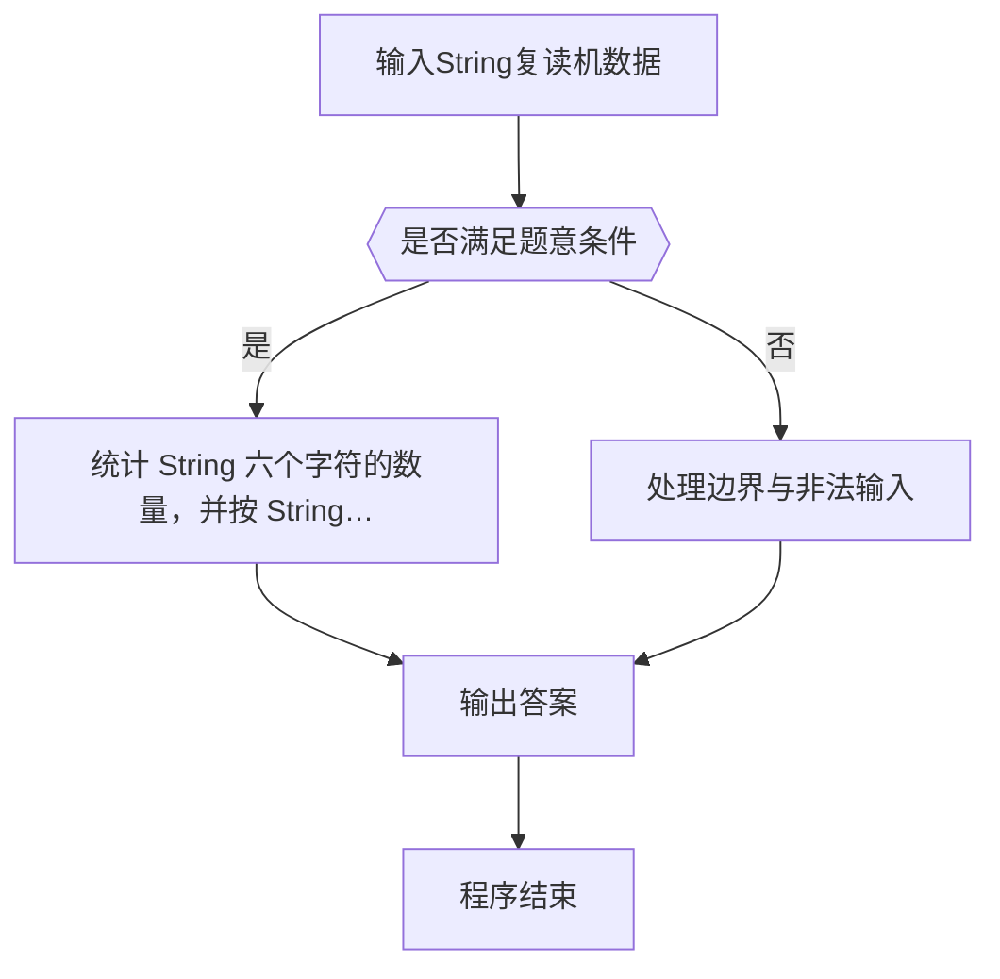

# 1108 String复读机

- **分值：** 20分

### 题目描述

给定一个长度不超过 10^4 的、仅由英文字母构成的字符串。请将字符重新调整顺序，按 `StringString....` （注意区分大小写）这样的顺序输出，并忽略其它字符。当然，六种字符的个数不一定是一样多的，若某种字符已经输出完，则余下的字符仍按 `String` 的顺序打印，直到所有字符都被输出。例如 `gnirtSSs` 要调整成 `StringS` 输出，其中 `s` 是多余字符被忽略。

### 输入格式：

输入在一行中给出一个长度不超过 10^4 的、仅由英文字母构成的非空字符串。

### 输出格式：

在一行中按题目要求输出处理后的字符串。题目保证输出非空。

### 输入样例：
```
sTRidlinSayBingStrropriiSHSiRiagIgtSSr
```

### 输出样例：
```
StringStringSrigSriSiSii
```


### 解题思路

本题的核心是：统计 `String` 六个字符的数量，并按 `String` 的顺序循环输出仍有剩余的字符。程序先读取题目输入，再按照上述规则完成数据处理，最后严格按照题目要求输出结果。实现时应优先根据题目约束选择合适的数据类型和数据结构，避免溢出或不必要的重复计算。

时间复杂度为 O(L)；空间复杂度取决于输入规模，主要用于保存题目数据和中间结果。

### 代码流程说明

1. 读取 1108 String复读机 所需的输入数据。
2. 初始化计数器、数组或其他辅助变量。
3. 统计 `String` 六个字符的数量，并按 `String` 的顺序循环输出仍有剩余的字符。
4. 按题目规定的格式输出计算结果。

### 代码实现

```r
# 实现原理：本题的核心是：统计 `String` 六个字符的数量，并按 `String` 的顺序循环输出仍有剩余的字符。程序先读取题目输入，再按照上述规则完成数据处理，最后严格按照题目要求输出结果。实现时应优先根据题目约束选择合适的数据类型和数据结构，避免溢出或不必要的重复计算。 时间复杂度为 O(L)；空间复杂度取决于输入规模，主要用于保存题目数据和中间结果。
# 代码按“读取输入—核心计算—格式化输出”的流程组织。

# 读取题目输入。
s<-scan(what=character(),quiet=TRUE)[1]
chars<-strsplit('String','')[[1]]
c<-tabulate(match(strsplit(s,'')[[1]],chars),nbins=6)
out<-character()
# 按题意重复处理，直到满足结束条件。
while(any(c>0)){
  for(i in 1:6)if(c[i]>0){
    out<-c(out,chars[i])
    c[i]<-c[i]-1
  }
}
# 按题目要求输出结果。
cat(paste(out,collapse=''),'\n',sep='')

```

### 代码流程图



### 解题流程图



### 常见易错点

- 输出格式必须与题目完全一致，包括空格、换行与单复数。
- 输出格式必须与题目要求完全一致，包括空格、换行、大小写和特殊符号。
