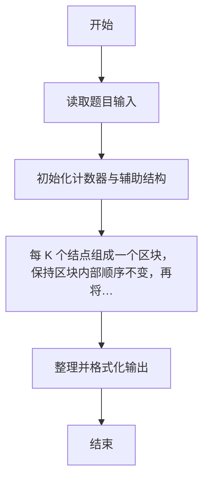
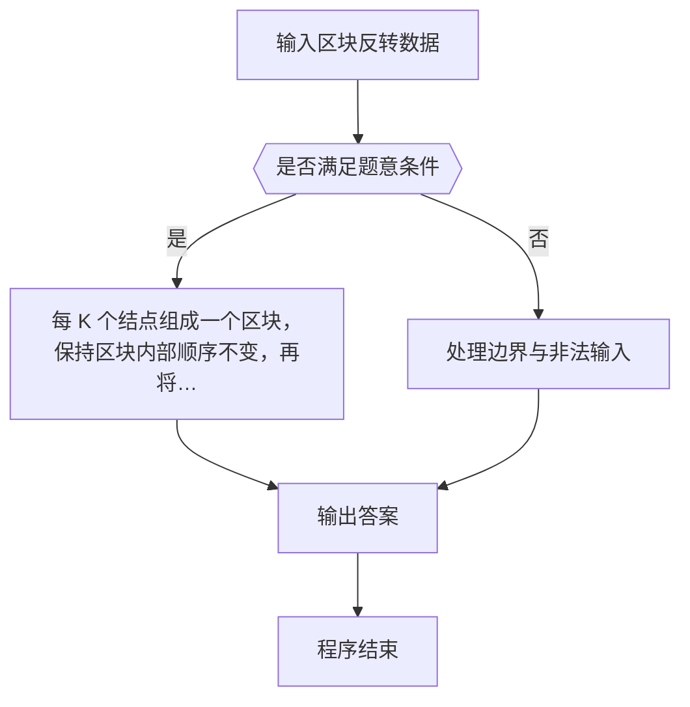

# 1110 区块反转

- **分值：** 25分

### 题目描述

给定一个单链表 L，我们将每 K 个结点看成一个**区块**（链表最后若不足 K 个结点，也看成一个区块），请编写程序将 L 中所有区块的链接反转。例如：给定 L 为 1 → 2 → 3 → 4 → 5 → 6 → 7 → 8，K 为 3，则输出应该为 7 → 8 → 4 → 5 → 6 → 1 → 2 → 3。

### 输入格式：

每个输入包含 1 个测试用例。每个测试用例第 1 行给出第 1 个结点的地址、结点总个数正整数 N（N ≤ 10^5）、以及正整数 K（K ≤ N），即区块的大小。结点的地址是 5 位非负整数，NULL 地址用 -1 表示。

接下来有 N 行，每行格式为：
```
Address Data Next
```

其中 `Address` 是结点地址，`Data` 是该结点保存的整数数据，`Next` 是下一结点的地址。

### 输出格式：

对每个测试用例，顺序输出反转后的链表，其上每个结点占一行，格式与输入相同。

### 输入样例：
```
00100 8 3
71120 7 88666
00000 4 99999
00100 1 12309
68237 6 71120
33218 3 00000
99999 5 68237
88666 8 -1
12309 2 33218
```

### 输出样例：
```
71120 7 88666
88666 8 00000
00000 4 99999
99999 5 68237
68237 6 00100
00100 1 12309
12309 2 33218
33218 3 -1
```


### 解题思路

本题的核心是：每 K 个结点组成一个区块，保持区块内部顺序不变，再将所有区块的顺序整体反转。程序先读取题目输入，再按照上述规则完成数据处理，最后严格按照题目要求输出结果。实现时应优先根据题目约束选择合适的数据类型和数据结构，避免溢出或不必要的重复计算。

时间复杂度为 O(n)；空间复杂度取决于输入规模，主要用于保存题目数据和中间结果。

### 代码流程说明

1. 读取 1110 区块反转 所需的输入数据。
2. 初始化计数器、数组或其他辅助变量。
3. 按 K 个结点划分区块，保持区块内部顺序并反转区块顺序。
4. 按题目规定的格式输出计算结果。

### 代码实现

```r
# 实现原理：每 K 个结点组成一个区块，保持区块内部顺序不变，再将所有区块的顺序整体反转。时间复杂度为 O(n)，空间复杂度为 O(n)。
# 代码按“读取输入—核心计算—格式化输出”的流程组织。

# 读取题目输入。
z<-scan(what=character(),quiet=TRUE)
head<-z[1]
n<-as.integer(z[2])
k<-as.integer(z[3])
at<-4
val<-nx<-list()
# 遍历数据并执行题目要求的处理。
for(i in seq_len(n)){
  ad<-z[at]
  val[[ad]]<-z[at+1]
  nx[[ad]]<-z[at+2]
  at<-at+3
}
lst<-character()
x<-head
# 按题意重复处理，直到满足结束条件。
while(x!='-1'){
  lst<-c(lst,x)
  x<-nx[[x]]
}
groups<-list()
i<-1
# 按题意重复处理，直到满足结束条件。
while(i<=length(lst)){
  j<-min(i+k-1,length(lst))
  groups[[length(groups)+1]]<-lst[i:j]
  i<-j+1
}
out<-unlist(rev(groups),use.names=FALSE)
# 遍历数据并执行题目要求的处理。
for(i in seq_along(out))cat(paste(out[i],val[[out[i]]],if(i<length(out))out[i+1]else'-1'), '\n', sep='')

```

### 代码流程图



### 解题流程图



### 常见易错点

- 链表处理需按地址串成有效链，注意末结点 -1 与不足一组时不反转/仍成块。
- 输出格式必须与题目要求完全一致，包括空格、换行、大小写和特殊符号。
