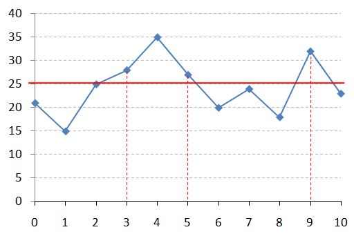
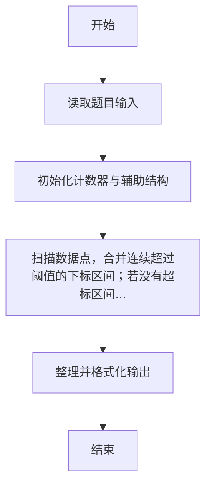
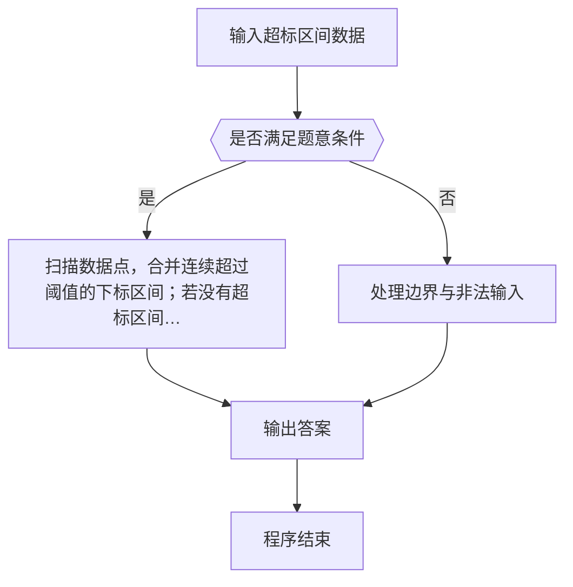

# 1112 超标区间

- **分值：** 20分

### 题目描述



上图是用某科学研究中采集的数据绘制成的折线图，其中红色横线表示正常数据的阈值（在此图中阈值是 25）。你的任务就是把超出阈值的非正常数据所在的区间找出来。例如上图中横轴 [3, 5] 区间中的 3 个数据点超标，横轴上点 9 （可以表示为区间 [9, 9]）对应的数据点也超标。

### 输入格式：

输入第一行给出两个正整数 N（≤ 10^4）和 T（≤ 100），分别是数据点的数量和阈值。第二行给出 N 个数据点的纵坐标，均为不超过 1000 的正整数，对应的横坐标为整数 0 到 N-1。

### 输出格式：

按从左到右的顺序输出超标数据的区间，每个区间占一行，格式为 `[A, B]`，其中 `A` 和 `B` 为区间的左右端点。如果没有数据超标，则在一行中输出所有数据的最大值。

### 输入样例 1：
```
11 25
21 15 25 28 35 27 20 24 18 32 23
```

### 输出样例 1：
```
[3, 5]
[9, 9]
```

### 输入样例 2：
```
11 40
21 15 25 28 35 27 20 24 18 32 23
```

### 输出样例 2：
```
35
```


### 解题思路

本题的核心是：扫描数据点，合并连续超过阈值的下标区间；若没有超标区间则维护最大值。程序先读取题目输入，再按照上述规则完成数据处理，最后严格按照题目要求输出结果。实现时应优先根据题目约束选择合适的数据类型和数据结构，避免溢出或不必要的重复计算。

时间复杂度为 O(n)；空间复杂度取决于输入规模，主要用于保存题目数据和中间结果。

### 代码流程说明

1. 读取 1112 超标区间 所需的输入数据。
2. 初始化计数器、数组或其他辅助变量。
3. 扫描数据点，合并连续超过阈值的下标区间；若没有超标区间则维护最大值。
4. 按题目规定的格式输出计算结果。

### 代码实现

```r
# 实现原理：本题的核心是：扫描数据点，合并连续超过阈值的下标区间；若没有超标区间则维护最大值。程序先读取题目输入，再按照上述规则完成数据处理，最后严格按照题目要求输出结果。实现时应优先根据题目约束选择合适的数据类型和数据结构，避免溢出或不必要的重复计算。 时间复杂度为 O(n)；空间复杂度取决于输入规模，主要用于保存题目数据和中间结果。
# 代码按“读取输入—核心计算—格式化输出”的流程组织。

# 读取题目输入。
z<-scan(what=integer(),quiet=TRUE)
n<-z[1]
t<-z[2]
a<-z[3:(n+2)]
out<-character()
start<-NA
# 遍历数据并执行题目要求的处理。
for(i in seq_len(n)){
  if(a[i]>t&&is.na(start))start<-i-1
  if((a[i]<=t||i==n)&&!is.na(start)){
    end<-if(a[i]<=t)i-2 else n-1
    out<-c(out,sprintf('[%d, %d]',start,end))
    start<-NA
  }
}
# 按题目要求输出结果。
if(length(out))cat(paste(out,collapse='\n'),'\n',sep='')else cat(max(a),'\n')

```

### 代码流程图



### 解题流程图



### 常见易错点

- 注意输入范围与边界值，选择合适的数据类型。
- 循环与下标要严格对应题目定义，避免越界或漏算。
- 输出格式必须与题目要求完全一致，包括空格与换行。
- 输出格式必须与题目要求完全一致，包括空格、换行、大小写和特殊符号。
