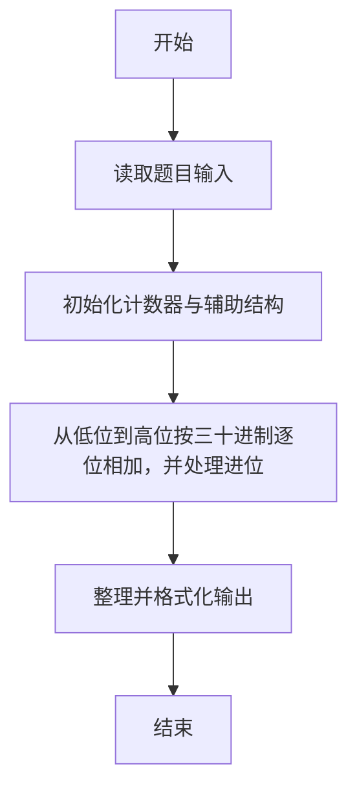
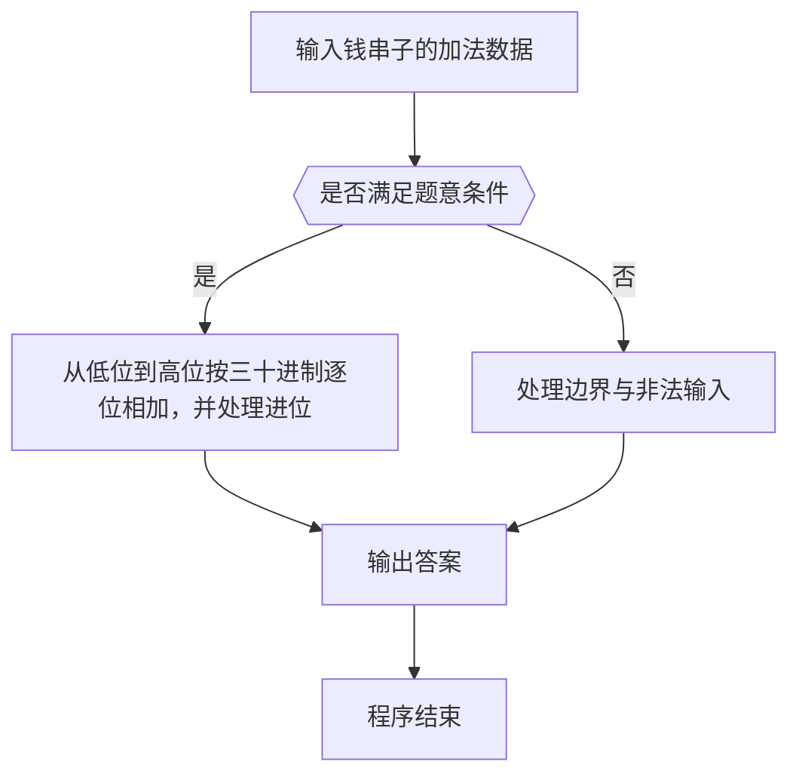

# 1113 钱串子的加法

- **分值：** 20分

### 题目描述


人类习惯用 10 进制，可能因为大多数人类有 10 根手指头，可以用于计数。这个世界上有一种叫“钱串子”（学名“蚰蜒”）的生物，有 30 只细长的手/脚，在它们的世界里，数字应该是 30 进制的。本题就请你实现钱串子世界里的加法运算。

### 输入格式：

输入在一行中给出两个钱串子世界里的非负整数，其间以空格分隔。

所谓“钱串子世界里的整数”是一个 30 进制的数字，其数字 0 到 9 跟人类世界的整数一致，数字 10 到 29 用小写英文字母 a 到 t 顺次表示。

输入给出的两个整数都不超过 10^5 位。

### 输出格式：

在一行中输出两个整数的和。注意结果数字不得有前导零。

### 输入样例：
```
2g50ttaq 0st9hk381
```

### 输出样例：
```
11feik2ir
```


### 解题思路

本题的核心是：从低位到高位按三十进制逐位相加，并处理进位。程序先读取题目输入，再按照上述规则完成数据处理，最后严格按照题目要求输出结果。实现时应优先根据题目约束选择合适的数据类型和数据结构，避免溢出或不必要的重复计算。

时间复杂度为 O(L)；空间复杂度取决于输入规模，主要用于保存题目数据和中间结果。

### 代码流程说明

1. 读取 1113 钱串子的加法 所需的输入数据。
2. 初始化计数器、数组或其他辅助变量。
3. 从低位到高位按三十进制逐位相加，并处理进位。
4. 按题目规定的格式输出计算结果。

### 代码实现

```r
# 实现原理：本题的核心是：从低位到高位按三十进制逐位相加，并处理进位。程序先读取题目输入，再按照上述规则完成数据处理，最后严格按照题目要求输出结果。实现时应优先根据题目约束选择合适的数据类型和数据结构，避免溢出或不必要的重复计算。 时间复杂度为 O(L)；空间复杂度取决于输入规模，主要用于保存题目数据和中间结果。
# 代码按“读取输入—核心计算—格式化输出”的流程组织。

# 读取题目输入。
z<-scan(what=character(),quiet=TRUE)
a<-strsplit(z[1],'')[[1]]
b<-strsplit(z[2],'')[[1]]
# 定义辅助函数，封装可复用的计算逻辑。
val<-function(x)if(x<='9')as.integer(x)else match(x,letters)+9
# 定义辅助函数，封装可复用的计算逻辑。
dig<-function(x)if(x<10)as.character(x)else letters[x-9]
i<-length(a)
j<-length(b)
carry<-0
out<-character()
# 按题意重复处理，直到满足结束条件。
while(i>0||j>0||carry>0){
  v<-carry
  if(i>0){
    v<-v+val(a[i])
    i<-i-1
  }
if(j>0){
  v<-v+val(b[j])
  j<-j-1
}
out<-c(out,dig(v%%30))
carry<-v%/%30
}
# 按题目要求输出结果。
cat(paste(rev(out),collapse=''), '\n', sep='')

```

### 代码流程图



### 解题流程图



### 常见易错点

- 注意输入范围与边界值，选择合适的数据类型。
- 循环与下标要严格对应题目定义，避免越界或漏算。
- 输出格式必须与题目要求完全一致，包括空格与换行。
- 输出格式必须与题目要求完全一致，包括空格、换行、大小写和特殊符号。
