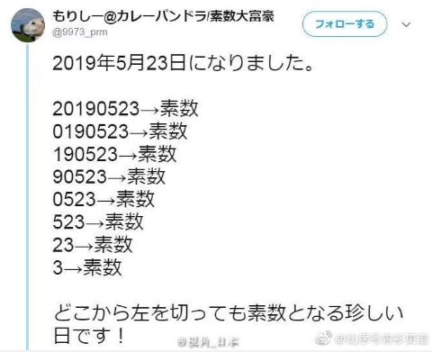
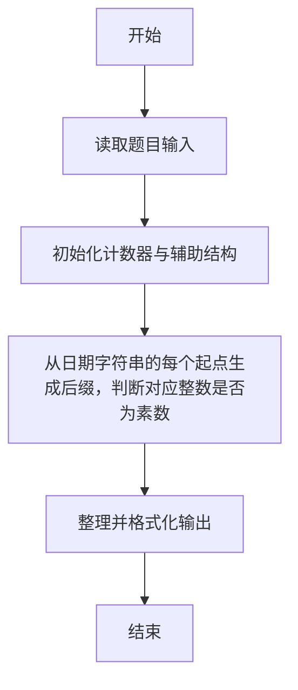
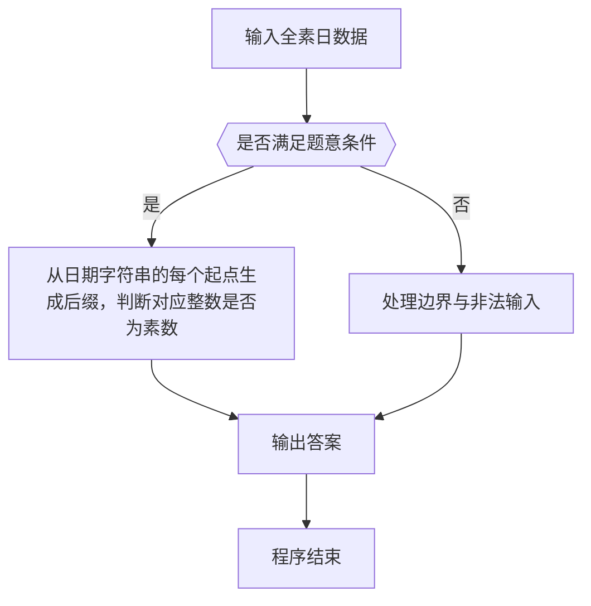

# 1114 全素日

- **分值：** 20分

### 题目描述



以上图片来自新浪微博，展示了一个非常酷的“全素日”：2019年5月23日。即不仅`20190523`本身是个素数，它的任何以末尾数字`3`结尾的子串都是素数。

本题就请你写个程序判断一个给定日期是否是“全素日”。

### 输入格式：

输入按照 `yyyymmdd` 的格式给出一个日期。题目保证日期在0001年1月1日到9999年12月31日之间。

### 输出格式：

从原始日期开始，按照子串长度递减的顺序，每行首先输出一个子串和一个空格，然后输出 `Yes`，如果该子串对应的数字是一个素数，否则输出 `No`。如果这个日期是一个全素日，则在最后一行输出 `All Prime!`。

### 输入样例 1：
```
20190523
```

### 输出样例 1：
```
20190523 Yes
0190523 Yes
190523 Yes
90523 Yes
0523 Yes
523 Yes
23 Yes
3 Yes
All Prime!
```

### 输入样例 2：
```
20191231
```

### 输出样例 2：
```
20191231 Yes
0191231 Yes
191231 Yes
91231 No
1231 Yes
231 No
31 Yes
1 No
```


### 解题思路

本题的核心是：从日期字符串的每个起点生成后缀，判断对应整数是否为素数。程序先读取题目输入，再按照上述规则完成数据处理，最后严格按照题目要求输出结果。实现时应优先根据题目约束选择合适的数据类型和数据结构，避免溢出或不必要的重复计算。

时间复杂度为 O(L²√V)；空间复杂度取决于输入规模，主要用于保存题目数据和中间结果。

### 代码流程说明

1. 读取 1114 全素日 所需的输入数据。
2. 初始化计数器、数组或其他辅助变量。
3. 从日期字符串的每个起点生成后缀，判断对应整数是否为素数。
4. 按题目规定的格式输出计算结果。

### 代码实现

```r
# 实现原理：本题的核心是：从日期字符串的每个起点生成后缀，判断对应整数是否为素数。程序先读取题目输入，再按照上述规则完成数据处理，最后严格按照题目要求输出结果。实现时应优先根据题目约束选择合适的数据类型和数据结构，避免溢出或不必要的重复计算。 时间复杂度为 O(L²√V)；空间复杂度取决于输入规模，主要用于保存题目数据和中间结果。
# 代码按“读取输入—核心计算—格式化输出”的流程组织。

# 读取题目输入。
s<-scan(what=character(),quiet=TRUE)[1]
# 定义辅助函数，封装可复用的计算逻辑。
prime<-function(x){
  if(x<2)return(FALSE)
  if(x<4)return(TRUE)
  all(x%%(2:floor(sqrt(x)))!=0)
}
allok<-TRUE
# 遍历数据并执行题目要求的处理。
for(i in seq_len(nchar(s))){
  x<-as.integer(substring(s,i))
  ok<-prime(x)
  if(!ok)allok<-FALSE
  # 按题目要求输出结果。
  cat(paste(substring(s,i),if(ok)'Yes'else'No'), '\n', sep='')
}
# 按题目要求输出结果。
if(allok)cat('All Prime!\n')

```

### 代码流程图



### 解题流程图



### 常见易错点

- 素数判断注意 1 不是素数，边界与取整平方根范围要正确。
- 大整数或超长串不要用浮点/普通整型硬算，应按字符串或高精度处理。
- 输出格式必须与题目要求完全一致，包括空格、换行、大小写和特殊符号。
