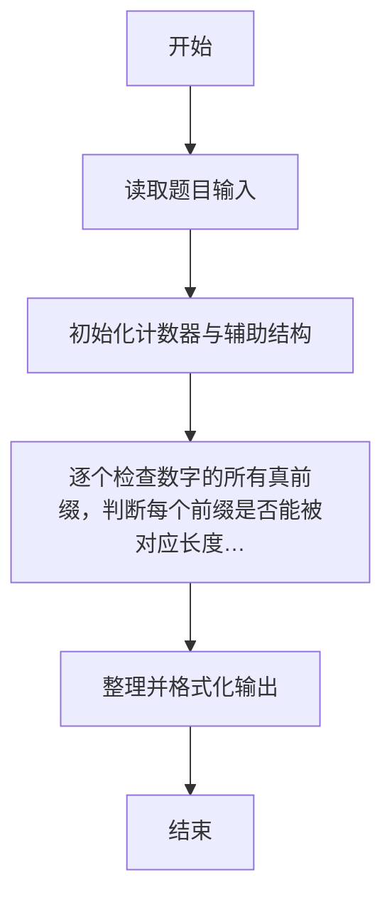
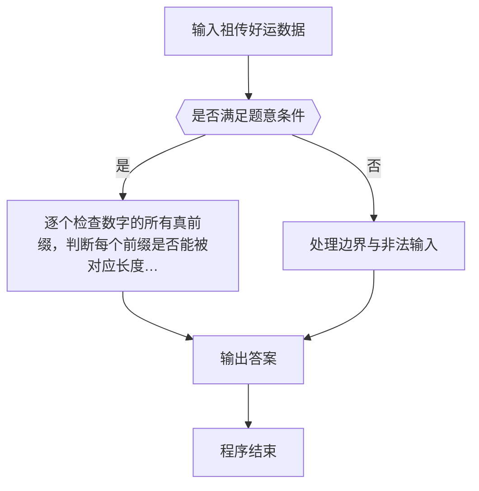

# 1121 祖传好运

- **分值：** 15分

### 题目描述

我们首先定义 0 到 9 都是**好运数**，然后从某个好运数开始，持续在其右边添加数字，形成新的数字。我们称一个大于 9 的数字 N 具有**祖传好运**，如果它是由某个好运数添加了一个个位数字得到的，并且它能被自己的位数整除。

例如 123 就是一个祖传好运数。首先因为 1 是一个好运数的老祖宗，添加了 2 以后，形成的 12 能被其位数 2 （即 12 是一个 2 位数）整除，所以 12 是一个祖传好运数；在 12 后面添加了 3 以后，形成的 123 能被其位数 3 整除，所以 123 是一个祖传好运数。

本题就请你判断一个给定的正整数 N 是不是具有祖传的好运。

### 输入格式：

每个输入包含 1 个测试用例。每个测试用例第 1 行给出正整数 K（K ≤ 1000）；第 2 行给出 K 个不超过 10^9 的待评测的正整数，注意这些数字都保证没有多余的前导零。

### 输出格式：

对每个待评测的数字，在一行中输出 `Yes` 如果它是一个祖传好运数，如果不是则输出 `No`。

### 输入样例：
```
5
123 7 43 2333 56160
```

### 输出样例：
```
Yes
Yes
No
No
Yes
```


### 解题思路

本题的核心是：逐个检查数字的所有真前缀，判断每个前缀是否能被对应长度整除。程序先读取题目输入，再按照上述规则完成数据处理，最后严格按照题目要求输出结果。实现时应优先根据题目约束选择合适的数据类型和数据结构，避免溢出或不必要的重复计算。

时间复杂度为 O(L²)；空间复杂度取决于输入规模，主要用于保存题目数据和中间结果。

### 代码流程说明

1. 读取 1121 祖传好运 所需的输入数据。
2. 初始化计数器、数组或其他辅助变量。
3. 逐个检查数字的所有真前缀，判断每个前缀是否能被对应长度整除。
4. 按题目规定的格式输出计算结果。

### 代码实现

```r
# 实现原理：本题的核心是：逐个检查数字的所有真前缀，判断每个前缀是否能被对应长度整除。程序先读取题目输入，再按照上述规则完成数据处理，最后严格按照题目要求输出结果。实现时应优先根据题目约束选择合适的数据类型和数据结构，避免溢出或不必要的重复计算。 时间复杂度为 O(L²)；空间复杂度取决于输入规模，主要用于保存题目数据和中间结果。
# 代码按“读取输入—核心计算—格式化输出”的流程组织。

# 读取题目输入。
z<-scan(what=character(),quiet=TRUE)
n<-as.integer(z[1])
# 遍历数据并执行题目要求的处理。
for(s in z[2:(n+1)]){
  v<-0
  ok<-TRUE
  # 遍历数据并执行题目要求的处理。
  for(j in seq_len(nchar(s))){
    v<-v*10+as.integer(substr(s,j,j))
    if(v%%j!=0)ok<-FALSE
  }
# 按题目要求输出结果。
cat(if(ok)'Yes\n'else'No\n')
}

```

### 代码流程图



### 解题流程图



### 常见易错点

- 素数判断注意 1 不是素数，边界与取整平方根范围要正确。
- 输出格式必须与题目要求完全一致，包括空格、换行、大小写和特殊符号。
