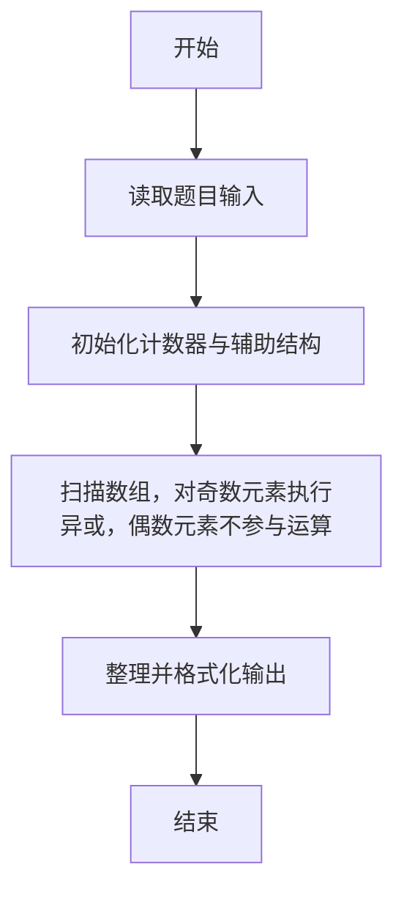
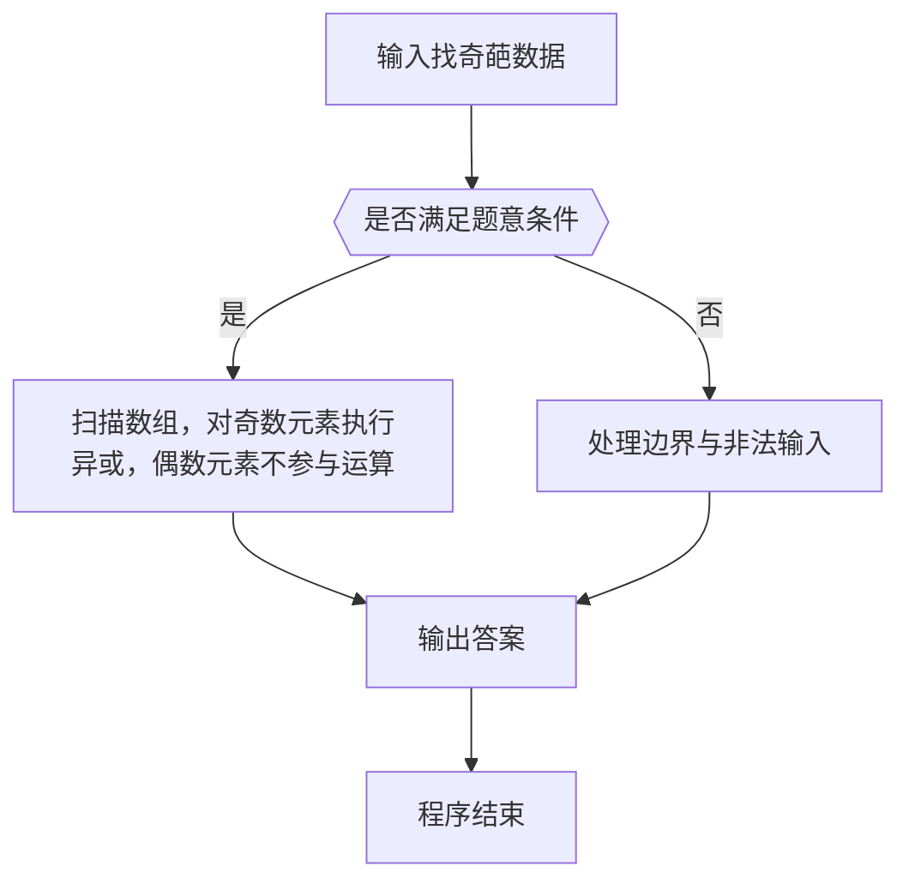

# 1122 找奇葩

- **分值：** 20分

### 题目描述

在一个长度为 n 的正整数序列中，所有的奇数都出现了偶数次，只有一个奇葩奇数出现了奇数次。你的任务就是找出这个奇葩。

### 输入格式：

输入首先在第一行给出一个正整数 n（≤ 10^4），随后一行给出 n 个满足题面描述的正整数。每个数值不超过 10^5，数字间以空格分隔。

### 输出格式：

在一行中输出那个奇葩数。题目保证这个奇葩是存在的。

### 输入样例：
```
12
23 16 87 233 87 16 87 233 23 87 233 16
```

### 输出样例：
```
233
```


### 解题思路

本题的核心是：扫描数组，对奇数元素执行异或，偶数元素不参与运算。程序先读取题目输入，再按照上述规则完成数据处理，最后严格按照题目要求输出结果。实现时应优先根据题目约束选择合适的数据类型和数据结构，避免溢出或不必要的重复计算。

时间复杂度为 O(n)；空间复杂度取决于输入规模，主要用于保存题目数据和中间结果。

### 代码流程说明

1. 读取 1122 找奇葩 所需的输入数据。
2. 初始化计数器、数组或其他辅助变量。
3. 扫描数组，对奇数元素执行异或，偶数元素不参与运算。
4. 按题目规定的格式输出计算结果。

### 代码实现

```r
# 实现原理：本题的核心是：扫描数组，对奇数元素执行异或，偶数元素不参与运算。程序先读取题目输入，再按照上述规则完成数据处理，最后严格按照题目要求输出结果。实现时应优先根据题目约束选择合适的数据类型和数据结构，避免溢出或不必要的重复计算。 时间复杂度为 O(n)；空间复杂度取决于输入规模，主要用于保存题目数据和中间结果。
# 代码按“读取输入—核心计算—格式化输出”的流程组织。

# 读取题目输入。
z<-scan(what=integer(),quiet=TRUE)
n<-z[1]
x<-0
# 遍历数据并执行题目要求的处理。
for(y in z[2:(n+1)])if(y%%2==1)x<-bitwXor(x,y)
# 按题目要求输出结果。
cat(x, '\n', sep='')

```

### 代码流程图



### 解题流程图



### 常见易错点

- 注意输入范围与边界值，选择合适的数据类型。
- 循环与下标要严格对应题目定义，避免越界或漏算。
- 输出格式必须与题目要求完全一致，包括空格与换行。
- 输出格式必须与题目要求完全一致，包括空格、换行、大小写和特殊符号。
