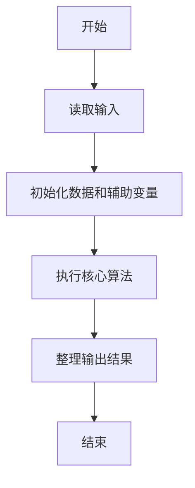
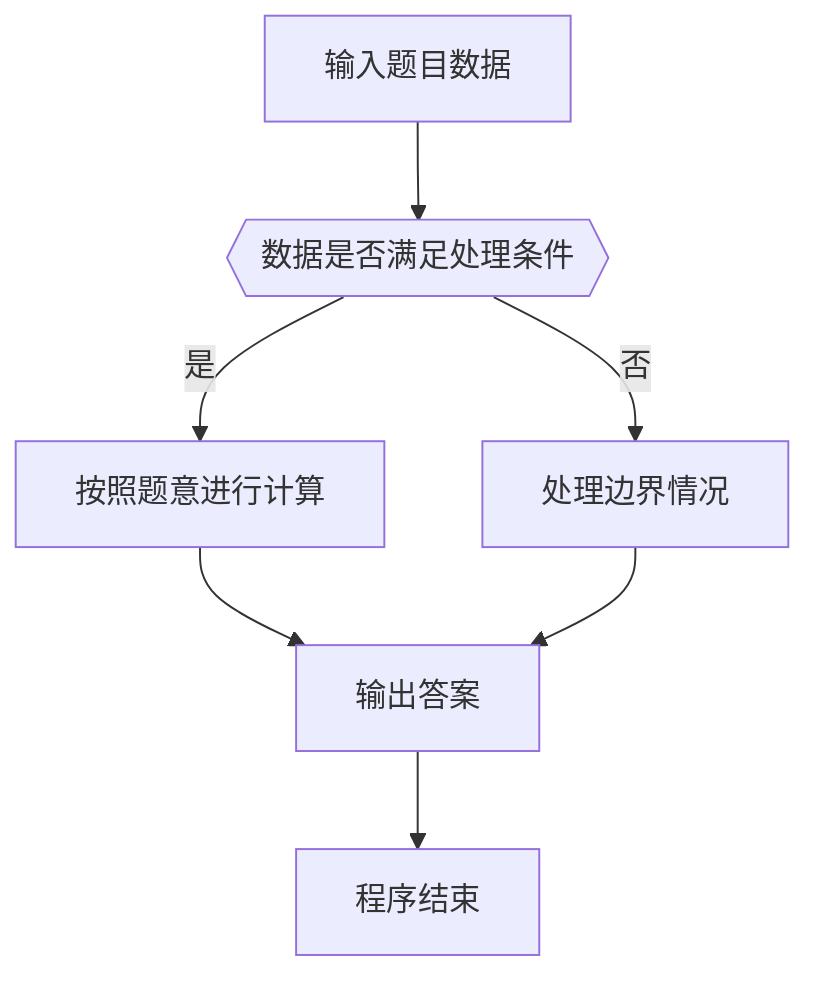

# 1123 舍入

- **分值：** 20分

### 题目描述

不同的编译器对浮点数的精度有不同的处理方法。常见的一种是“四舍五入”，即考察指定有效位的后一位数字，如果不小于 5，就令有效位最后一位进位，然后舍去后面的尾数；如果小于 5 就直接舍去尾数。另一种叫“截断”，即不管有效位后面是什么数字，一概直接舍去。还有一种是“四舍六入五成双”，即当有效位的后一位数字是 5 时，有 3 种情况要考虑：如果 5 后面还有其它非 0 尾数，则进位；如果没有，则当有效位最后一位是单数时进位，双数时舍去，即保持最后一位是双数。

本题就请你写程序按照要求处理给定浮点数的舍入问题。

### 输入格式：

输入第一行给出两个不超过 100 的正整数 $N$ 和 $D$，分别是待处理数字的个数和要求保留的小数点后的有效位数。随后 $N$ 行，每行给出一个待处理数字的信息，格式如下：

```
指令符 数字
```

其中`指令符`是表示舍入方法的一位数字，`1` 表示“四舍五入”，`2` 表示“截断”，`3` 表示“四舍六入五成双”；`数字`是一个总长度不超过 200 位的浮点数，且不以小数点开头或结尾，即 `0.123` 不会写成 `.123`，`123` 也不会写成 `123.`。此外，输入保证没有不必要的正负号（例如 `-0.0` 或 `+1`）。

### 输出格式：

对每个待处理数字，在一行中输出根据指令符处理后的结果数字。

### 输入样例：
```
7 3
1 3.1415926
2 3.1415926
3 3.1415926
3 3.14150
3 3.14250
3 3.14251
1 3.14
```

### 输出样例：
```
3.142
3.141
3.142
3.142
3.142
3.143
3.140
```


### 解题思路

本题的核心是：按字符串处理小数位，根据舍入模式和保留位数决定是否进位。程序先读取题目输入，再按照上述规则完成数据处理，最后严格按照题目要求输出结果。实现时应优先根据题目约束选择合适的数据类型和数据结构，避免溢出或不必要的重复计算。

时间复杂度为 O(L)；空间复杂度取决于输入规模，主要用于保存题目数据和中间结果。

### 代码流程说明

1. 读取 1123 舍入 所需的输入数据。
2. 初始化计数器、数组或其他辅助变量。
3. 按字符串处理小数位，根据舍入模式和保留位数决定是否进位。
4. 按题目规定的格式输出计算结果。

### 代码实现

```r
# 实现原理：本题的核心是：按字符串处理小数位，根据舍入模式和保留位数决定是否进位。程序先读取题目输入，再按照上述规则完成数据处理，最后严格按照题目要求输出结果。实现时应优先根据题目约束选择合适的数据类型和数据结构，避免溢出或不必要的重复计算。 时间复杂度为 O(L)；空间复杂度取决于输入规模，主要用于保存题目数据和中间结果。
# 代码按“读取输入—核心计算—格式化输出”的流程组织。

# 读取题目输入。
z<-scan(what=character(),quiet=TRUE)
n<-as.integer(z[1])
d<-as.integer(z[2])
at<-3
# 遍历数据并执行题目要求的处理。
for(q in seq_len(n)){
  mode<-as.integer(z[at])
  s<-z[at+1]
  at<-at+2
  neg<-startsWith(s,'-')
  if(neg)s<-substring(s,2)
  p<-strsplit(s,'\\.',fixed=FALSE)[[1]]
  whole<-p[1]
  frac<-if(length(p)>1)p[2]else''
  digits<-strsplit(paste0(whole,frac),'')[[1]]
  keep<-nchar(whole)+d
  if(length(digits)<keep)digits<-c(digits,rep('0',keep-length(digits)))
  up<-FALSE
  if(nchar(frac)>d){
    r<-as.integer(substr(frac,d+1,d+1))
    up<-if(mode==1)r>=5 else if(mode==3)r>5||(r==5&&(any(as.integer(substr(frac,d+2,nchar(frac)))!=0)||as.integer(digits[keep])%%2==1))else FALSE
  }
if(up){
  i<-keep
  # 按题意重复处理，直到满足结束条件。
  while(i>0&&digits[i]=='9'){
    digits[i]<-'0'
    i<-i-1
  }
if(i==0){
  digits<-c('1',digits)
  keep<-keep+1
}else digits[i]<-as.character(as.integer(digits[i])+1)
}
ie<-keep-d
if(ie<=0)out<-paste0('0.',strrep('0',-ie),paste(digits[1:keep],collapse=''))else out<-paste0(paste(digits[1:ie],collapse=''),if(d>0)paste0('.',paste(digits[(ie+1):keep],collapse=''))else'')
if(neg)out<-paste0('-',out)
# 按题目要求输出结果。
cat(out,'\n')
}
```

### 代码流程图



### 解题流程图



### 常见易错点

- 注意输入数据的范围，选择足够大的整数类型，并正确处理边界值。
- 循环、数组下标和字符串结束位置要严格对应题目定义，避免越界。
- 输出格式必须与题目要求完全一致，包括空格、换行、大小写和特殊符号。
- 如果存在排序、去重、进位、约分或四舍五入等操作，应在输出前统一完成。
